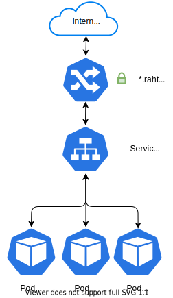

<style>
.admonition-title { background-color: rgba(255, 145, 0, 0.1) !important; }
.admonition { background-color: white !important; }
</style>
!!! Attention "⚠️ Rahti 3 is deprecated"

    This page is about a deprecated version of Rahti, please consult the [updated documentation article](../../../rahti4/tutorials/elemental_tutorial/)

# Introduction

In this tutorial, the Kubernetes core concepts _pods_, _services_, _routes_ and
_ReplicationControllers_ and their YAML representations are discussed. In order
to illustrate these _Kubernetes API objects_, an Apache HTTP server application
is constructed by writing plain text YAML representations of these objects.

The objects minimally required defined in the cluster to have the
server running:

1. A pod that runs the container.
1. A service that exposes the pod internally and gives it a predictable name.
1. A route that will expose the service to the internet by redirecting
   traffic from `<myservice>.rahtiapp.fi` to the service object.

!!! Note

    In practice, you should not deploy applications the way described in this
    tutorial. Instead, it is meant for learning the core concepts of
    Kubernetes.



## Preparation

Make sure you have the `oc` command line installed, and that you are logged in. Please check the [command line tool installation](/cloud/rahti/usage/cli/) if you need help on that.

## Projects

The command `oc projects` shows the projects you have access to:

```bash
$ oc projects
You have access to the following projects and can switch between them with 'oc
project <projectname>':

    someone-elses-public-project
  * my-project-with-unique-name

Using project "my-project-with-unique-name" on server "https://rahti.csc.fi:8443".
```

!!! Note

    The listing may include projects that other users have created to host
    public Docker images. While it is possible to switch to these projects, you
    only have read-only access to the Docker images hosted in them.

If there is no single suitable project, a new one can be created with the command `oc
new-project`:

```bash
oc new-project my-project-with-unique-name
```

The name of the project needs to be unique across the Rahti container cloud, and
moreover, the name may only contain letters, digits and hyphen symbols, and it
is not case sensitive. In essence, the name needs to be usable as part of a DNS
name.

If you are a member of multiple CSC projects with access to Rahti, the description of the
project must contain `csc_project: #######`, where `#######` is the project
that should be billed (see
[Projects and quota](../../usage/projects_and_quota/)).
The description can be included in the `new-project` command:

```bash
oc new-project my-project-with-unique-name --description='csc_project: #######'
```

Switch between projects using the command `oc project`:

```bash
oc project another-project
```

## Pods and the command line interface

Pods are objects that run one or more containers. The containers in a pod
share an IP address, and they can communicate via `localhost` or shared memory.
Consequently, they need to be executed in a single physical node.

In our case, the pod will run a container image with a web server installed in
it:

*`pod.yaml`*:

```yaml
apiVersion: v1
kind: Pod
metadata:
  name: mypod
  labels:
    app: serveapp
    pool: servepod
spec:
  containers:
  - name: serve-cont
    image: "docker-registry.default.svc:5000/openshift/httpd"
```

This pod will run one container image specified in the field
`spec.containers.image`.

The name of the pod is provided in `metadata.name`. The pod can be referred to
using `oc`:

```bash
oc get pods mypod
```

The field `metadata.labels.pool` is an arbitrary key-value pair that enables
the pods to be grouped and referred by e.g. _services_.

The Kubernetes API objects are represented in the YAML format.
[Short introduction to YAML](/cloud/rahti/tutorials/yaml_introduction/).

Pods and other Kubernetes/OpenShift API objects are created with the `oc`
command line utility:

```bash
oc create -f pod.yaml
```

The pod should now appear in the "Overview" page in OpenShift's web console when
the project is viewed.

Pods can be deleted using the command `oc delete`:

```bash
oc delete pod mypod
```

Consequently, the pod should disappear from the OpenShift web console, but let us
keep this one running for now.

----

### Resource requests and limits

Typically, you allocate _resources_ to containers using _requests_ and
_limits_, but in these examples, we refrain from doing that for the sake of
brevity. If no values are provided, default values will be used instead. The
same pod as above with memory and CPU resources of 200 MB to 1 GB and 0,2 CPU
to 1 CPU would read as:

*`pod.yaml`*:

```yaml
apiVersion: v1
kind: Pod
metadata:
  name: mypod
  labels:
    app: serveapp
    pool: servepod
spec:
  containers:
  - name: serve-cont
    image: "docker-registry.default.svc:5000/openshift/httpd"
    resources:
      requests:
        memory: "200M"
        cpu: "200m"
      limits:
        memory: "1G"
        cpu: "1"
```

Read more about requests and limits in the [Kubernetes
documentation](https://kubernetes.io/docs/tasks/configure-pod-container/quality-service-pod/).

----

## Service

The IP addresses of pods are not consistent and may change if, for example,
a pod is killed and recreated. Thus, in order to reliably access a pod, its IP
address must be tracked and stored. Service objects do just that, and as
a result, they provide a consistent network identity to pods:

*`service.yaml`*:

```yaml
apiVersion: v1
kind: Service
metadata:
  name: serve
  labels:
    app: serveapp
spec:
  ports:
  - name: 8081-tcp
    port: 8081
    protocol: TCP
    targetPort: 8080
  selector:
    pool: servepod
```

This service will redirect TCP traffic internally from port 8081 in the project
to the port 8080 of the pods having their labels listed in `spec.selector`. In this
case, traffic is redirected to the pods with the label `pool: servepod`. If
there are multiple pods matching `spec.selector`, then traffic is split
between the pods. By default, splitting is done in a round-robin manner.

The only required field in the `spec.ports` field is `port`. Omitting
`protocol` defaults it to TCP, and omitting `targetPort` defaults to the
value of `port`.

Let us ensure that the service actually works by launching a remote shell in the
container running in the pod `mypod` and pinging the service:

```bash
$ oc rsh mypod
sh-4.2$ ping serve
PING serve.my-project-with-unique-name.svc.cluster.local (172.30.39.82) 56(84) bytes of data.
```

## Route

The _route_ object is an OpenShift extension to Kubernetes that routes HTTP
traffic from the internet (or whichever network the OpenShift cluster is
connected to) to services in the OpenShift cluster.

*`route.yaml`*:

```yaml
apiVersion: v1
kind: Route
metadata:
  labels:
    app: serveapp
  name: myservice
  annotations:
    haproxy.router.openshift.io/ip_whitelist: 192.168.1.0/24 10.0.0.1
spec:
  host: <myservice>.rahtiapp.fi
  to:
    kind: Service
    name: serve
    weight: 100
```

This route redirects traffic from the internet to the service in the cluster
whose `metadata.name` equals `spec.to.name`.

This particular route also allows traffic only from the subnet `192.168.1.0/24` and
the IP `10.0.0.1`. Security-wise, it is highly encouraged to utilize IP
whitelisting for services that are not meant to be visible to the entire
internet.

!!! Caution

    If the whitelist entry is malformed, OpenShift will discard the whitelist
    and allow all traffic.

By default, the hostname is `metadata.name` + `-` + project name
+ `.rahtiapp.fi` unless otherwise specified in `spec.host`.

So far we have set up a pod, a service and a route. If the physical server
where the pod lives gets shut down, you have to manually restart the pod using
`oc create -f pod.yaml`. The _ReplicationController_ and _ReplicaSet_ objects are
a mechanism that will, roughly speaking, do that for the user.

## ReplicationController

A ReplicationController ensures that there are `spec.replicas` number of pods
whose labels match the `spec.selector` running in the cluster. If there are too many,
ReplicationController shuts down the extra ones, and if there are too few,
it starts up pods according to the `spec.template` field. Actually, the
template field is exactly the pod described in `pod.yaml`, except the fields
`apiVersion` and `kind` are missing.

*`ReplicationController.yaml`*:

```yaml
apiVersion: v1
kind: ReplicationController
metadata:
  labels:
    app: serveapp
  name: blogtest-replicator
spec:
  replicas: 1
  selector:
    app: serveapp
    pool: servepod
  template:
    metadata:
      name: mypod
      labels:
        app: serveapp
        pool: servepod
    spec:
      containers:
      - name: serve-cont
        image: "docker-registry.default.svc:5000/openshift/httpd"
```

The ReplicationControllers are functionally close to ReplicaSets, discussed
in the chapter "[Kubernetes and OpenShift
concepts](/cloud/rahti/introduction/background#kubernetes-and-openshift-concepts)".
A ReplicationController can be transformed into a ReplicaSet by
changing `spec.selector` to `spec.selector.matchLabels` and setting
`kind: ReplicaSet`. The motivation to understand the ReplicationController
object is that [DeploymentConfig](/cloud/rahti/concepts/#deploymentconfig)
objects generate ReplicationControllers.

!!! Note

    A central Kubernetes' concept coined *reconciliation loop* manifests in the
    ReplicationControllers. The reconciliation loop is a mechanism that measures
    the *actual state* of the system, constructs the *current state* based to the
    measurement of the system and performs such actions that the state of the
    system would equal to the *desired state*.

    In such a terminology, ReplicationControllers are objects that describe the
    *desired state* of the cluster. Another such object is the service
    object encountered earlier. There, an another reconciliation loop compares
    the endpoints of the service to the actual pods that are ready and adjusts
    accordingly. As a result, the endpoints of the service always point to pods
    that are ready and only those pods whose labels contain all fields in
    the selector of the service object. In fact, every incidence of `spec` in
    a YAML representation of a Kubernetes object describes a specification for
    a reconciliation loop. The loops for pods just happen to be tied to the
    worker nodes of Kubernetes and are thus susceptible to deletion if, or
    when, the worker nodes are deprovisioned.

## Cleaning up

Once we are satisfied with the application, let us not keep it running in the
cluster but remove it with the command `oc delete`:

```bash
oc delete all --selector app=serveapp
```

This will delete all objects with the label `app: serveapp`.

## Conclusion

In this tutorial, a static web page server was set up using YAML files
representing the Kubernetes objects. The created objects can be further
modified in the OpenShift web console where:

* Routes can be modified to be secure ones encrypted by TLS.
* Autoscalers, persistent storage, resource limits and health checks can be added to ReplicationControllers.
* New routes can be added to services.
