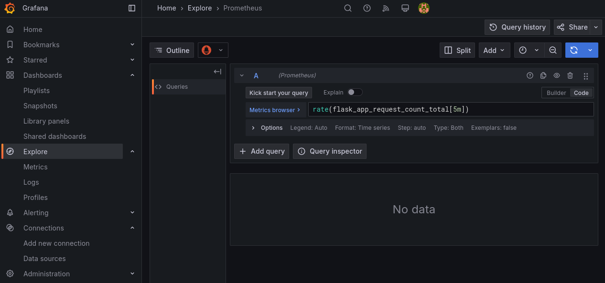
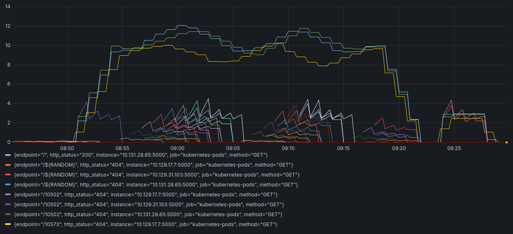

!!! warning "Middle level"
    You need a knowledge of OpenShift CLI tool [oc](../usage/cli.md) and [Helm](../../../support/faq/helm.md)

# How to deploy a High Available application in Rahti

This is a simple High Available web application deployment in Rahti. 

## Schema


In the schema above you can see the end result that you will achieve at the end of this tutorial. We will deploy two URLs, one for the application itself (`app.rahtiapp.fi`), and the other for the monitoring dashboard(s) (`grafana-app.rahtiapp.fi`). The application run on the Frontend section and will have two replicas. The frontend is connected to a postgres database. The monitoring is provided by Grafana and Prometheus, two very commonly used software solutions for monitoring. Prometheus gathers the metrics exposed by the frontend and the database and grafana show the data in nice graphs.

We will deploy each part step by step, and describe them in more detail while doing so. 

## Manual deployment

### Frontend

We will start by deploying the application stored on:

- <https://github.com/CSCfi/rahti-ha-tutorial/>

We will use the command `oc new-app`, if you do not have `oc` installed, please follow the instructions on the [Command line tool usage](../usage/cli.md) page . Across all this tutorial, we will use the namespace `tutorial`, please replace it with your own namespace when running the commands. The command and its output is the following:

```sh
$ oc new-app https://github.com/CSCfi/rahti-ha-tutorial/ -n tutorial
--> Found container image 955f4cc (9 days old) from Docker Hub for "python:3.11-slim"

    * An image stream tag will be created as "python:3.11-slim" that will track the source image
    * A Docker build using source code from https://github.com/CSCfi/rahti-ha-tutorial/ will be created
      * The resulting image will be pushed to image stream tag "rahti-ha-tutorial:latest"
      * Every time "python:3.11-slim" changes a new build will be triggered

--> Creating resources ...
    imagestream.image.openshift.io "python" created
    imagestream.image.openshift.io "rahti-ha-tutorial" created
    buildconfig.build.openshift.io "rahti-ha-tutorial" created
    deployment.apps "rahti-ha-tutorial" created
    service "rahti-ha-tutorial" created
--> Success
    Build scheduled, use 'oc logs -f buildconfig/rahti-ha-tutorial' to track its progress.
    Application is not exposed. You can expose services to the outside world by executing one or more of the commands below:
     'oc expose service/rahti-ha-tutorial' 
    Run 'oc status' to view your app.
```

!!! Note
    You can also deploy this from the web interface at [Import from Git](https://console.rahti.csc.fi/import/)

Once deployed we will have:

```sh
$ oc get all -n tutorial
Warning: apps.openshift.io/v1 DeploymentConfig is deprecated in v4.14+, unavailable in v4.10000+
NAME                                     READY   STATUS             RESTARTS      AGE
pod/rahti-ha-tutorial-1-build            0/1     Completed          0             26m
pod/rahti-ha-tutorial-86467965d5-hn4hp   0/1     CrashLoopBackOff   9 (21s ago)   24m

NAME                        TYPE        CLUSTER-IP      EXTERNAL-IP   PORT(S)    AGE
service/rahti-ha-tutorial   ClusterIP   172.30.61.169   <none>        5000/TCP   26m

NAME                                READY   UP-TO-DATE   AVAILABLE   AGE
deployment.apps/rahti-ha-tutorial   0/1     1            0           26m

NAME                                           DESIRED   CURRENT   READY   AGE
replicaset.apps/rahti-ha-tutorial-69f9d94dbb   0         0         0       26m
replicaset.apps/rahti-ha-tutorial-86467965d5   1         1         0       24m

NAME                                               TYPE     FROM   LATEST
buildconfig.build.openshift.io/rahti-ha-tutorial   Docker   Git    1

NAME                                           TYPE     FROM          STATUS     STARTED          DURATION
build.build.openshift.io/rahti-ha-tutorial-1   Docker   Git@80211bf   Complete   26 minutes ago   2m5s

NAME                                               IMAGE REPOSITORY                                                 TAGS        UPDATED
imagestream.image.openshift.io/python              image-registry.apps.2.rahti.csc.fi/tutorial2/python              3.11-slim   26 minutes ago
imagestream.image.openshift.io/rahti-ha-tutorial   image-registry.apps.2.rahti.csc.fi/tutorial2/rahti-ha-tutorial   latest      24 minutes ago
```

`new-app` has created few things automatically for us. First a `BuildConfig` that together with the two `ImageStream` and a single `Build` instance, build and store the image with our application. Secondly a `Deployment` that together with the `ReplicaSet` and `Pod` runs our application. And thirdly and finally a `Service` that takes care of the networking.

But you can see that `pod/rahti-ha-tutorial-86467965d5-hn4hp` is in `CrashLoopBackOff` state. Let's take a look into the log of the problematic Pod:

```sh
$ oc logs rahti-ha-tutorial-86467965d5-hn4hp -n tutorial
Waiting for db:5432
nc: getaddrinfo for host "db" port 5432: Name or service not known
nc: getaddrinfo for host "db" port 5432: Name or service not known
nc: getaddrinfo for host "db" port 5432: Name or service not known
nc: getaddrinfo for host "db" port 5432: Name or service not known
nc: getaddrinfo for host "db" port 5432: Name or service not known
nc: getaddrinfo for host "db" port 5432: Name or service not known
nc: getaddrinfo for host "db" port 5432: Name or service not known
nc: getaddrinfo for host "db" port 5432: Name or service not known
nc: getaddrinfo for host "db" port 5432: Name or service not known
nc: getaddrinfo for host "db" port 5432: Name or service not known
nc: getaddrinfo for host "db" port 5432: Name or service not known
nc: getaddrinfo for host "db" port 5432: Name or service not known
nc: getaddrinfo for host "db" port 5432: Name or service not known
nc: getaddrinfo for host "db" port 5432: Name or service not known
nc: getaddrinfo for host "db" port 5432: Name or service not known
Timed out
```

This is expected because there is no Database to connect to. Let's fix that.

### Database

For the database we will use a template provided by Rahti:

```sh
$ oc new-app --template=postgresql-ephemeral \
  -p POSTGRESQL_USER=postgres \
  -p POSTGRESQL_PASSWORD=postgres \
  -p POSTGRESQL_DATABASE=postgres \
  -p DATABASE_SERVICE_NAME=db \
  -n tutorial
--> Deploying template "tutorial2/postgresql-ephemeral" to project tutorial

     PostgreSQL (Ephemeral)
     ---------
     PostgreSQL database service, without persistent storage. For more information about using this template, including OpenShift considerations, see https://github.com/sclorg/postgresql-container/.
     
     WARNING: Any data stored will be lost upon pod destruction. Only use this template for testing

     The following service(s) have been created in your project: db.
     
            Username: postgres
            Password: postgres
       Database Name: postgres
      Connection URL: postgresql://db:5432/
     
     For more information about using this template, including OpenShift considerations, see https://github.com/sclorg/postgresql-container/.

     * With parameters:
        * Memory Limit=512Mi
        * Namespace=openshift
        * Database Service Name=db
        * PostgreSQL Connection Username=postgres
        * PostgreSQL Connection Password=postgres
        * PostgreSQL Database Name=postgres
        * Version of PostgreSQL Image=10-el8

--> Creating resources ...
    secret "db" created
    service "db" created
Warning: apps.openshift.io/v1 DeploymentConfig is deprecated in v4.14+, unavailable in v4.10000+
    deploymentconfig.apps.openshift.io "db" created
--> Success
    Application is not exposed. You can expose services to the outside world by executing one or more of the commands below:
     'oc expose service/db' 
    Run 'oc status' to view your app.
```

The template "PostgreSQL Ephemeral" uses memory to store the data, and it is used only for testing as when the Pod of the database is restarted the data is lost. If you want to have a proper production database, we recommend that you use [Pukki DBaaS](../../dbaas/index.md).

After a few minutes, the `rahti-ha-tutorial` Pod should restart by itself and the error will be fixed:

```sh
$ oc logs rahti-ha-tutorial-86467965d5-hn4hp -n tutorial
Waiting for db:5432
Connection to db (172.30.224.18) 5432 port [tcp/postgresql] succeeded!
 * Serving Flask app 'app'
 * Debug mode: off
WARNING: This is a development server. Do not use it in a production deployment. Use a production WSGI server instead.
 * Running on all addresses (0.0.0.0)
 * Running on http://127.0.0.1:5000
 * Running on http://10.131.7.213:5000
Press CTRL+C to quit
```

!!! Info "oc delete pod"
    You can always accelerate the process and delete the Pod that is crashing by running: `oc delete pod <YOUR_POD_NAME> -n tutorial`.

!!! Info "Single point of failure"
    The database we installed is **not really highly available**. It is not trivial to make PostgreSQL highly available. Explaining how to make this component high available will be too complicated for this tutorial, but there is plenty of documentation available on the internet about the topic.

### Scaling

Scaling in Kubernetes and by extension Rahti is very simple. You simply run:

```sh
$ oc scale --replicas=3 deploy/rahti-ha-tutorial -n tutorial
deployment.apps/rahti-ha-tutorial scaled
```

And two extra copies of the Pod will be launched: 

```sh
$ oc get pod -n tutorial -o wide
NAME                                 READY   STATUS      RESTARTS      AGE   IP             NODE                        NOMINATED NODE   READINESS GATES
db-1-deploy                          0/1     Completed   0             21h   10.131.6.10    2-rcr6j-worker-io-1-cv824   <none>           <none>
db-1-rvtw4                           1/1     Running     1 (21h ago)   21h   10.131.6.11    2-rcr6j-worker-io-1-cv824   <none>           <none>
rahti-ha-tutorial-1-build            0/1     Completed   0             21h   10.131.7.196   2-rcr6j-worker-io-1-cv824   <none>           <none>
rahti-ha-tutorial-6488b5d958-45rr8   1/1     Running     0             17m   10.129.31.71   2-rcr6j-worker-0-lnm4d      <none>           <none>
rahti-ha-tutorial-6488b5d958-7l86w   1/1     Running     0             20h   10.131.6.69    2-rcr6j-worker-io-1-cv824   <none>           <none>
rahti-ha-tutorial-6488b5d958-pjzbf   1/1     Running     0             17m   10.129.23.88   2-rcr6j-worker-0-8z2q5      <none>           <none>
```

As you can see the NODE for each of the rahti-ha-tutorial pods is different. So a single node failing will not affect the application much. The replicas are also useful for scaling up and down the application and to make more transparent migrations (Rahti will update Pods one by one).

### Exposing the app

At this moment we hopefully have a working application, but we cannot check this with our own eyes. We need to expose the application to the internet:

```sh
$ oc expose service/rahti-ha-tutorial -n tutorial
route/rahti-ha-tutorial exposed
```

The change will be nearly instantaneous and, for our example, the URL is:

<http://rahti-ha-tutorial-tutorial.2.rahtiapp.fi/>

In your case the URL will be different and you can check it out by running:

```sh
$ oc get route -n tutorial
NAME                HOST/PORT                                   PATH   SERVICES            PORT       TERMINATION   WILDCARD
rahti-ha-tutorial   rahti-ha-tutorial-tutorial.2.rahtiapp.fi           rahti-ha-tutorial   5000-tcp                 None
```

The URL was auto-generated based on the service name and the namespace name, but you can always decide which name to expose the app by using this option:

```sh
    --hostname='':
	Set a hostname for the new route
```

At this moment we have a working application, but we lack monitoring.


## Monitoring

For monitoring we will use Grafana and Prometheus. Rahti provides a "Chart" (this is how Helm calls its recipes/templates). In order to deploy it we will use the `helm` command line tool:

```sh
$ helm repo add helm-charts https://cscfi.github.io/helm-charts/     
"helm-charts" has been added to your repositories
```

Then update the repo to get the charts:

```sh
$ helm repo update      
Hang tight while we grab the latest from your chart repositories...
...Successfully got an update from the "helm-charts" chart repository
Update Complete. ⎈Happy Helming!⎈
```

Create as file called `values.yaml` with the content:

```yaml
prometheus:
  serverFiles:
    prometheus.yml:
      scrape_configs:
        - job_name: kubernetes-pods
          kubernetes_sd_configs:
            - role: pod
              namespaces:
                names:
                - tutorial
```

Finally install it:

```sh
$ helm upgrade --install graf-prom helm-charts/prometheus-grafana-helm -n tutorial -f values.yaml
Release "graf-prom" does not exist. Installing it now.
level=WARN msg="unable to find exact version; falling back to closest available version" chart=prometheus-grafana-helm requested="" selected=2.1.0
NAME: graf-prom
LAST DEPLOYED: Thu Jan 15 16:09:32 2026
NAMESPACE: tutorial
STATUS: deployed
REVISION: 1
DESCRIPTION: Install complete
NOTES:
========================================
  CSC Prometheus-Grafana Helm deployed
========================================
===========
  GRAFANA
===========
Wait a few seconds. Time for the application to be fully deployed.

Get the Grafana application URL by running these commands:

  export GRAFANA=$(oc get route --namespace=tutorial -o yaml | yq '.items[] | select(.metadata.name == "grafana") .spec.host' -r)
  echo "GRAFANA server URL: http://$GRAFANA"

The password for the access is generated randomly.
To retrieve the information, run these commands:

  echo Username: $(oc get secret --namespace=tutorial2 graf-prom -o jsonpath="{.data.admin-user}" | base64 -d)
echo Password: $(oc get secret --namespace=tutorial2 graf-prom -o jsonpath="{.data.admin-password}" | base64 -d)


========================
  PROMETHEUS (OPTIONAL)
========================
The Route to Prometheus is not deployed by default. You can change the behaviour by setting `true` in the `values.yaml`
or you can type this command:

  oc --namespace tutorial2 create route edge prometheus --service=graf-prom-prometheus-server --insecure-policy='Redirect' --port=9090

You can retrieve the Prometheus URL by running these commands:

  export PROMETHEUS=$(oc get route --namespace=tutorial -o yaml | yq '.items[] | select(.metadata.name == "prometheus") .spec.host' -r)
  echo "PROMETHEUS server URL: http://$PROMETHEUS"
```

We are almost done, before we try to login to Grafana web interface, we just need to tell Prometheus where to find the monitoring data of our Pods. In order to have your pods monitored by Prometheus, you need to add the annotations `prometheus.io/scrape=true` and `prometheus.io/port=5000`
to the application Pods. You can use this command:

```sh
$ oc patch deployment rahti-ha-tutorial -n tutorial --type='merge' -p '{
  "spec": {
    "template": {
      "metadata": {
        "annotations": {
          "prometheus.io/scrape": "true",
          "prometheus.io/port": "5000",
        }
      }
    }
  }
}'
```

Grafana, for our example, will be available at:

<https://grafana-tutorial2.rahtiapp.fi>

The last thing to do is to test grafana graphs by:

1. Generating some fake traffic:

    ```sh
    $ future=$[$(date +%s)+600]
    $ while test $(date +%s) -lt $future; do 
      sleep 1;
      ab -n 200 -c 1 \
          http://rahti-ha-tutorial-tutorial.2.rahtiapp.fi/$RANDOM &
      ab -n 2000 -c 10 \
          http://rahti-ha-tutorial-tutorial.2.rahtiapp.fi/;
    done
    ```

    We use the tool `ab` (short for `Apache HTTP server benchmarking tool`) installed from the apache utils package. There are lots of ways to generate traffic, this is just a simple way.

1. Login into Grafana's web interface. You can find the username and password in the Secret called `graf-prom-grafana`.

1. Click in `Explore`, this will open the metric Explore panel. In this page you can see all the metrics, and test queries.

1. Select code, instead of build, so you can input the query: `rate(flask_app_request_count_total[5m])`.

    

1. Click in the blue icons with the arrows, and the graph will appear:

    

## Conclusion

This tutorial is only a short showcase of the possibilities of Rahti as a platform to host high available applications, and how easy is to start adding monitoring to it. Rahti provides out of the box load balancing, integrated building system and registry, pre-created test DNS names (`*.rahtiapp.fi`), and other minor features. All together aim to remove load from the application's DevOps team.

The application we deployed is a toy, you can play with it to really understand what happens when a node is down, how to add monitoring view and alerts via Grafana, and to change random configuration values to see what it happens.

There are few ways this deployment can be expanded:

- Make PostgreSQL high available, or migrate the database to the [Pukki](../../dbaas/index.md) service.
- Create tables on the PostgreSQL database and add some data to it.
- Replace this app by other that you have developed and see how the replicas behave.
- Play with [autoscaling](../../../support/faq/addHorizontalAutoscaler.md).

See here our basic kubernetes concepts documentation, on the [kubernetes basic concepts](../concepts.md) page.
