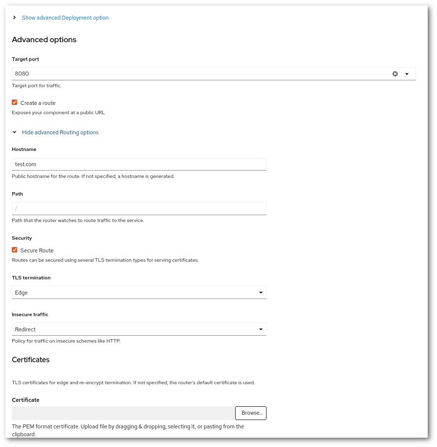

!!! success "Basic level"
    It is very simple to setup a HTTP redirection in Rahti using a web server like nginx. We can redirect to basically any URL we want with very complex logics. For this tutorial, we will keep it simple and simply redirect to a different host, but keeping the path of the URL.

# Setup a HTTP redirection in Rahti

## Procedure

1. Deploy an NGINX Image. It is recommended to use `bitnami/nginx`

    

1. Add a Route with the URL that you want to redirect. If you visit the URL, you should see the "nginx welcome page"

    

1. Add a ConfigMap with a server redirection block. Go to **Workloads > ConfigMaps**, click in **Create ConfigMap**. The **Name** will be later used when mounting the ConfigMap. The **Key** will be the name of the file, and the **Value** the content of the file. 

    ```nginx
    #default.conf
    server {
            listen *:8080;
            server_name test.com;
            return 301 $scheme://test2.com$request_uri;
    }
    ```

    In this example, `test.com` is the original URL, and `test2.com`  is the one that the user will be redirected to.

1. Mount the Configmap to the nginx deployment as a volume. Go to deployment and add following code in the YAML file.

   ```
   spec:
        containers:
          volumeMounts:
          - mountPath: /opt/bitnami/nginx/conf/server_blocks
            name: nginx-conf
          volumes:
          - configMap:
              defaultMode: 420
              name: nginx-config
            name: nginx-conf
   ```

    In this example, nginx-conf is the **name** of configMap, nginx-config is the **key** and the ConfigMap has to be mounted in `/opt/bitnami/nginx/conf/server_blocks/`, other images may store the nginx configuration in different folders.

## Add more host domains

If you need to redirect more than one host domain, you can use the same nginx, you just need to (1) add a new Route with the new host, and (2) add a new server block to the existing ConfigMap. In order for nginx to pick up the new configuration, you can delete the Pod or enter in the pod's terminal and run `nginx -s reload`.

## Conclusion and more

Nginx is a powerful web server. You can use it also as a HTTP proxy and load balancer. For more information, please check the documentation at <https://nginx.org/en/docs/>.
