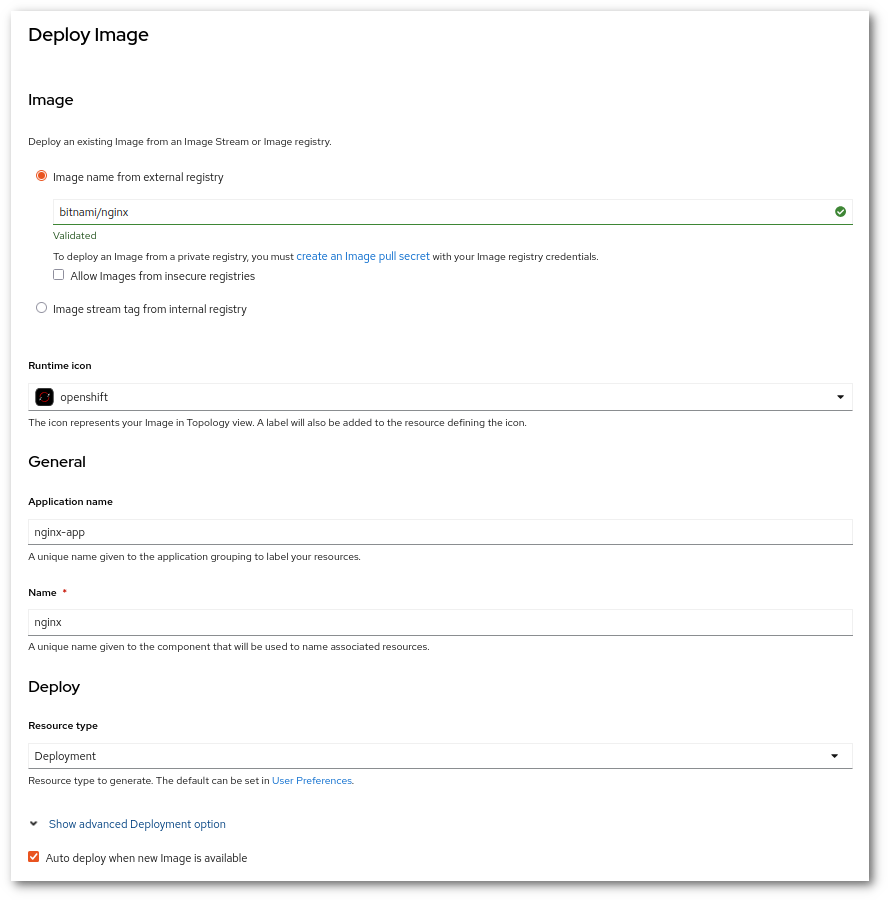

!!! success "Perustaso"
    HTTP-uudelleenohjauksen asettaminen Rahtissa on hyvin yksinkertaista käyttäen verkkopalvelinta kuten nginx:ä. Voimme ohjata käytännössä mihin tahansa URL:iin hyvin monimutkaisilla logiikoilla. Tässä opetusohjelmassa pidämme sen yksinkertaisena ja ohjaamme yksinkertaisesti eri isäntään, mutta säilytämme URL:n polun.

# HTTP-uudelleenohjauksen asettaminen Rahtissa {#setup-a-http-redirection-in-rahti}

## Menettely {#procedure}

1. Ota käyttöön NGINX-kuva. On suositeltavaa käyttää `bitnami/nginx`

    

1. Lisää reitti URL:llä, johon haluat ohjata. Jos vierailet URL:ssä, sinun pitäisi nähdä "nginx tervetuloa -sivu"

    

1. Lisää ConfigMap-palvelin uudelleenohjauslohkolla. Siirry kohtaan **Workloads > ConfigMaps**, klikkaa **Create ConfigMap**. **Nimi** käytetään myöhemmin, kun ConfigMap asennetaan. **Avain** on tiedoston nimi, ja **Arvo** tiedoston sisältö.

    ```nginx
    #default.conf
    server {
            listen *:8080;
            server_name test.com;
            return 301 $scheme://test2.com$request_uri;
    }
    ```

    Tässä esimerkissä `test.com` on alkuperäinen URL, ja `test2.com` on se, johon käyttäjä ohjataan.

1. Asenna Configmap nginx-sijoitteluun volyymina. Siirry sijoitteluun ja lisää seuraava koodi YAML-tiedostoon.

   ```
   spec:
        containers:
          volumeMounts:
          - mountPath: /opt/bitnami/nginx/conf/server_blocks
            name: nginx-conf
          volumes:
          - configMap:
              defaultMode: 420
              name: nginx-config
            name: nginx-conf
   ```

    Tässä esimerkissä nginx-conf on ConfigMapin **nimi**, nginx-config on **avain** ja ConfigMap on asennettava sijaintiin `/opt/bitnami/nginx/conf/server_blocks/`, muilla kuvilla nginx-konfiguraatio saattaa sijaita eri hakemistoissa.

## Lisää isäntäalueita {#add-more-host-domains}

Jos sinun täytyy ohjata useampia kuin yksi isäntäalue, voit käyttää samaa nginxiä. Sinun tarvitsee vain (1) lisätä uusi reitti uudella isännällä ja (2) lisätä uusi palvelinlohko olemassa olevaan ConfigMapiin. Jotta nginx ottaa uuden konfiguraation käyttöön, voit poistaa Podin tai siirtyä Podin terminaaliin ja ajaa `nginx -s reload`.

## Yhteenveto ja lisätietoja {#conclusion-and-more}

Nginx on tehokas verkkopalvelin. Voit käyttää sitä myös HTTP-välityspalvelimena ja kuormantasaimena. Lisätietoja saat dokumentaatiosta osoitteessa <https://nginx.org/en/docs/>.
