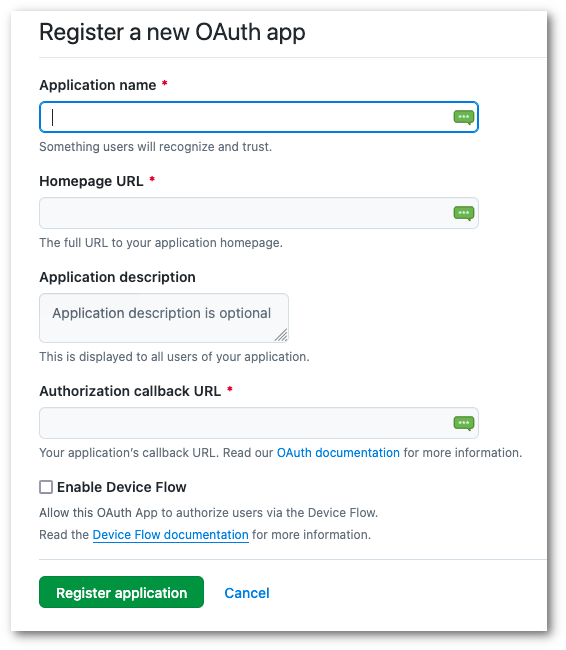

# How to deploy OAuth2 Proxy in Rahti

We will explain how to deploy and use [OAuth2 Proxy](https://oauth2-proxy.github.io/oauth2-proxy/) to provide authentication control
using Providers such as Google, GitHub, and others.

In this tutorial, we will see how to use GitHub

!!! warning
    This is a simple proof of concept. Naturally, your application should be able to control the access based on groups, email, username, ...

## Deploy your web application

First, we will deploy a very simple web application, this [flask demo](https://github.com/CSCfi/rahti-flask-hello). Follow the instructions
from the GitHub repo.

Don't create the Route, it won't be necessary because we will use `NGINX` as a reverse proxy.

## Deploy NGINX

You can use our [NGINX image](https://github.com/CSCfi/nginx-okd) to run NGINX on Rahti (OpenShift 4)

With Rahti, you can directly build the image. More information [here](../images/creating.md#using-the-source-to-image-mechanism)

Run this command:

```sh
oc new-app https://github.com/CSCfi/nginx-okd
```

Once the build is finished, run this command to create a Route:

```sh
oc create route edge flask-demo --service=nginx-okd --hostname=demo-oauth2.2.rahtiapp.fi --insecure-policy='Redirect' --port=8081
```

!!! info
    You can set your own `--hostname`. In this example, we are using Rahti default domain `2.rahtiapp.fi`.

    You can also use your own domain but in this case, you will need to create an `Ingress`.
    More information [here](https://kubernetes.io/docs/concepts/services-networking/ingress/)

We need to create a specific configuration to make NGINX run as reverse-proxy. For that, we will use a [ConfigMap](../concepts.md#configmap)

Create a new `configmap.yaml` file:

```yaml
apiVersion: v1
kind: ConfigMap
metadata:
  name: nginx-default
data:
  default.conf: |
    server {
      listen 8081; # NGINX service port
      server_name demo-oauth2.2.rahtiapp.fi; # The same as the --hostname created previously in the Route
    
    location /oauth2/ {
      proxy_pass       http://oauth2-proxy:4180;
      proxy_set_header Host                    $host;
      proxy_set_header X-Real-IP               $remote_addr;
      proxy_set_header X-Auth-Request-Redirect $request_uri;
      # or, if you are handling multiple domains:
      # proxy_set_header X-Auth-Request-Redirect $scheme://$host$request_uri;
    }
    
    location = /oauth2/auth {
      proxy_pass       http://oauth2-proxy:4180;
      proxy_set_header Host             $host;
      proxy_set_header X-Real-IP        $remote_addr;
      proxy_set_header X-Forwarded-Uri  $request_uri;
      # nginx auth_request includes headers but not body
      proxy_set_header Content-Length   "";
      proxy_pass_request_body           off;
    }
    
    location / {
      root   /usr/share/nginx/html;
      index  index.html index.htm;
      auth_request /oauth2/auth;
      error_page 401 =403 /oauth2/sign_in;
    
      # pass information via X-User and X-Email headers to backend,
      # requires running with --set-xauthrequest flag
      auth_request_set $user   $upstream_http_x_auth_request_user;
      auth_request_set $email  $upstream_http_x_auth_request_email;
      proxy_set_header X-User  $user;
      proxy_set_header X-Email $email;
      proxy_set_header Host $http_host;
    
      # if you enabled --pass-access-token, this will pass the token to the backend
      auth_request_set $token  $upstream_http_x_auth_request_access_token;
      proxy_set_header X-Access-Token $token;
    
      # if you enabled --cookie-refresh, this is needed for it to work with auth_request
      auth_request_set $auth_cookie $upstream_http_set_cookie;
      add_header Set-Cookie $auth_cookie;
    
      # When using the --set-authorization-header flag, some provider's cookies can exceed the 4kb
      # limit and so the OAuth2 Proxy splits these into multiple parts.
      # Nginx normally only copies the first `Set-Cookie` header from the auth_request to the response,
      # so if your cookies are larger than 4kb, you will need to extract additional cookies manually.
      auth_request_set $auth_cookie_name_upstream_1 $upstream_cookie_auth_cookie_name_1;
    
      # Extract the Cookie attributes from the first Set-Cookie header and append them
      # to the second part ($upstream_cookie_* variables only contain the raw cookie content)
      if ($auth_cookie ~* "(; .*)") {
          set $auth_cookie_name_0 $auth_cookie;
          set $auth_cookie_name_1 "auth_cookie_name_1=$auth_cookie_name_upstream_1$1";
      }
    
      # Send both Set-Cookie headers now if there was a second part
      if ($auth_cookie_name_upstream_1) {
          add_header Set-Cookie $auth_cookie_name_0;
          add_header Set-Cookie $auth_cookie_name_1;
      }
    
      proxy_pass http://course-flask-demo:8080/; # Set your backend, where you should be redirected. Here, our flask-demo webapp. It is the service name and its port.
    # or "root /path/to/site;" or "fastcgi_pass ..." etc
    }
    
      error_page   500 502 503 504  /50x.html;
      location = /50x.html {
        root   /usr/share/nginx/html;
      }
    }
```

You can find more information about this configuration on the [OAuth2 Proxy website](https://oauth2-proxy.github.io/oauth2-proxy/configuration/integration)

The most important values to modify in this ConfigMap are:

- `listen 8081`: Which represents the NGINX service port
- `server_name`: The same as the --hostname created previously in the Route
- `proxy_pass`: Set your backend, where you should be redirected. Here, our flask-demo webapp. It is the service name and its port.

Apply the ConfigMap configuration:

```sh
oc apply -f configmap.yaml
```

## Create your GitHub OAuth Apps

You need to go to [GitHub](https://github.com/settings/developers) > OAuth Apps

Click on New OAuth App



Fill in the different fields:

- **Application Name**: Give a name to your GitHub OAuth Application
- **Homepage URL**: The homepage of your web application. In this example, it will be the route of the NGINX reverse proxy (`https://demo-oauth2.2.rahtiapp.fi`)
- **Authorization callback URL**: Your applications's callback URL. In this example, it will be like `https://demo-oauth2.2.rahtiapp.fi/oauth2/callback`

## Deploy OAuth2 Proxy

To deploy [OAuth2 Proxy](https://oauth2-proxy.github.io/oauth2-proxy/), we will use a .yaml file. Create a new file named `oauth2.yaml` and copy this:

```yaml
apiVersion: apps/v1
kind: Deployment
metadata:
  labels:
    k8s-app: oauth2-proxy
  name: oauth2-proxy
spec:
  replicas: 1
  selector:
    matchLabels:
      k8s-app: oauth2-proxy
  template:
    metadata:
      labels:
        k8s-app: oauth2-proxy
    spec:
      containers:
      - args:
        - --provider=github
        - --client-id=<CLIENT_ID_FROM_GITHUB>
        - --client-secret=<CLIENT_SECRET_FROM_GITHUB>
        - --redirect-url=https://demo-oauth2.2.rahtiapp.fi/oauth2/callback
        - --email-domain=*
        - --reverse-proxy=true
        - --upstream=static://200
        - --http-address=0.0.0.0:4180
        - --set-authorization-header=true
        - --set-xauthrequest=true
        - --pass-access-token=true
        - --pass-authorization-header=true
        - --pass-user-headers=true
        - --pass-host-header=true
        - --cookie-secret=<YOUR_COOKIE_SECRET>
        image: quay.io/oauth2-proxy/oauth2-proxy:latest
        imagePullPolicy: Always
        name: oauth2-proxy
        ports:
        - containerPort: 4180
          protocol: TCP
        resources: {}

---

apiVersion: v1
kind: Service
metadata:
  labels:
    k8s-app: oauth2-proxy
  name: oauth2-proxy
spec:
  ports:
  - name: http
    port: 4180
    protocol: TCP
    targetPort: 4180
  selector:
    k8s-app: oauth2-proxy
```

The most important things are:

- `--provider=github`
- `--client-id=` Copy from the GitHub OAuth Apps created previously
- `--client-secret=` Copy from the GitHub OAuth Apps created previously
- `--cookied-secret=` You can generate one by running this command: `docker run -ti --rm python:3-alpine python -c 'import secrets,base64; print(base64.b64encode(base64.b64encode(secrets.token_bytes(16))));'`

Once done, apply the configuration:

```sh
oc apply -f oauth2.yaml
```

## Almost done

Now that we have:

1. Our web application
2. NGINX as a reverse proxy
3. Our GitHub OAuth App
4. OAuth2 proxy deployed

We need to tell NGINX to communicate with our OAuth2 Proxy that will reach GitHub to let us access our web application

Here is schema:


Do you remember that we created a ConfigMap earlier? What's the purpose of it? Well, it is going to be the new NGINX default configuration file.

Create a `patch-configmap.yaml` file:

```yaml
apiVersion: apps/v1
kind: Deployment
metadata:
  name: nginx-okd
spec:
  template:
    spec:
      containers:
        - name: nginx-okd
          volumeMounts:
            - mountPath: /etc/nginx/conf.d/
              name: nginx-default
      volumes:
        - configMap:
            name: nginx-default
            defaultMode: 420
          name: nginx-default
```

Patch your deployment:

```sh
oc patch deploy/nginx-okd --patch-file=patch-configmap.yaml
```

It will automatically trigger a new deployment of a NGINX pod.

Once the pod is ready, you can try your new configuration. Open your web application website (it should be the Route created during the deployment of NGINX
so https://demo-oauth2.2.rahtiapp.fi for this example).

You should see the OAuth2 Proxy Homepage and a **Sign in with GitHub** button.


Proceed

Once you have validated your credentials and let GitHub access your data, you should be redirected to the web application:


# Few comments

Congrats! You managed to deploy an OAuth2 Proxy to access your website.

Keep in mind that this example doesn't control the name, username or email. A good application must be able to check the email for example and
let the user access the applications or not.

Here is an example of OAuth2 Proxy + Kubernetes-Dashboard: <https://kubernetes.github.io/ingress-nginx/examples/auth/oauth-external-auth/#example-oauth2-proxy-kubernetes-dashboard>

In this example, it is possible to give access to the cluster by controlling the email of the user with [kubernetes RBAC](https://kubernetes.io/docs/reference/access-authn-authz/rbac/)
