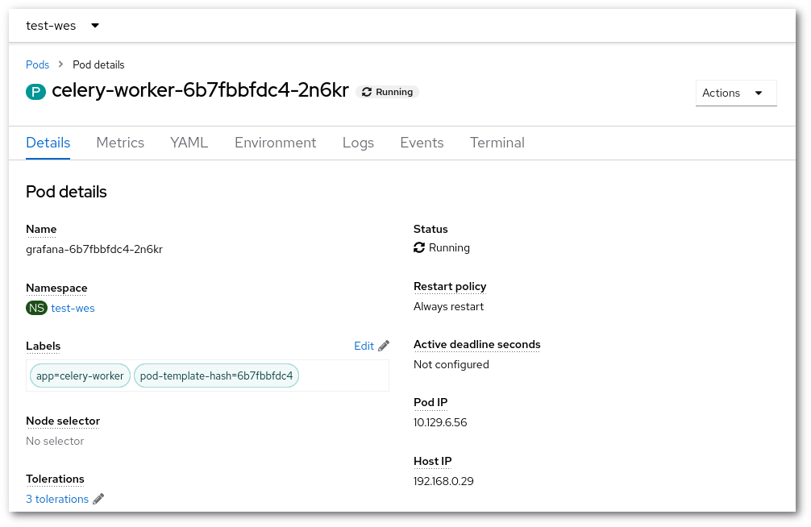

!!! warning "Keskitaso"
    Tässä opetusohjelmassa käytetään OpenShiftin komentorivityökalua [oc](../usage/cli.md)

    Kubernetes-ympäristön tuntemus on edellytys

# Podien (anti)affiniteetti { #pod-anti-affinity }

Pod-affiniteetin ja -anti-affiniteetin avulla voit rajoittaa, mille solmuille podit ajoitetaan, perustuen kyseisellä solmulla jo ajossa olevien podien tunnisteisiin. Tätä periaatetta voi käyttää myös tiettyjen solmujen valitsemiseen (tai välttämiseen), esimerkiksi kun ne sisältävät tietynlaisen laitteistokokoonpanon, kuten GPU:n.

Tämä on hyödyllistä, koska joskus (affiniteetti) halutaan varmistaa, että kaksi podia käyttää samaa liitettyä taltiota ja välttää verkon synkronointiongelmia, tai päinvastoin (anti-affiniteetti) varmistaa, että kaksi podia ei jaa samaa palvelinta ja näin parantaa sovelluksen käytettävyyttä.

Tässä käyttöönottoesimerkissä haluamme, että `wes-deployment`in podit ajetaan samassa solmussa kuin `celery-worker`in podit, jotta ne voivat liittää saman tallennustaltion (joka voidaan liittää vain yhteen fyysiseen solmuun).

```diff
diff --git a/charts/wes/templates/wes/wes-deployment.yaml b/charts/wes/templates/wes/wes-deployment.yaml
index 93ca230..e64349b 100644
--- a/charts/wes/templates/wes/wes-deployment.yaml
+++ b/charts/wes/templates/wes/wes-deployment.yaml
@@ -12,6 +12,16 @@ spec:
       labels:
         app: {{ .Values.wes.appName }}
     spec:
+      affinity:
+        podAffinity:
+          requiredDuringSchedulingIgnoredDuringExecution:
+          - labelSelector:
+              matchExpressions:
+              - key: app
+                operator: In
+                values:
+                - celery-worker
+            topologyKey: "kubernetes.io/hostname"
       initContainers:
```

`affinity`-lohkon tulee sijaita `spec`-osion alla. Jos tätä sovelletaan toiseen käyttöönottoon, tarvitsee muuttaa vain `value` ja mahdollisesti `key` siten, että ne vastaavat sitä `key`- ja `value`-paria, joka kuuluu siihen podin **tunnisteeseen**, johon halutaan affiniteetti. Podin **tunnisteet** on mahdollista nähdä komentoriviltä tai verkkokäyttöliittymästä.



Ja komentoriviltä:

```sh
$ oc describe pods celery-worker-6777488df4-s9tc7
Name:           celery-worker-6777488df4-s9tc7
Namespace:      wes
Priority:       0
Node:           rahti-comp-io-s25-d/192.168.54.13
Start Time:     Wed, 17 Jan 2024 14:55:57 +0200
Labels:         app=celery-worker
                deployment=celery-worker-57
(...)
```

Kun tähän käyttöönottoon lisätään `affinity`-lohko, ajoitin käynnistää (uudelleen) `wes-deployment`in podit samalle solmulle, jossa `celery-worker` on käynnissä. Koska käytössä oleva käytäntö on `requiredDuringSchedulingIgnoredDuringExecution`, jos valitussa solmussa ei ole tilaa, käyttöönotto ei onnistu. Toinen käytäntö on `preferredDuringSchedulingIgnoredDuringExecution`, mikä tarkoittaa, että ajoitus ei epäonnistu, vaikka valitussa solmussa ei olisi tilaa, vaan podit ajoitetaan toiselle solmulle.

Podien anti-affiniteetin osalta syntaksi on hieman erilainen. Tässä esimerkki:

```diff
diff --git a/charts/wes/templates/wes/wes-deployment.yaml b/charts/wes/templates/wes/wes-deployment.yaml
index 93ca230..e64349b 100644
--- a/charts/wes/templates/wes/wes-deployment.yaml
+++ b/charts/wes/templates/wes/wes-deployment.yaml
@@ -12,6 +12,16 @@ spec:
       labels:
         app: {{ .Values.wes.appName }}
     spec:
+      affinity:
+        podAntiAffinity:
+          requiredDuringSchedulingIgnoredDuringExecution:
+          - weight: 100
+            podAffinityTerm:
+              labelSelector:
+                matchExpressions:
+                - key: app
+                  operator: In
+                  values:
+                  - celery-worker
+            topologyKey: "kubernetes.io/hostname"
       initContainers:
```

Anti-affiniteettia varten tarvitaan kaksi uutta avainta:

- `weight` (alue 1–100): Ajoitin suosii podien ajoittamista solmuihin, jotka täyttävät anti-affiniteetin ehdot. Eniten suosittu solmu on se, jonka painojen summa on suurin; toisin sanoen jokaiselle solmulle, joka täyttää kaikki ajoitusvaatimukset (resurssipyynnöt, requiredDuringScheduling-anti-affiniteetin ehdot jne.), lasketaan summa käymällä tämän kentän alkiot läpi ja lisäämällä summaan kentän "weight", jos solmussa on podeja, jotka vastaavat kyseistä podAffinityTerm-arvoa; suurimman summan saaneet solmut ovat ensisijaisia. Kaikkien osuneiden WeightedPodAffinityTerm-kenttien painot lasketaan solmukohtaisesti yhteen, jotta löydetään ensisijaiset solmut.

- `podAffinityTerm`: Määrittelee joukon podeja, joiden kanssa tämän podin ei tule sijaita samassa paikassa (anti-affiniteetti), missä samasijainti tarkoittaa ajamista solmussa, jonka tunnisteen avaimen <topologyKey> arvo vastaa minkä tahansa kyseisen podijoukon podin ajosolmun arvoa.

Lisätietoja ja lisää esimerkkejä löydät täältä:

<https://kubernetes.io/docs/concepts/scheduling-eviction/assign-pod-node/#inter-pod-affinity-and-anti-affinity>