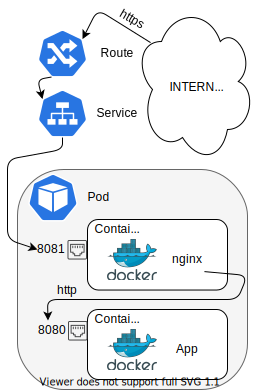

!!! error "Edistynyt taso"
    Sinulla tulee olla hyvä tietämys Kubernetes/OpenShift -ympäristöstä sekä käytettävästä työkalusta. Tässä tapauksessa [oc](../usage/cli.md)

    [Verkko](../networking.md) -tietämys on hyödyksi tässä tutoriaalissa

# Käänteinen välityspalvelimen autentikointi sivuvaunukontin avulla {#reverse-proxy-authentication-using-a-sidecar-container}

Konttia kutsutaan sivuvaunuksi, kun: se sijaitsee samassa Podissa kuin toinen "pää"kontti ja se tarjoaa jonkin toiminnallisuuden tälle toiselle kontille. Kun kontit ovat samassa `Podissa`, ne jakavat saman verkon, sijaitsevat aina samassa solmussa, ja ne luodaan ja tuhotaaan yhtäaikaisesti.

Yksi tämän suunnittelumallin käyttötavoista on käänteinen välityspalvelin, joka hoitaa autentikoinnin. Ajatuksena on, että meillä on Flask-sovellus, joka pyörii konteissa Podissa. Samassa Podissa luomme nginx-kontin. Tämä nginx-palvelin yhdistää Flask-sovellukseen käyttäen Podin sisäistä verkkoa ja toteuttaa autentikoinnin. Tässä tapauksessa se käyttää oletus-käyttäjänimeä ja -salasanaa.



## Käyttöönotto {#deployment}

Ensin luo projekti:

```bash
oc new-project <OPEN_SHIFT_PROJECT_NAME> --description="csc_project: <CSC_PROJECT_NUMBER>" \
    --display-name="Sidecar test tutorial"
```

Sitten kloonaa tämän tutoriaalin arkisto:

```bash
git clone https://github.com/CSCfi/nginx-sidecar.git
```

Arkistossa on kansio `templates`, missä luomme objektit yksitellen:

* Ensin [Deployment](https://github.com/CSCfi/nginx-sidecar/blob/master/templates/Deployment.yaml), joka luo `Podin`:

```bash
oc create -f templates/Deployment.yaml
```

* Sitten [Service](https://github.com/CSCfi/nginx-sidecar/blob/master/templates/Service.yaml), joka yhdistää nginxin porttiin 8081:

```bash
oc create -f templates/Service.yaml
```

* Lopuksi luo reitti:

```bash
oc create route edge sidecar --service=python-and-sidecar --insecure-policy='Redirect'
oc get route sidecar
```

Ensimmäinen komento luo reitin, ja toinen antaa DNS-nimen, jonka OpenShift valitsi sille.

## Testi {#test}

Jos kaikki sujui odotetusti, syöttämällä edellisen vaiheen DNS-nimen, selain kysyy käyttäjänimeä ja salasanaa (`admin`/`admin1041`), ja sen jälkeen näytetään viesti "Hello World".

## Yhteenveto {#conclusion}

Tämä on vain yksinkertainen esimerkki suunnittelumallista. Kaksi tai useampi kontti työskentelemässä yhdessä samalla paikallisverkolla, yleensä yksi konteinista on "pää"kontti, jolle muut tarjoavat lisätoiminnallisuutta. Tätä konseptia voidaan laajentaa käyttämällä muita autentikointimenetelmiä, kuten LDAP tai OpenID. Myös tämä malli on hyödyllinen tiedostojen palveluun, missä tiedostot isännöidään "hitaassa mutta turvallisessa" tiedostojärjestelmässä ja sivuvaunukontti siirtää nämä tiedostot `emptyDir`-kansioon, joka on väliaikainen nopea tiedostojärjestelmä, jonka Rahti tarjoaa.
