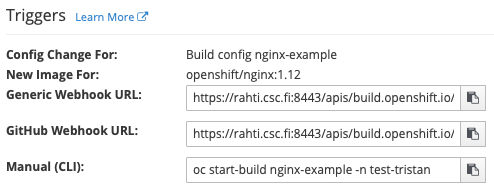
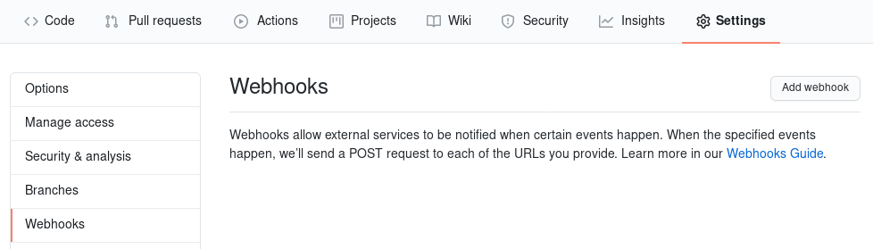
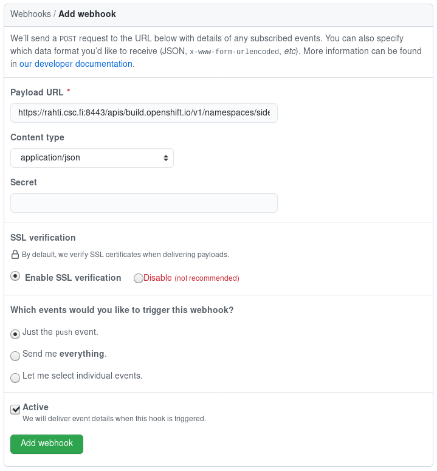

# Webhooks

Webhooks are URLs that allow triggering actions in a system. Rahti supports webhooks to trigger rebuilds. This means that each BuildConfig is listening to a particular URL that includes a secret (more about that later), and that when this URL is called, a build will be triggered. There few types of formats supported: Generic, GitHub, GitLab and Bitbucket. This means that if the source code of the application is in Gitlab, the Gitlab URL type is the one that should be filled in in Gitlab's side.


## Using the command line
First, it is necessary to find the secret, in the BuildConfig (in this case called `serveimg-generate`) look for the GitHub secret:

```bash
oc get bc/serveimg-generate -o yaml
```


```yaml
...
spec:
...
  triggers:
  - github:
      secret: <secret>
    type: GitHub
...
```

When the BuildConfig is configured to be triggered by the webhook, and the
corresponding secret exists, the webhook URL can be found by using the command `oc describe`:

```bash
$ oc describe bc/serveimg-generate
Name:                serveimg-generate
.
.
.
Webhook GitHub:
        URL:        https://rahti.csc.fi:8443/apis/build.openshift.io/v1/.../<secret>/github
.
.
.
```

## Using the web interface
In the Application Console, go to **Builds > Builds**, select your build and go to the **Configuration tab**. Find the GitHub URL and copy it:  



## Set Webhooks in GitHub

Finally, go to [GitHub](https:///github.com), go to the repository where the code is, and in Settings > Webhooks, click on "Add webhook".

 

The GitHub WebHook payload URL is the URL above with `<secret>` replaced with the value of `spec.triggers.github[secret]` above, and the content type is `application/json`. Leave the filed `Secret` empty.


