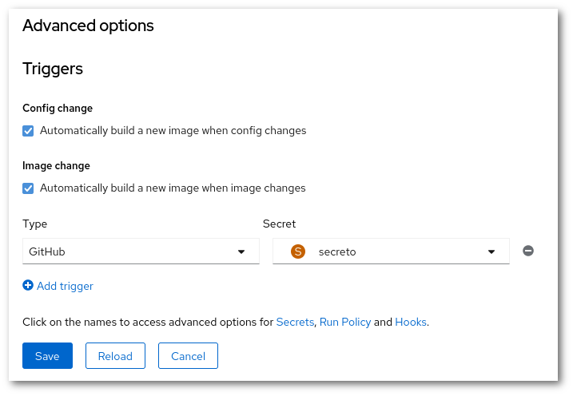

!!! success "Perustaso"
    Sinun täytyy tutustua Rahtin [verkkokäyttöliittymään](../usage/getting_started.md)

    Sinulla tulee olla tietoa Gitistä ja GitHubista. Lisäksi tarvitaan GitHub-tili.

# Webhooks {#webhooks}

Webhookit ovat URL-osoitteita, jotka mahdollistavat toimintojen käynnistämisen järjestelmässä. Rahti tukee webhooks-toimintoa uudelleenrakentamisen käynnistämiseen. Tämä tarkoittaa, että jokainen BuildConfig kuuntelee tiettyä URL-osoitetta, joka sisältää salaisuuden (lisätietoa myöhemmin), ja kun tätä URL-osoitetta kutsutaan, käynnistetään oletushaaran rakentaminen.

Muutamia formaatteja tuetaan: Yleinen, GitHub, GitLab ja Bitbucket. Tämä tarkoittaa, että jos sovelluksen lähdekoodi on GitLabissa, on valittava GitLab URL-tyyppi.

Tässä esimerkissä käytämme GitHub-tyyppiä.

## Salaisuuden luominen {#creating-a-secret}

`Kehittäjä`-valikossa siirry **Salaisuudet**-sivulle. Varmista, että olet oikeassa projektissa ja sitten klikkaa kohtaa **Luo -> Webhook-salaisuus**. Anna järkevä nimi. Ja klikkaa Generoi. Kirjoita muistiin luotu salaisuus. Ja **Tallenna**.

## URL-osoite {#getting-the-url}

Tarvitset jo luodun `BuildConfig`-objektin tai luo uusi. Uuden BuildConfigin luomiseksi katso artikkeli [Kuvan luominen](../images/creating.md).

Nyt sinun täytyy muokata BuildConfigia (**Toiminnot -> Muokkaa BuildConfigia**), ja lisätä laukaisu. Tee tämä klikkaamalla kohtaa "Laukaise", sivun alareunassa, "Lisäasetukset"-osiossa. Sitten klikkaa "Lisää laukaisu". Uudella laukaisulla täytyy olla tyyppi, meidän tapauksessa se on "GitHub". Se tarvitsee myös salaisuuden, valitse edellisessä vaiheessa luomasi salaisuus.

Kun `BuildConfig` on määritetty, voit saada URL-osoitteen verkkokäyttöliittymän kautta. Käyttämällä `Kehittäjä`-valikkoa, siirry **Rakennukset**-sivulle, ja valitse `BuildConfig`. `Webhookit`-osiossa näet "Kopioi URL salaisuuden kanssa". Klikkaa sitä, ja URL-osoite on leikepöydälläsi.

!!! Warning "Oletushaaran nimet eivät täsmää"

    Sinun täytyy varmistaa, että haaran nimet täsmäävät Rahtin ja GitHubin välillä. Rahtissa oletushaaran nimi on `master`, mutta GitHubissa oletushaaran nimi on `main`. Tämä tarkoittaa sitä, että oletuksena kaikki muutokset GitHubin `main`-nimisessä haarassa jätetään huomiotta Rahtin toimesta.

    Jos haluat, että muutokset `main`-haarassa poimitaan Rahtissa, sinun täytyy:

    1. Muokata **BuildConfigia**
    1. Laajentaa **Näytä lisäasetukset Git-vaihtoehdoille** kohdassa **Lähde**
    1. Lisätä oikea haaran nimi (tässä tapauksessa `master`) kohtaan **Git-viite**.

## GitHub {#github}

Kun olet saanut URL-osoitteen ja salaisuuden, mene osoitteeseen <https://github.com>. Mene siellä siihen repositorioon missä koodi on, ja kohdassa **Asetukset -> Webhooks**, klikkaa "Lisää webhook".

Sinun tarvitsee vain täyttää "Palautteen URL" ja "Salaisuus", ja vaihtaa sisällön tyyppi muotoon `Application/json`.

