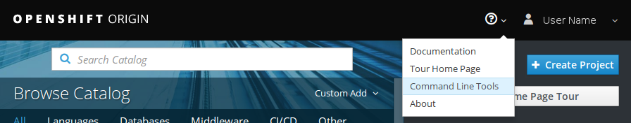
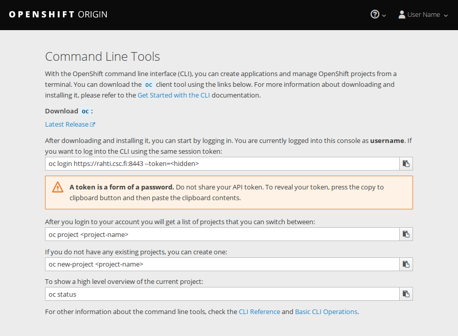

# Command line tool usage

\env{SYSTEM_NAME} can be used via the command line either with OpenShift's oc tool
or with the kubectl tool from Kubernetes. Certain features specific to OpenShift
are only available when using the oc tool.

## The "Command Line Tools" page in the OpenShift web UI

The information for downloading the oc tool and logging in from the command line
can be found in the "Command Line Tools" page in the web interface. After
logging in to the web interface, you can find the page here:



The oc tool is a single binary that just needs to be placed in your path. You
can find the oc command to login in one the fields on the page. There is a
button next to it to copy the command to the clipboard:



Copy the command and paste it into a terminal to start using OpenShift via the
command line.

!!! note
    If you open multiple terminals, the login session for oc will be active in
    all of them.

## CLI cheat sheet

**Basic usage:**

```bash
oc <command> <--flags>
oc help <command>
```

**Examples:**

Authorize CLI tool to the cluster:

```bash
oc login https://rahti.csc.fi:8443 --token=<secret access token>
```

This command can be obtained by clicking your usename and "Copy Login Command"
in the web console:


Show projects:

```bash
oc projects
```

Switch to project `my-project`:

```bash
oc project my-project
```

Show all pods in the current namespace:

```bash
oc get pods
```

Show all pods in namespace `<my-other-name-space>`:

```bash
oc get pods -n <my-other-namespace>
```

Show all pods that have key-value -pair `app: myapp` in `metadata.labels`:

```bash
oc get pods --selector app=myapp
```

Output specifications of pod `mypod`

```bash
oc get pod mypod -o yaml
```

### Other useful commands

* `oc create` creates an object. Example: `oc create -f file.yaml`
* `oc replace` replaces object. Example: `oc replace -f file.yaml`
* `oc delete` deletes object in openshit. Example: `oc delete rc
  myreplicationcontroller`
* `oc apply` modifies object according to input. Example `oc apply -f
  file.yaml`
* `oc explain` prints out API documentation. Example: `oc explain dc.spec`
* `oc edit` loads object from API to local editor chosen by `$EDITOR`
  environment variable. Example: `oc edit DeploymentConfig mydc`

## Abbreviations

Object types have abbreviations that are recognized on CLI:

|Abbreviation |Meaning|
|-----:|:-------|
|`is`|`ImageStream`|
|`dc`|`DeploymentConfig`|
|`svc`|`Service`|
|`bc`|`BuildConfig`|
|`rc`|`ReplicationController`|
|`pvc`|`PersistentVolumeClaim`|

## More documentation

See the official documentation for more information on using the command line
interface:

* [OpenShift documentation: CLI reference](https://docs.okd.io/latest/cli_reference/index.html)
