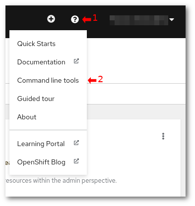

# Komentorivityökalun käyttö {#command-line-tool-usage}

Rahti voidaan käyttää komentorivin kautta joko OpenShiftin _oc_-työkalulla tai Kubernetesin _kubectl_-työkalulla. Tietyt OpenShiftille ominaiset toiminnot ovat saatavilla vain oc-työkalun avulla.

## Miten asentaa `oc`-työkalu {#how-to-install-the-oc-tool}

Oc-työkalu on yksi binaaritiedosto, joka tarvitsee vain lisätä _path_:iin. Voit ladata sen OpenShiftin dokumentaation [Getting started with the OpenShift CLI](https://docs.openshift.com/container-platform/4.15/cli_reference/openshift_cli/getting-started-cli.html) -sivulta. Noudata linkissä olevia yksityiskohtaisia ohjeita.

Testataksesi, että työkalu on asennettu oikein, avaa uusi pääte, siirry mihin tahansa kansioon ja suorita:

```
$ oc --help
```

Sen pitäisi näyttää kaikki käytettävissä olevat komennot.

## "Komentorivityökalut" -sivu OpenShiftin web-käyttöliittymässä {#the-command-line-tools-page-in-the-openshift-web-ui}

Oc-työkalun latausohjeet, mukaan lukien latauslinkki useille alustoille ja käyttöjärjestelmille, löytyvät web-käyttöliittymän "Komentorivityökalut" -sivulta:



Klikkauksen jälkeen sinua tervehtii näytöllä seuraavanlainen näkymä:


## Miten kirjautua `oc`:lla? {#how-to-login-with-oc}

Oc-komennon kirjautumisohje löytyy nimesi vieressä olevasta pudotusvalikosta.
Siinä on myös nappi, jolla komento voidaan kopioida leikepöydälle. Kopioi komento ja liitä se päätteeseen aloittaaksesi OpenShiftin käytön komentoriviltä. Komento näyttää tältä:

```bash
oc login https://api.2.rahti.csc.fi:6443 --token=<salainen pääsytunnus>
```

Tämä komento voidaan saada klikkaamalla käyttäjänimeäsi ja "Copy Login Command" web-konsolissa:


!!! info "sudo"

    Jos avaat useita päätteitä, oc:n kirjautumissessio on aktiivinen kaikissa.

!!! info "Helm login"
    Jos käytät Helmiä etkä ole kirjautunut sisään, saatat kohdata virheen, kuten:
    ```sh
    $ helm ls       
    Error: Kubernetes cluster unreachable: Get "http://localhost:8080/version": dial tcp 127.0.0.1:8080: connect: connection refused
    ```

## Miten kirjautua rekisteriin? {#how-to-login-in-the-registry}

Käyttääksesi Rahtin sisäistä konttirekisteriä, on tarpeen kirjautua erikseen. Kun olet kirjautunut sisään, voit käyttää docker-asiakasta `pull`- ja `push`-komentoihin Rahtin rekisterissä.

### Käyttäen henkilökohtaista tiliä {#using-personal-account}

Kun kirjaudut sisään `oc`:lla, voit käyttää komentoa luodaksesi tunnisteen (`oc whoami -t`):

`docker login -p $(oc whoami -t ) -u unused image-registry.apps.2.rahti.csc.fi`

!!! info "sudo käyttö"
    Jotkut docker-asiakasasennukset vaativat `docker`-asiakkaan ajamista root-käyttäjänä käyttäen `sudo`:a. Tässä tapauksessa `oc login` -komento täytyy myös suorittaa käyttäen `sudo`:a. Tämä johtuu siitä, että kirjautumistiedot säilytetään käyttäjän kotihakemistossa, joten vain käyttäjä, joka suorittaa `oc login` -komennon, on kirjautunut Rahtiin.

    Yleisohjeena on parempi käyttää muita non-root-ajokorttiohjelmia, kuten podmania, aina kun mahdollista. On myös mahdollista konfiguroida Docker non-root-käyttäjää varten. Tämän tekemiseksi useimmissa Linux-jakeluissa tulee vain suorittaa tämä komento:  
    
    ```sh
    sudo usermod -aG docker $USER
    ```

    Ja sitten kirjaudu ulos ja takaisin sisään, jotta ryhmäjäsenyyden uudelleentarkastelu tapahtuu.

### Käyttäen palvelutilin tunnistetta {#using-a-service-account-token}

Rahti tarjoaa myös mahdollisuuden käyttää sisäistä palvelutiliä rekisterin kanssa toimimiseen. Tämä on suositeltavaa automatisoiduille menettelyille, kuten CI-putkiloille. Vaikka oletuksena kolme sisäistä palvelutiliä luodaan jokaiseen Rahtin namespaceen: builder, default ja deployer, on suositeltavaa luoda erityinen sisäinen palvelutili ja määrittää sille `system:image-pusher`-rooli.

```sh
oc create serviceaccount pusher
oc policy add-role-to-user system:image-pusher -z pusher
docker login -p $(oc create token pusher) -u unused image-registry.apps.2.rahti.csc.fi
```

Tämä palvelutilin tunniste, jonka saat `oc sa get-token pusher` -komennolla, ei vanhene.

## Komentorivin lunttitaulu {#cli-cheat-sheet}

**Peruskäyttö:**

```bash
oc <komento> <--liput>
oc help <komento>
```

**Esimerkkejä:**

Näytä projektit:

```bash
oc projects
```

Vaihda projektiin `my-project`:

```bash
oc project my-project
```

Näytä kaikki podit nykyisessä nimiavaruudessa:

```bash
oc get pods
```

Näytä kaikki podit nimiavaruudessa `<my-other-name-space>`:

```bash
oc get pods -n <my-other-namespace>
```

Näytä kaikki podit, joilla on avain-arvopari `app: myapp` `metadata.labels`-kohdassa:

```bash
oc get pods --selector app=myapp
```

Tulosta podin `mypod` määrittelyt:

```bash
oc get pod mypod -o yaml
```

### Muut hyödylliset komennot {#other-useful-commands}

* `oc create` luo objektin. Esimerkki: `oc create -f file.yaml`
* `oc replace` korvaa objektin. Esimerkki: `oc replace -f file.yaml`
* `oc delete` poistaa objektin OpenShiftissa. Esimerkki: `oc delete rc myreplicationcontroller`
* `oc apply` päivittää objektin syöttötietojen mukaan. Esimerkki `oc apply -f file.yaml`
* `oc explain` tulostaa API-dokumentaation. Esimerkki: `oc explain deploy.spec`
* `oc edit` lataa objektin API:sta paikalliseen editoriin, jonka `$EDITOR`
  ympäristömuuttuja määrää. Esimerkki: `oc edit Deployment mydeploy`

## Lyhenteet {#abbreviations}

Objektilajeilla on lyhenteitä, jotka CLI tunnistaa:

|Lyhenne |Merkitys|
|-----:|:-------|
|`is`|`ImageStream`|
|`dc`|`DeploymentConfig`\*|
|`svc`|`Service`|
|`bc`|`BuildConfig`|
|`rc`|`ReplicationController`|
|`pvc`|`PersistentVolumeClaim`|

\* Deployment Config on vanhentunut

## Lisädokumentaatio {#further-documentation}

Katso virallinen dokumentaatio saadaksesi lisätietoja komentorivikäyttöliittymän käytöstä:

* [OpenShift dokumentaatio: CLI viite](https://access.redhat.com/documentation/en-us/openshift_container_platform/4.10/html-single/cli_tools/index)
