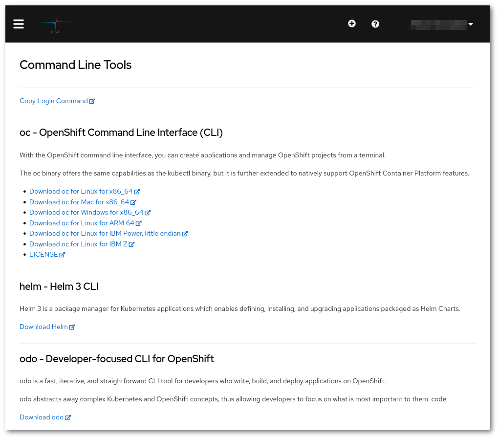

# Komentorivityökalun käyttö { #command-line-tool-usage }

Rahtia voidaan käyttää komentoriviltä joko OpenShiften _oc_-työkalulla tai Kubernetesin _kubectl_-työkalulla. Tietyt OpenShiftiin liittyvät ominaisuudet ovat käytettävissä vain, kun käytät oc-työkalua.

## Rahti-verkkokäyttöliittymän "Command Line Tools" -sivu { #the-command-line-tools-page-in-the-rahti-web-ui }

_oc_-työkalu on yksittäinen binääri, joka tarvitsee vain lisätä _path_:iin. Ohjeet oc-työkalun lataamiseen (mukaan lukien latauslinkit useille alustoille ja käyttöjärjestelmille) löytyvät verkkokäyttöliittymän [Command Line Tools](https://console.rahti.csc.fi/command-line-tools) -sivulta:


klikkauksen jälkeen sinua tervehtii:



Lataa tarvittava paketti ja kopioi se _path_:iin.

Varmistaaksesi, että asennus onnistui, avaa uusi terminaali, siirry mihin tahansa kansioon ja suorita:

```
$ oc --help
```

Komennon pitäisi näyttää kaikki käytettävissä olevat komennot.

## Kuinka kirjautua `oc`:lla? { #how-to-login-with-oc }

oc-kirjautumiskomento löytyy nimesi vieressä olevasta pudotusvalikosta. Sen vieressä on painike, jolla komento kopioidaan leikepöydälle. Kopioi komento ja liitä se terminaaliin aloittaaksesi OpenShiften käytön komentoriviltä. Komento näyttää tältä:

```bash
oc login https://api.2.rahti.csc.fi:6443 --token=<secret access token>
```

Tämän komennon saat napsauttamalla käyttäjätunnustasi ja "Copy Login Command" verkkokonsolissa:


!!! info "sudo"

    Jos avaat useita terminaaleja, oc:n kirjautumisistunto on aktiivinen niissä kaikissa.

!!! info "Helm login"
    Jos käytät Helmiä (Helm) etkä ole kirjautunut sisään, saatat saada virheen, kuten:
    ```sh
    $ helm ls       
    Error: Kubernetes cluster unreachable: Get "http://localhost:8080/version": dial tcp 127.0.0.1:8080: connect: connection refused
    ```

## Kuinka kirjautua rekisteriin? { #how-to-login-in-the-registry }

Rahtin sisäisen konttirekisterin käyttämiseksi on kirjauduttava erikseen. Kun olet kirjautunut sisään, voit käyttää Docker-asiakasta suorittamaan `pull`- ja `push`-toiminnot Rahtin rekisteriin.

### Henkilökohtaisen tilin käyttäminen { #using-personal-account }

Kun olet kirjautunut sisään komennolla `oc`, voit luoda tunnuksen komennolla (`oc whoami -t`):

`docker login -p $(oc whoami -t ) -u unused image-registry.apps.2.rahti.csc.fi`

!!! info "sudo-käyttö"
    Joissakin Docker-asiakasohjelman asennuksissa `docker`-asiakas täytyy suorittaa root-käyttäjänä käyttäen `sudo`-komentoa. Tällöin myös `oc login` -komento täytyy suorittaa `sudo`:lla. Tämä johtuu siitä, että kirjautumistiedot tallennetaan käyttäjän kotihakemistoon; vain se käyttäjä, joka suorittaa `oc login` -komennon, on kirjautunut Rahtiin.

    Yleisenä suosituksena on käyttää muita "rootittomia" ajoaikoja, kuten podmania, aina kun mahdollista. On myös mahdollista määrittää Docker toimimaan ilman root-oikeuksia. Useimmissa Linux-jakeluissa tämä onnistuu komennolla:  
    
    ```sh
    sudo usermod -aG docker $USER
    ```

    Kirjaudu sen jälkeen ulos ja takaisin sisään, jotta ryhmäjäsenyys päivittyy.

### Palvelutilin tunnuksen käyttäminen { #using-a-service-account-token }

Rahti tarjoaa myös mahdollisuuden käyttää sisäistä palvelutiliä rekisterin kanssa toimimiseen. Tämä on suositeltavaa automatisoiduissa prosesseissa, kuten CI-putkissa. Vaikka jokaisessa Rahti-nimiavaruudessa luodaan oletuksena 3 sisäistä palvelutiliä: builder, default ja deployer, on suositeltavaa luoda oma erillinen sisäinen palvelutili ja antaa sille rooli `system:image-pusher`.

```sh
oc create serviceaccount pusher
oc policy add-role-to-user system:image-pusher -z pusher
docker login -p $(oc create token pusher) -u unused image-registry.apps.2.rahti.csc.fi
```

Tämä palvelutilin tunnus (se, jonka saat komennolla `oc sa get-token pusher`) ei vanhene.

## CLI-pikaopas { #cli-cheat-sheet }

**Peruskäyttö:**

```bash
oc <command> <--flags>
oc help <command>
```

**Esimerkkejä:**

Näytä projektit:

```bash
oc projects
```

Vaihda projektiin `my-project`:

```bash
oc project my-project
```

Näytä kaikki podit nykyisessä nimiavaruudessa:

```bash
oc get pods
```

Näytä kaikki podit nimiavaruudessa `<my-other-name-space>`:

```bash
oc get pods -n <my-other-namespace>
```

Näytä kaikki podit, joilla on avain–arvo‑pari `app: myapp` kohdassa `metadata.labels`:

```bash
oc get pods --selector app=myapp
```

Tulosta podin `mypod` määrittelyt

```bash
oc get pod mypod -o yaml
```

### Muita hyödyllisiä komentoja { #other-useful-commands }

* `oc create` luo objektin. Esimerkki: `oc create -f file.yaml`
* `oc replace` korvaa objektin. Esimerkki: `oc replace -f file.yaml`
* `oc delete` poistaa objektin OpenShiftissä. Esimerkki: `oc delete rc
  myreplicationcontroller`
* `oc apply` muokkaa objektia annetun syötteen mukaisesti. Esimerkki: `oc apply -f
  file.yaml`
* `oc explain` tulostaa API-dokumentaation. Esimerkki: `oc explain deploy.spec`
* `oc edit` lataa objektin API:sta paikalliseen editoriin, jonka määrittää `$EDITOR`-ympäristömuuttuja. Esimerkki: `oc edit Deployment mydeploy`

## Lyhenteet { #abbreviations }

Objektityypeillä on lyhenteitä, jotka CLI tunnistaa:

|Lyhenne |Merkitys|
|-----:|:-------|
|`is`|`ImageStream`|
|`dc`|`DeploymentConfig`\*|
|`svc`|`Service`|
|`bc`|`BuildConfig`|
|`rc`|`ReplicationController`|
|`pvc`|`PersistentVolumeClaim`|

\* Deployment Config on vanhentunut

## Lisädokumentaatio { #further-documentation }

Katso virallisesta dokumentaatiosta lisätietoja komentorajapinnan käytöstä:

* [OpenShift-dokumentaatio: CLI-viite](https://access.redhat.com/documentation/en-us/openshift_container_platform/4.10/html-single/cli_tools/index)