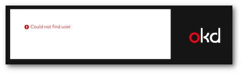
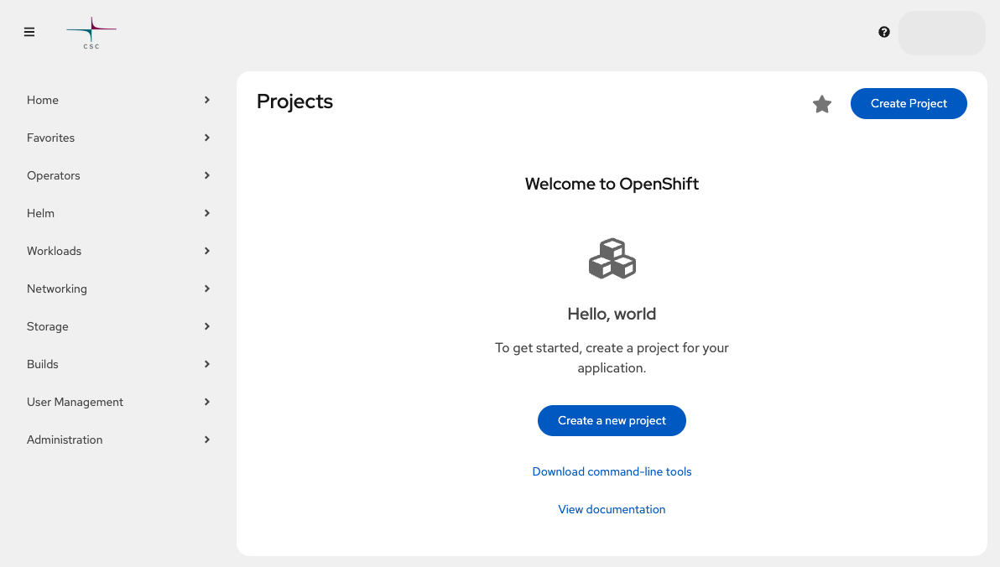

# Using the web interface

All applications launched in OpenShift run within **projects** that can be
created by any authenticated user. Each project has its own private virtual
network and it is isolated from other projects. Users can only see projects
they have created themselves or that have been shared with them. Any
containers, volumes and other resources created by users are always created
within a project. You might need to wait a few hours after your access application is accepted, before you can 
authenticate to Rahti.

You can either select applications to run from Home -> Software Catalog after [creating a project](projects_and_quota.md) or launch any applications using the
primitives described in the [background](../concepts.md) chapter.

1. Log in at <https://rahti.csc.fi/>.

    !!! Warning "User not found"
        If you get an error message similar to this please read through the article [Getting access](../access.md).
          

1. Click the 'Login page' button.

    > [MFA required] Since November 25th 2025

    Multi Factor Authentication (MFA) is required when login. For more information, visit the [Multi-Factor Authentication (MFA) Guide](../../../accounts/mfa.md)

1. After logging in you should see a page like this:

    

1. Proceed to [create a project](projects_and_quota.md) for running your applications.
