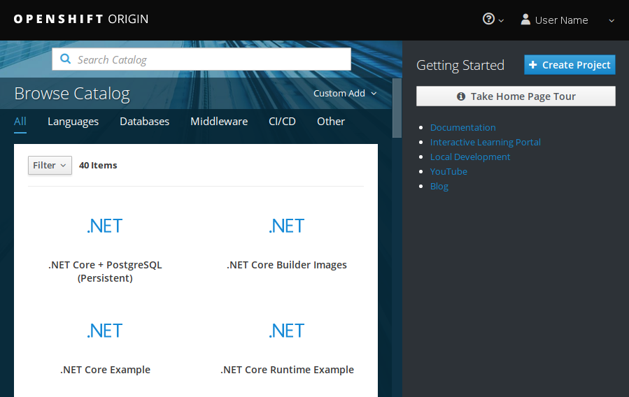

# Getting started

All applications launched in OpenShift run within **projects** that can be
created by any authenticated user. Each project has its own private virtual
network and is isolated from other projects. Users can only see projects
they have created themselves or that have been shared with them. Any
containers, volumes and other resources created by users are always created
within a project.

You can either select applications to run in the application catalog that is
visible when first logging in or launch any applications using the
primitives described in the [background](/cloud/rahti/concepts/) chapter.

Log in at <https://rahti.csc.fi:8443> (see [Getting access](/cloud/rahti/access)
for instructions). After logging in, you should see a page like this:

Proceed to [create a project](/cloud/rahti/usage/projects_and_quota/) for running your applications.
