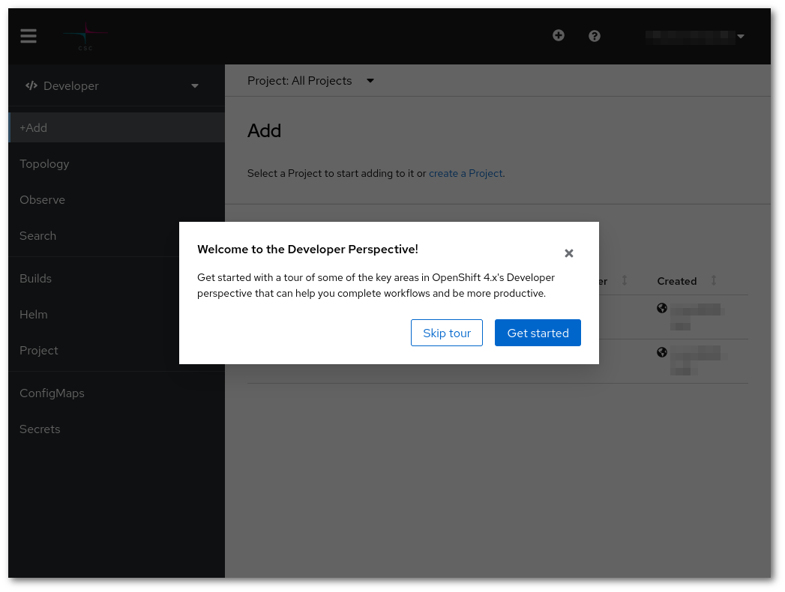

# Web-käyttöliittymän käyttö {#using-the-web-interface}

Kaikki OpenShiftissä käynnistetyt sovellukset toimivat **projekteissa**, joita
voi luoda kuka tahansa todennettu käyttäjä. Jokaisella projektilla on oma
yksityinen virtuaaliverkkonsa ja se on eristetty muista projekteista. Käyttäjät
nähdä vain itse luomiaan tai heille jaettuja projekteja. Käyttäjien luomat
kontit, volyymit ja muut resurssit luodaan aina projektin sisällä. Saatat joutua
odottamaan muutaman tunnin sen jälkeen, kun käyttöoikeushakemuksesi on hyväksytty,
ennen kuin voit todentaa Rahdissa.

Voit valita sovelluksia ajettavaksi sovelluskatalogista, joka näkyy
ensimmäisellä kirjautumisella, tai käynnistää sovelluksia käyttämällä 
[taustatietoihin](../concepts.md) kuvattuja perusosioita.

Kirjaudu sisään osoitteessa <https://rahti.csc.fi/>.

!!! Varoitus "Käyttäjää ei löydy"
    Jos saat virheviestin tämänkaltaisena, lue artikkeli [Käyttöoikeuden hankkiminen](../access.md).
      

Valitse RAHTI-2 ympäristö ja paina 'Kirjautumissivu' -painiketta.

Kirjautumisen jälkeen sinun pitäisi nähdä tämänkaltainen sivu:

Jatka [projektin luomiseen](projects_and_quota.md) sovellustesi ajamiseksi.
