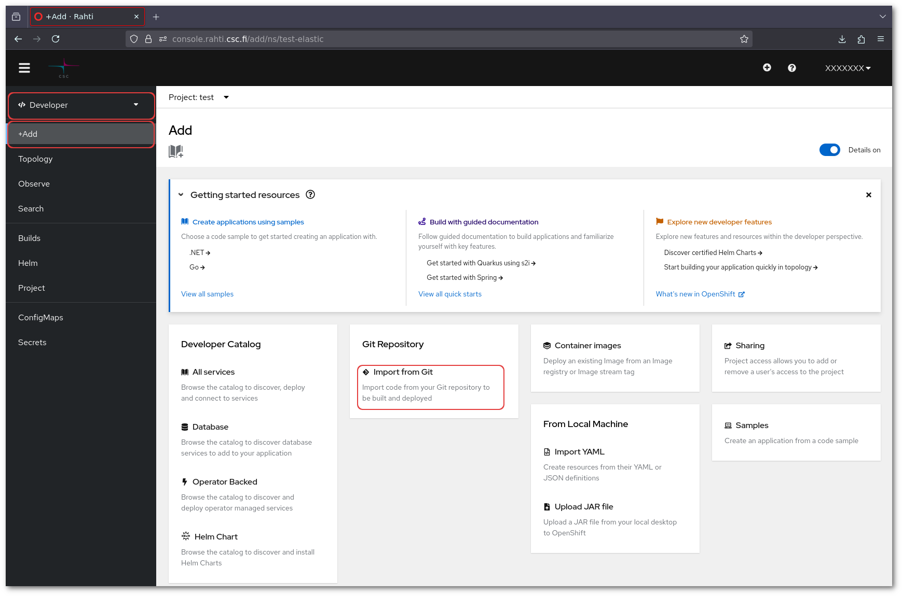
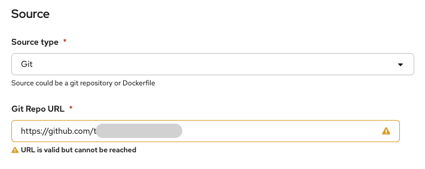
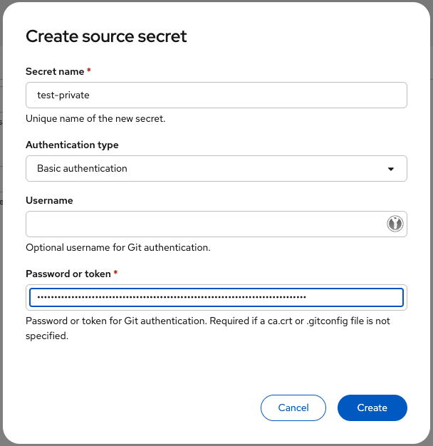
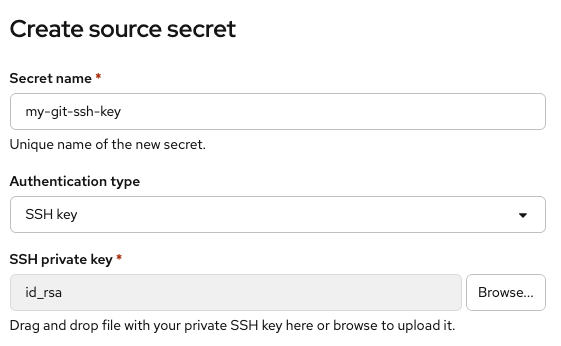

When using Rahti, you might need to build your own container images before deploying them. Possible reasons for doing 
so, include but not limited to:

* Package your application: this is the case when your application is available as source-code or executable, and you 
want run it in Rahti as containers.
* Specific dependencies: you are using an already built container image but the version of libraries, tools, or 
configurations inside it are not suitable for your needs.
* Rootless compatibility: Many public and open-source images assume root privileges. Re-building these images lets you 
ensure the application runs without root, which is a best practice enforced in Rahti.

  
Rahti's registry has an image size limit of 10 GB, this is because smaller images download faster, which reduces startup 
time for Pods in Kubernetes and improves the responsiveness of scaling operations. They also use less storage in 
registries and on cluster nodes, which matters in multi-tenant environments like Rahti. Moreover, a smaller image 
contains fewer packages and files, which reduces the potential attack surface and lowers the chance of including 
outdated or vulnerable components. This makes maintenance easier and improves overall security. Since smaller images include 
only what the application needs, they are more predictable, easier to debug, and simpler to reproduce across environments.

## Building images locally

In this example, we are going to build a custom version of the [official nginx image](https://hub.docker.com/_/nginx)
built over the [Alpine Linux](https://www.alpinelinux.org/) distribution, and make the necessary changes to make it rootless and 
compatible with Rahti policy. Three steps are needed to build an image in your machine or server:

1. First, create a file named `Dockerfile` that contains the instructions for building the custom container image. 
It specifies the base image to use, what files to add, what commands to run, and what settings the final image 
should have:

    ```Dockerfile
    FROM nginx:alpine

    # support running as arbitrary user which belongs to the root group
    RUN chmod g+rwx /var/cache/nginx /var/run /var/log/nginx && \
        chown nginx.root /var/cache/nginx /var/run /var/log/nginx && \
        # users are not allowed to listen on privileged ports
        sed -i.bak 's/listen\(.*\)80;/listen 8081;/' /etc/nginx/conf.d/default.conf && \
        # Make /etc/nginx/html/ available to use
        mkdir -p /etc/nginx/html/ && chmod 777 /etc/nginx/html/ && \
        # comment user directive as master process is run as user in OKD anyhow
        sed -i.bak 's/^user/#user/' /etc/nginx/nginx.conf

    WORKDIR /usr/share/nginx/html/
    EXPOSE 8081

    USER nginx:root
    ```

    this `Dockerfile` is:
    * Uses the `nginx:alpine` image hosted in Docker hub registry as base image.
    * Gives write permissions to the `root` group (not the `root` user) to several folders that nginx needs to write to
    (/var/cache/nginx, /var/run, /var/log/nginx, and /etc/nginx/html/). Rahti runs application using a random user and the 
    `root` group.
    * Changing the port where nginx listens to, as only root is allowed to listen on privileged ports (<1024).
    * And finally comment out the `user` configuration directive.

    The original `nginx:alpine` image has 5 layers, and  the `RUN` directive in our Docker file will add a new layer.

    A simpler example of `Dockerfile` could be:

    ```Dockerfile
    FROM ubuntu

    RUN apt install git
    ```

    This is installing git in the `ubuntu:latest` base image, and add also a new layer.

    See the [Dockerfile](https://docs.docker.com/engine/reference/builder/) reference docs.


2. Second, build the container image and give it a tag. This can be done by executing the following command in the same
directory as your Dockerfile. 


    ```bash
    docker build . -t nginx:rootless
    ```

    The instructions in your Dockerfile will be executed one by one to produce the final image container image. The value 
    you pass to `-t` is the name and tag that will be assigned to the image you are building. The name identifies the image,
    and the tag (after the colon) identifies a specific version of that image.

    You can see the built image in you local registry by running

    ```bash
    docker image ls
    ```

3. Finally, if you want to share your image with others, you will need to publish it to a remote registry. To do so,
you will need to give your image a new tag that points to the remote registry and then push it.

    ```bash
    docker tag nginx:rootless <remote-registry.example.com>/<registry-username>/nginx:rootless
    docker push <remote-registry.example.com>/<registry-username>/nginx:rootless
    ```

    !!! warning "Note"
        Images built for machines with architecture other than **amd64** are not runnable on Rahti. Either re-build them on 
        an **amd64** machine or convert them. You can also rebuild them directly in Rahti as described in the following section.


## Using Rahti to build container images

The methods below use Rahti to build container images.

### Using a local folder for building

This method allows building an image using a local folder containing a Dockerfile and the other required project files
(source code, executables, configuration, etc.). It is useful when it is impossible or inconvenient to allow Rahti to
clone your git repository directly. As prerequisites, you should have:

* Created a project in Rahti as described [here](../../get-started/projects.md)
* Logged in to the Rahti cluster using the `oc` [CLI](../../get-started/cli.md)

**Steps:**

1. Create [OKD BuildConfig](https://docs.okd.io/latest/cicd/builds/creating-build-inputs.html#builds-binary-source_creating-build-inputs) 
with build source set to binary. Be sure to not be in a directory under git version control:

    ```bash
    $ oc new-build --to=my-hello-image:devel --name=my-hello --binary
    ```

    The output should be similar to:

    ```bash
        * A Docker build using binary input will be created
          * The resulting image will be pushed to image stream tag "my-hello-image:devel"
          * A binary build was created, use 'start-build --from-dir' to trigger a new build

    --> Creating resources with label build=my-hello ...
        imagestream.image.openshift.io "my-hello-image" created
        buildconfig.build.openshift.io "my-hello" created
    --> Success
    ```

    OKD creates a **BuildConfig** with name `my-hello` object in your active project, it also creates a placeholder
    **ImageStream** object with name `my-hello-image` to host the resulting image.

2. Trigger the build process by providing the build artifacts (i.e., Dockerfile and other dependencies if any) to 
Rahti. 

    ```bash
    oc start-build my-hello --from-dir=/path/to/artifacts --follow
    ```

    Once the build is successfully completed, the resulting image will be available in [Rahti image registry](./integrated-registry.md). 

### Using the Source to Image (S2I) mechanism

Use S2I builds when you want to build a container image directly from source code without writing your own Dockerfile. 
S2I lets Rahti handle the build process using its default builder images for different runtime environment (e.g., Python, Node.js, Java, Go, 
PHP, Ruby). You can see the list of available build images in Rahti by running the following command:

```bash
oc get is -n openshift
```

S2I is a good choice when:

* Your application fits well into a standard runtime environment (e.g., Python/Flask, Node.js/Express, Java/Spring).
* You prefer to avoid maintaining Dockerfiles.
* You want Rahti to handle dependency installation, environment setup, and incremental builds.

S2I is not ideal when you need full control over the container image, custom OS packages, 
non-standard runtimes, or complex build steps. In such cases, a Dockerfile or binary build is better suited.

Assume you have a private Git repository containing a python application, you can import your application for build and
deployment in Rahti using the web console or the CLI.

#### Using the web console

* Click the plus button on the top right of the web console and choose **import from Git**.



* Enter the URL to your git repository in the **Git Repo URL** field. If your repository is private you will 
see the warning "**URL is valid but cannot be reached**" 



* Next, you need to provide authentication credentials. Two options are possible, a token or an ssh private key:
  1. **Option 1: Using a Token for Git Authentication**
     1.  **Generate a Personal Access Token:**
     
           - **GitHub:**
               - Go to your GitHub account settings.
               - Navigate to "Developer settings" > "Personal access tokens".
               - Click on "Generate new token".
               - Select the scopes you need (typically, you'll need `repo` scope for private repositories).
               - Generate the token and copy it.

           - **GitLab:**
                - Go to your GitLab profile settings.
                - Navigate to "Access Tokens".
                - Give your token a name, select the required scopes (e.g., `api`, `read_repository`), and create the token.
                - Copy the token.
             
     2. **Add the Token to Rahti:**
           - Under "Source Secret" choose "Create new Secret".
           - Name the secret, under "Authentication type" choose "Basic Authentication".
           - Paste the token and create.
        
           
  
  2. **Option 2: Using a Private SSH Key**
     1. **Generate an SSH Key Pair (if you don't have one already):**
     
        - Open a terminal and run the following command to generate a new SSH key pair:
         ```sh
         ssh-keygen -t rsa -b 4096 -C "your_email@example.com"
         ```
        - This will create two files: a private key (`id_rsa`) and a public key (`id_rsa.pub`).
     
     2. **Add Your Public Key to Your Git Hosting Service:**

        - **GitHub:**
            - Go to your GitHub account settings.
            - Navigate to "SSH and GPG keys".
            - Click "New SSH key" and paste the contents of your `id_rsa.pub` file.

        - **GitLab:**
            - Go to your GitLab profile settings.
            - Navigate to "SSH Keys".
            - Add a new SSH key and paste the contents of your `id_rsa.pub` file.

     3. **Add the Private SSH Key to Rahti:**
         - Under "Source Secret" choose "Create new Secret".
         - Name the secret, under "Authentication type" choose "SSH Key".
         - Paste the contents of your private SSH key (`id_rsa`) and create.

        

#### Using the CLI

1. Log into Rahti with [(`oc`) CLI](../../get-started/cli.md#how-to-login-with-oc):

    ```bash
    oc login <cluster-url>
    ```

2. Create a [New Project](../../get-started/projects.md#creating-a-project):

    ```bash
    oc new-project <project-name> --display-name=<display-name> --description="csc_project:<project-number>"
    ```

3. Create SSH Key Secret:

    ```bash
    oc create secret generic <secret-name> --from-file=ssh-privatekey=<path-to-private-key> --type=kubernetes.io/ssh-auth
    ```

4. Link the Secret to the Builder Service Account:

    ```bash
    oc secrets link builder <secret-name>
    ```

5. Deploy the Application:

    ```bash
    oc new-app <repository-url> --name=<application-name>
    ```

6. You can follow the build progress:

    ```bash
    oc logs bc/<application-name>
    ```

7. Once the build ends, the resulting image will be pushed to [Rahti's integrated registry](./integrated-registry.md).
Moreover, the container image will automatically be instantiated in Rahti via a Deployment object.

8. Optionally, you can expose your application to internet by running:

    ```bash
    $ oc expose service <application-name>
    ```

    This will create a [Route](../networking.md#routes) that you can check with:

    ```bash
    oc get route <application-name>
    ```

9. A new build can be triggered for the application by:

    ```bash
    oc start-build <application-name>
    ```

Alternatively, to trigger a build from a Gitlab or a Github repository you can checkout the [webhooks](https://docs.okd.io/latest/cicd/builds/triggering-builds-build-hooks.html#builds-webhook-triggers_triggering-builds-build-hooks) documentations.


### Using the inline Dockerfile method

It is possible to create a new build using a Dockerfile provided in the command line. By doing this, the `Dockerfile`
itself will be embedded in the Build object, so there is no need for an external Git repository.

```bash
oc new-build -D $'FROM almalinux:10'
```

In this example, we will build an image that is a copy of `AlmaLinux 10`.  It is also possible to create a build from a
local `Dockerfile`:

```bash
cat Dockerfile | oc new-build -D -
```

### Troubleshooting

* If a build fails due to authentication issues, set the build secret explicitly:
     
```bash
oc set build-secret --source bc/<application-name> <secret-name>
```

* If your build fails or it is very slow in Rahti, it could mean that you need to assign more resources to the BuildConfig object.
By default, the BuildConfig uses the [default request and limits](../../configurations/resource-quota.md) for running the builder Pod. In that case
you need to modify the BuildConfig YAML definition using the console or the CLI.

#### Update BuildConfig resources using the CLI

1. First, you need to get he YAML definition of the failed BuildConfig.

    ```bash
    oc get bc <name-of-failed-bc> -o yaml > fixed_buildconfig.yaml
    ```

2. Edit the fixed_buildconfig.yaml file in your favorite editor by adding the desired `resources` under `.spec` as follows:

    ```yaml
    apiVersion: build.openshift.io/v1
    kind: BuildConfig
    metadata:
      name: my-app-build
    spec:
      source:
        type: Git
        git:
          uri: https://github.com/example/my-app.git

      strategy:
        type: Docker
        dockerStrategy: {}

      output:
        to:
          kind: ImageStreamTag
          name: my-app:latest
      resources:
        requests:
          cpu: "500m"
          memory: "1Gi"
        limits:
          cpu: "1"
          memory: "2Gi"
    ```

    !!! info

        You can also use the command `oc edit bc <buildconfig-name>` to modify the BuildConfig object.


3. Apply the changes:

    ```bash
    oc apply -f fixed_buildconfig.yaml
    ```

4. Run the build again:

    ```bash
    oc start-build <buildconfig-name>
    ```

#### Update BuildConfig resources using the Web console

1. In Rahti console, navigate to `Builds > BuildConfigs` and click on your BuildConfig.
2. Select the `YAML` tab.
3. Add  the desired `resources` under `.spec` as follows:

    ```yaml
    apiVersion: build.openshift.io/v1
    kind: BuildConfig
    metadata:
      name: my-app-build
    spec:
      source:
        type: Git
        git:
          uri: https://github.com/example/my-app.git

      strategy:
        type: Docker
        dockerStrategy: {}
      output:
        to:
          kind: ImageStreamTag
          name: my-app:latest
        
      resources:
        requests:
          cpu: "500m"
          memory: "1Gi"
        limits:
          cpu: "1"
          memory: "2Gi"
    ```

4. Save the changes.

5. Run the build again:

    ```bash
    oc start-build <buildconfig-name>
    ```

Note that the ratio between requests and limits cannot be more than 5x.
Check out for more information in [here](../../configurations/resource-quota.md#default-pod-resource-limits).
