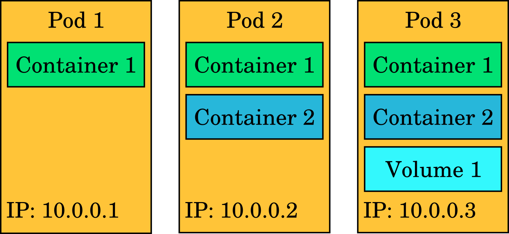
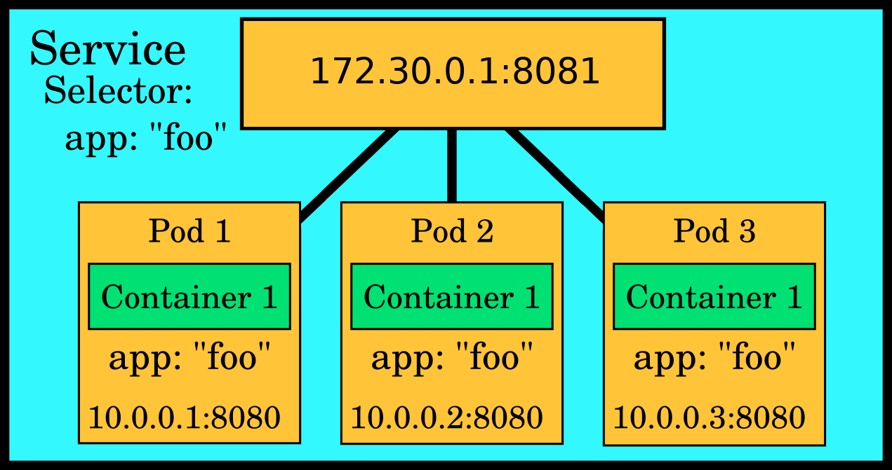
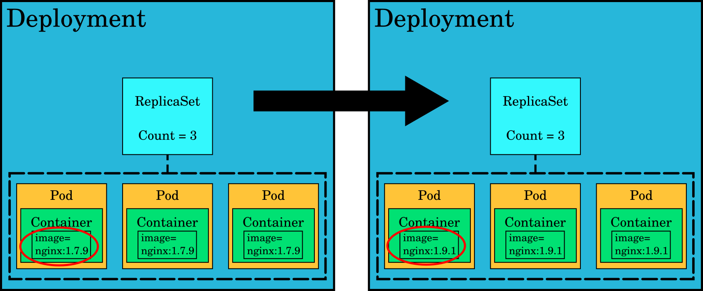
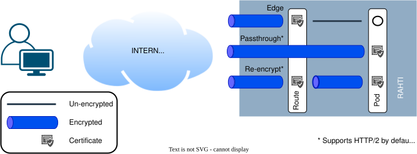

# Kubernetes and OKD concepts

The power of Kubernetes (and OKD) is in the relatively simple abstractions that they provide for complex tasks such as load balancing, software updates for a distributed system, or autoscaling. Here we give a very brief overview of some of the most important abstractions, but we highly recommend that you read the concept documentation for Kubernetes and OKD as well:

* [Kubernetes concepts](https://kubernetes.io/docs/concepts/)
* [OKD concepts](https://docs.okd.io/latest/architecture/architecture.html)

These abstractions are objects, persistent entities in the Kubernetes system. These entities are used to represent the desired state of the project (also called namespace in Kubernetes). Most of the objects are common to both plain Kubernetes and OKD, but OKD also introduces some of its own extra objects.


## Kubernetes concepts

### Namespace

 Most Kubernetes objects are created inside a **Namespace**. The namespace is just a sandbox where all the other objects are contained and isolated from objects belonging to other namespaces. In OKD, a namespace is referred to as a **Project**. Both terms (project and namespace) are very common words in computing, so referring to them can sometimes be confusing. In these documents, the terms _namespace_ and _Rahti project_ are used interchangeably. To create a project, please see the [Creating a project](../get-started/projects.md#creating-a-project) documentation.

### Pod

A **Pod** contains one or more containers that run applications. It is the basic unit in Kubernetes: when you run a workload in Kubernetes, it always runs in a pod. Kubernetes handles scheduling these pods on multiple servers. Pods can contain volumes of different types for accessing data. Each pod has its own IP address, shared by all containers in the pod; this IP address may change if the pod is killed and recreated. In the most typical case, a pod contains one container and perhaps one or a few different volumes.

Pods are intended to be _expendable_, i.e. they may be killed at any time, and a "cloud native" application must be able to continue working and show no sign of interruption to the user. It must recover automatically. Any data that needs to persist after a pod is killed should be stored on a [persistent volume](storage/persistent.md) attached to the pod.



The abstractions in Kubernetes/OKD are described using YAML or JSON. YAML and JSON are so-called data serialization languages: they provide a way to describe key-value pairs and data structures such as lists in a form that is easy to read for both humans and computers. Below is an example of what the representation of a pod looks like in YAML:

```yaml
apiVersion: v1
kind: Pod
metadata:
  name: example
  labels:
    app: foo
spec:
  securityContext:
    runAsNonRoot: true
    seccompProfile:
      type: RuntimeDefault
  containers:
    - name: httpd
      image: 'image-registry.openshift-image-registry.svc:5000/openshift/httpd:latest'
      ports:
        - containerPort: 8080
          protocol: TCP
      securityContext:
        allowPrivilegeEscalation: false
        capabilities:
          drop:
            - ALL
```

The above YAML representation describes a web server pod that has one container, and exposes port 8080. You could put this snippet of text in a file and create a pod that runs an Apache HTTP server by feeding that file to the Rahti API.

#### InitContainer

**initContainer** is a container in a pod that is intended to run to completion before the main containers are started. Data from the init containers can be transferred to the main container using, for example, empty volume mounts.


```yaml
apiVersion: v1
kind: Pod
metadata:
  name: example-pod
spec:
  initContainers:
    - name: init-permissions
      image: busybox
      command: ["sh", "-c", "mkdir -p /workdir/data && chmod 755 /workdir/data"]
      volumeMounts:
      - name: workdir
        mountPath: /workdir

  containers:
    - name: main-app
      image: nginx:latest
      volumeMounts:
      - name: workdir
        mountPath: /usr/share/nginx/html

  volumes:
    - name: workdir
      emptyDir: {}
```

The Pod definition above contains one init container and one main container. The init container named `init-permissions`  runs before the main container starts. In this example, the init container creates a directory and sets permissions inside a shared volume mounted at `/workdir`. Only when the init container finishes successfully does Kubernetes start the main container, which in this case runs Nginx. The main container mounts the same shared volume at `/usr/share/nginx/html`, so it can use the directory created by the init container.


### Service

The pod IP addresses are not predictable. If a pod is replaced as part of normal operations such as an update, the IP address of the new pod will be different. **Services** (also abbreviated `svc`) provide a _stable_ [private IP](https://en.wikipedia.org/wiki/Private_network) to one or more Pods. This IP will act as a load balancer, distributing the traffic load between the Pods behind it. For this, the service will make sure to keep an updated list of IPs so requests are only sent to valid ones.

Services are built to export one or more ports, and they also provide an internal DNS name. Any of these names are valid and will resolve to the same service IP:

* `<service_name>`, e.g., `example-svc`
* `<service_name>.<namespace>`, e.g., `example-svc.my-project`
* and `<service_name>.<namespace>.svc.cluster.local`, e.g., `example-svc.my-project.svc.cluster.local`

In the same manner as Pods, Services in Rahti can only be reached from inside the namespace in which they run; any request from another namespace will be able to resolve the DNS name to an IP, but will never connect due to the default [`NetworkPolicies`](../configurations/netpol.md). Another feature of services is that they can forward requests from one port to another target port (e.g. 80 to 8080). This is useful in Rahti, as Pods cannot listen on privileged ports (below 1024).

Services can be used for internal connections. For example, suppose we have one or more MongoDB database replicas running in the `my-project` namespace, each in a different pod, all exporting port `27017`. We can create a service called `mongo` associated with the pods under that name. We can then launch our Pods running a Python application that will use the URL `mongo:27017` to connect to the database. When a connection to the service is attempted, one of the mongo pods will be selected to serve the data request.




```yaml
apiVersion: v1
kind: Service
metadata:
  name: example-svc
spec:
  ports:
  - port: 8081
    protocol: TCP
    targetPort: 8080
    name: web-server
  selector:
    app: foo
  sessionAffinity: None
  type: ClusterIP
```

#### Ports
- The `ports` field in a Kubernetes Service defines the network ports that the Service will expose to clients and how it maps those to the corresponding ports on the pods.

- It typically consists of several components:

    - **Name**: A label for the port, which can help identify it.
    - **Port**: The port number that clients will use to access the Service.
    - **Protocol**: The communication protocol used (usually TCP).
    - **TargetPort**: The port (the name or the number) on the pod where the Service directs traffic.

#### Selector
- The `selector` field in a Kubernetes Service is crucial for determining which pods the Service should route traffic to.

- It consists of key-value pairs that match the labels assigned to the pods. The Service uses these labels to identify and connect to the appropriate pods dynamically.

- If multiple label selectors are used, they will be ANDED.

```yaml
selector:
  app: foo
```

- **Key-Value Pair (`app: foo`)**: This means that the Service will route traffic to any pods that have a label matching **app**: _foo_.

- **Functionality**: This allows the Service to connect to all relevant pods automatically. If any pods with this label are added or removed, the Service will adjust its routing accordingly, ensuring that traffic is always directed to the correct pods.


### ReplicaSet

A **ReplicaSet** ensures that _n_ copies of a pod are running. If one of the pods dies, the ReplicaSet creates a new one in its place. ReplicaSets are typically not used directly but rather as part of a **Deployment** that is explained next.


### Deployment

**Deployments** manage updates for an application. They typically contain a ReplicaSet and several pods. If you make a change that requires an update, such as switching to a newer image for the pod containers, the deployment ensures the change is applied without any service based on its strategy. A typical strategy will perform a rolling update, killing all pods one by one and replacing them with newer ones, while making sure that end-user traffic is directed towards working pods at all times.




### StatefulSet

Most Kubernetes objects are stateless. This means that they may be deleted and recreated, and the application should be able to cope with that without any visible effect. For example, a Deployment might define a Pod with 5 replicas and a rolling update strategy. When a new image is deployed, Kubernetes gradually replaces the old Pods with new ones, recreating them with different names and possibly on different nodes, while keeping enough replicas available to serve traffic throughout the rollout (bounded by the strategy's `maxUnavailable` and `maxSurge` settings). For some applications this is not acceptable, and it is for this use case that **StatefulSets** were created.

Like a Deployment, a StatefulSet defines its Pods from a common Pod template. But unlike a Deployment, whose Pods are interchangeable, a StatefulSet gives each Pod a stable, unique identity that is preserved across rescheduling, restarts, and updates. A StatefulSet provides:

* Stable, unique network identifiers.
* Stable, persistent storage.
* Ordered, graceful deployment and scaling.
* Ordered, automated rolling updates.


```yaml
apiVersion: apps/v1
kind: StatefulSet
metadata:
  name: web
spec:
  selector:
    matchLabels:
      app: nginx # has to match .spec.template.metadata.labels
  serviceName: "nginx"
  replicas: 3 # If omitted, by default is 1
  template:
    metadata:
      labels:
        app: nginx # has to match .spec.selector.matchLabels
    spec:
      terminationGracePeriodSeconds: 10
      containers:
      - name: nginx
        image: openshift/hello-openshift
        ports:
        - containerPort: 8888
          name: web
        volumeMounts:
        - name: www
          mountPath: /usr/share/nginx/html
  volumeClaimTemplates:
  - metadata:
      name: www
    spec:
      accessModes: [ "ReadWriteOnce" ]
      storageClassName: "standard-csi"
      resources:
        requests:
          storage: 1Gi
```

### Job

A **Job** uses pods to execute a specific task one or several times, and will continue to retry execution of the Pods until a specified number of them successfully terminate or a backoff limit is reached. As pods successfully complete, the Job tracks the successful completions. When a specified number of successful completions is reached, the task (i.e. the Job) is complete. Deleting a Job will clean up the Pods it created. Suspending a Job will delete its active Pods until the Job is resumed again.


```yaml
apiVersion: batch/v1
kind: Job
metadata:
  name: pi
spec:
  template:
    spec:
      volumes:
      - name: smalldisk-vol
        emptyDir: {}
      containers:
      - name: pi
        image: perl
        command:
        - sh
        - -c
        - >
          echo helloing so much here! Lets hello from /mountdata/hello.txt too: &&
          echo hello to share volume too >> /mountdata/hello-main.txt &&
          cat /mountdata/hello.txt
        volumeMounts:
        - mountPath: /mountdata
          name: smalldisk-vol
      restartPolicy: Never
      initContainers:
      - name: init-pi
        image: perl
        command:
        - sh
        - -c
        - >
          echo this hello is from the initcontainer >> /mountdata/hello.txt
        volumeMounts:
        - mountPath: /mountdata
          name: smalldisk-vol
  backoffLimit: 4
```

This job names the pod automatically, and the pod can be queried with a job-name label:

```bash
$ oc get pods --selector job-name=pi
NAME       READY     STATUS      RESTARTS   AGE
pi-gj7xg   0/1       Completed   0          3m
```

The standard output of the job:

```bash
$ oc logs pi-gj7xg
helloing so much here! Lets hello from /mountdata/hello.txt too:
this hello is from the initcontainer
```

There may only be one object with a given name in the project namespace; thus, the job cannot be run twice unless its first instance is removed. The pod, however, does not need to be cleaned up; it will be removed automatically in cascade after the Job is removed.

### CronJob

A **CronJob** builds on the Job concept by running Jobs on a repeating schedule. Instead of executing once, a CronJob creates a new Job at the times you specify with a cron expression (for example, every night or once an hour), which is convenient for recurring work such as backups, report generation, or periodic clean-up. Each scheduled run produces a Job like the one shown below, which in turn creates the Pods that carry out the task.

```yaml
apiVersion: batch/v1
kind: CronJob
metadata:
  name: hello
spec:
  schedule: "30 14 * * *"  # At 14:30 everyday.
  jobTemplate:
    spec:
      template:
        spec:
          containers:
          - name: hello
            image: busybox:1.28
            imagePullPolicy: IfNotPresent
            command:
            - /bin/sh
            - -c
            - date; echo Hello from the Rahti!
          restartPolicy: OnFailure
```


The example CronJob above will create a pod every day at 14:30 and run it to completion.

### ConfigMap

**ConfigMaps** are useful in collecting configuration type data in Kubernetes objects. Their contents are communicated to containers by environmental variables or `volumeMounts`.

```yaml
kind: ConfigMap
apiVersion: v1
metadata:
  name: my-config-map
data:
  data.prop.a: hello
  data.prop.b: bar
  data.prop.long: |-
    fo=bar
    baz=notbar
```

#### Create a ConfigMap

ConfigMaps can be created in various ways. If we have a ConfigMap object definition like the one listed above in `configmap.yaml`, an instance of it can be created using the `oc create -f configmap.yaml` command. You can also use the more specific command `oc create configmap <configmap_name> [options]` to create an instance of a ConfigMap from directories, specific files, or literal values. For example, suppose you have a directory whose files contain the data needed to populate a ConfigMap, as follows:

```sh
$ ls example-dir
data.prop.a
data.prop.b
data.prop.long
```

You can then create a ConfigMap similar to the one defined in `configmap.yaml` as:

```sh
oc create configmap my-config-map \
    --from-file=example-dir/
```

This command also works with files instead of directories.

#### Use a ConfigMap

The following pod imports the value of `data.prop.a` into the `DATA_PROP_A` environment variable and creates the files `data.prop.a`, `data.prop.b`, and `data.prop.long` inside `/etc/my-config`:

```yaml
kind: Pod
apiVersion: v1
metadata:
  name: my-config-map-pod
spec:
  restartPolicy: Never
  volumes:
  - name: configmap-vol
    configMap:
      name: my-config-map
  containers:
  - name: confmap-cont
    image: perl
    command:
    - /bin/sh
    - -c
    - |-
      cat /etc/my-config/data.prop.long &&
      echo "" &&
      echo DATA_PROP_A=$DATA_PROP_A
    env:
    - name: DATA_PROP_A
      valueFrom:
        configMapKeyRef:
          name: my-config-map
          key: data.prop.a
          optional: true     # Run this pod even
    volumeMounts:            # if data.prop.a is not defined in configmap
    - name: configmap-vol
      mountPath: /etc/my-config
```

Deploy the pod using the `oc create -f configmap-pod.yaml` command. The output log of this container, obtained with the command `oc logs my-config-map-pod`, should be:

```
fo=bar
baz=notbar

DATA_PROP_A=hello
```

### Secret

**Secrets** behave much like ConfigMaps, with the difference that once created they are stored in *base64* encoded form, and their contents are not displayed by default in the command line or in the web interface.


```yaml
apiVersion: v1
kind: Secret
data:
  WebHookSecretKey: dGhpc19pc19hX2JhZF90b2tlbgo=
metadata:
  name: webhooksecret
```

#### Create a secret

As with any other Kubernetes/OKD object, Secrets can also be created from a Secret object definition. For the definition listed above as `secret.yaml`, a Secret instance can be created using the `oc create -f secret.yaml` command. You can also use the more specific command `oc create secret [flags] <secret_name> [options]` to create an instance of a Secret from directories, specific files, or literal values. For example, if you have a file called `WebHookSecretKey` containing a secret key, you can use it to create a Secret similar to the one defined in `secret.yaml` above, as follows:

```sh
oc create secret generic webhooksecret \
   --from-file=WebHookSecretKey
```

#### Edit a secret

The process to edit a secret is not trivial. The idea is to retrieve the secret JSON definition, decode it, edit it, and then encode it back and replace it.

* First you need to retrieve the different files/secrets inside the secret (the examples use jq to process the JSON files, but it can be done without it):

```sh
oc get secrets <SECRET_NAME> -o json | jq ' .data | keys '
```

* Then choose one of the options and get the file/secret itself:

```sh
oc get secrets <SECRET_NAME> -o json >secret.json
jq '.data.<KEY_NAME>' -r secret.json | base64 -d > <KEY_NAME>.file
```

* Edit the file with any editor.

* Encode the new file and replace the previous value in the JSON file:

```sh
B64=$(base64 <KEY_NAME>.file -w0)
jq " .data.<KEY_NAME> = \"$B64\" " secret.json
oc replace -f secret.json
```

As you can see, the process can be a bit cumbersome.


##  OKD extensions

OKD includes all Kubernetes objects, plus some extensions:

!!! info
    OKD is an open source distribution of Red Hat OpenShift. It exposes the same Kubernetes extension APIs as OpenShift, including the `*.openshift.io` API groups.

* **ImageStream** objects abstract images and enrich them into streams that emit signals when a new image is uploaded into them, e.g. by a BuildConfig.
* **BuildConfig** objects build container images based on the source files.
* **Route** objects connect a **Service** to the internet using _HTTP_.


### ImageStream

[**ImageStream**](https://docs.okd.io/4.22/openshift_images/image-streams-manage.html) resources store container images. They simplify the management of container images and can be created by a BuildConfig, or by the user when new images are uploaded to the registry.

A simple ImageStream object:

```yaml
apiVersion: image.openshift.io/v1
kind: ImageStream
metadata:
  labels:
    app: serveapp
  name: serveimagestream
spec:
  lookupPolicy:
    local: false
```

### BuildConfig

[**BuildConfig**](https://docs.okd.io/4.22/cicd/builds/understanding-image-builds.html) resources create container images according to specific rules. In the following example, the _Docker_ strategy is used to build a trivial extension of the `httpd` image shipped with OKD.

```yaml
kind: "BuildConfig"
apiVersion: "build.openshift.io/v1"
metadata:
  name: "serveimg-generate"
  labels:
    app: "serveapp"
spec:
  runPolicy: "Serial"
  output:
    to:
      kind: ImageStreamTag
      name: serveimagestream:latest
  source:
    dockerfile: |
      FROM image-registry.openshift-image-registry.svc:5000/openshift/httpd
  strategy:
    type: Docker
```

After creating the build object (here named `serveimg-generate`), we can request the OKD cluster to build the image:

```bash
 oc start-build serveimg-generate
```

Other source strategies include `Custom` and `Source`.

### Route

[**Route**](https://docs.okd.io/4.22/networking/ingress_load_balancing/routes/creating-basic-routes.html) resources are the OKD equivalent of _Ingress_ in vanilla Kubernetes; they expose a single port of a single Service object to traffic from outside the namespace and from the Internet, via HTTP/HTTPS only. A typical Route definition would be:

```yaml
apiVersion: route.openshift.io/v1
kind: Route
metadata:
  name: example-route
spec:
  to:
    name: example-svc
    weight: 100
    kind: Service
  host: ''
  path: ''
  tls:
    insecureEdgeTerminationPolicy: Redirect
    termination: edge
  port:
    targetPort: web-server
```




Every host with the pattern `*.2.rahtiapp.fi` and `*.rahtiapp.fi` will automatically have a **DNS record** and a valid **TLS certificate**. It is possible to configure a Route with any given hostname, but a `CNAME` pointing to `router-default.apps.2.rahti.csc.fi` must be configured, and a **TLS certificate** must be provided. See the [Custom domain names and secure transport](../tutorials/intermediate/custom-domain.md) article for more information.

!!! info "Default hostname"
    By default, the hostname of the Route is `metadata.name` + `-` + `project name` + `.2.rahtiapp.fi` unless otherwise specified in `spec.host` such as `my-app.rahtiapp.fi`.

!!! info "Detailed information on Routes"
    Refer to [this document](./networking.md#routes) for more information about Routes.
