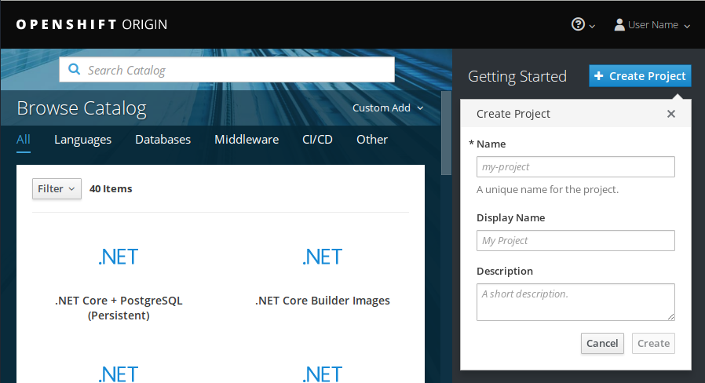

# Projects and quota

\if{LDAP_LOGIN_SUPPORT}
## OpenShift projects and CSC computing projects

!!! note
    Projects in OpenShift are separate from CSC computing projects. A single CSC
    computing project can have access to multiple projects in OpenShift.
    Each CSC computing project with access to \env{SYSTEM_NAME} gets a *group* in
    OpenShift.

!!! note
    \env{SYSTEM_NAME} can be used free of charge for open research and
    education in Finnish universities and polytechnics.

All projects in OpenShift must be mapped to a CSC computing project. This
mapping is used to determine which CSC computing project a given resource
belongs to for billing and other purposes. If you only have one CSC computing
project with access to \env{SYSTEM_NAME}, this mapping will be done for you
automatically. If you have more than one CSC computing project, you need to
specify which of them to use. You can do so by entering `csc_project: ` followed
by the name or number of your CSC computing project in the *Description* field
when creating a new project in OpenShift. You can also enter other text in the
description field as well if you want to have a human readable description for
the project you are creating.

For example, if you have \env{SYSTEM_NAME} access via project_1000123, you would
enter this in the *Description* field:

```yaml
csc_project: project_1000123
```

You could also enter a human readable description for the project, in which case
the field could look like this:

```yaml
This project is used for hosting the Pied Piper web application.

csc_project: project_1000123
```

This would make it so that any usage within that OpenShift project is billed
from the billing unit quota of project_1000123. Note that project_1000123 must
have \env{SYSTEM_NAME} access and you must be a member of that computing project
or the OpenShift project creation will fail.

If you would like to know which CSC computing projects you are a member of, you
can view a list in the [My Projects
tool](https://sui.csc.fi/group/sui/my-projects) of the Scientist's User
Interface. You can also set a default billing project with the same tool. Select
the project that you would like to have as your default billing project and
click "Set As Billing Project". After doing this, the default billing project
will be selected as the billing project for OpenShift projects that don't
explicitly specify one.

If you would like to know which CSC computing project an OpenShift project is
associated with, you can do so using the oc command line tool. You can find
instructions for setting up oc in the [command line tool usage
instructions](/usage/cli). For example, if your OpenShift project was called
my-openshift-project, you would run this:

```bash
oc get project my-openshift-project -o yaml
```

This should produce output like this:

```yaml
apiVersion: project.openshift.io/v1
kind: Project
metadata:
  annotations:
    ...
  creationTimestamp: 2018-11-22T12:27:05Z
  labels:
    csc_project: "1000123"
  name: my-openshift-project
  resourceVersion: "72557736"
  selfLink: /apis/project.openshift.io/v1/projects/my-openshift-project
  uid: df4970e2-abd7-4417-adbf-531293c68cd6
spec:
  finalizers:
  - openshift.io/origin
  - kubernetes
status:
  phase: Active
```

In the output above, you can find the associated CSC computing project under
`metadata.labels.csc_project`. In this case the project is `1000123`.
Unfortunately this information is not available via a web user interface yet.

!!! note
    It is not possible for normal users to change the csc_project label
    after a project has been created. If you would like to change the label for
    an existing project, please [contact support](/contact). You can also create
    a completely new project if you want to use a different label.

\endif

## Creating a project

Click the blue "Create Project" button to create a project and you will be
presented with this view:



Here you'll need to pick a unique name that is not in use by any other project
in the system. You can also enter a human readable display name and a
description for the project. \if{LDAP_LOGIN_SUPPORT} You may also enter a CSC
computing project here in the Description field as described above.\endif Once
you've filled in the fields, click "Create" and you will see the application
catalog where you can pick from various application templates or import your
own.

For more information about using the web user interface, you can refer to the
[official OpenShift documentation](https://docs.okd.io/). You can find
out which version of the documentation to look at in the web interface by
clicking the question mark symbol in the top bar and selecting "About".

## Project quotas

Two kinds of quota are applied in OpenShift:

* Total number of projects per user
* Resources created inside a project

By default, users can create **up to five projects**. Each of these then has its
own quota for the following resources:

| Resource                         | Default |
|----------------------------------|---------|
| Pods                             | 20      |
| Virtual cores per pod            | 2       |
| Virtual cores per container      | 2       |
| RAM per pod                      | 8 GiB   |
| RAM per container                | 8 GiB   |

You can find the resource usage and quota for a project from the project view in
the web interface under Resources -> Quota. Alternatively, you can use the oc
command line tool:

```bash
oc get quota -o yaml
oc get limitranges -o yaml
```

If you need to create more projects or you need more resources in a project for
your application, you can apply for more quota by contacting \env{SYSTEM_NAME}
support. See the  [Contact page](/contact) for instructions. Quota requests are
handled on a case-by-case basis depending on the currently available resources
in \env{SYSTEM_NAME} and the use case.

## Sharing projects with other users

OpenShift has a flexible role based access control system that allows you to
give access to projects you've created to other users and groups in the system.
You can give e.g. full admin, basic user, edit or read only access to other
users and groups in the system for collaboration.

You can edit project membership in the web interface via Resources ->
Membership. You can either give access rights to individuals users or groups by
selecting either the Users or the Groups tab and clicking Edit Membership in the
top right corner.

\if{LDAP_LOGIN_SUPPORT}
If you would like to share a project you've created with members of the same CSC
computing project, you can do so by selecting the Groups tab, clicking Edit
Membership and entering the name of the computing project and a role in the
dropdown menu on the right for the members of that computing project.
\endif
