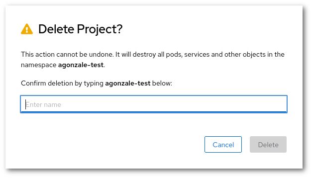

--8<-- "rahtibeta_announcement.md"

## Creating a project

Click the blue "Create Project" button to create a project, and you will be
presented with the following view:


1. You *need* to pick a **unique name** that is not in use by any other project
in the system.
1. You *can* also enter a **human-readable display name** and.
1. You *have to* also enter a **CSC computing project** in the _Description_ field. It must be a currently valid CSC project, that your account has access to. In order to view to which CSC projects you have access to, please check <https://my.csc.fi>. If you have access to no CSC project, you will not be able to create any Rahti 1 project. If you have Rahti 1 access via project_1000123, you would enter the following in the Description field:

> csc_project: 1000123

You can also enter other text in the
description field if you want to have a human-readable description for
the project you are creating. In that case
the field could look like this:

```yaml
This project is used for hosting the Pied Piper web application.

csc_project: 1000123
```

See the section about [accounts](/accounts/).

Once you have filled in the fields, click **Create**, and you will see the application
catalog where you can pick an application template or import your
own one.

For more information about using the web interface, refer to the
[official OpenShift documentation](https://docs.okd.io/). You can find
out which version of the documentation to look at in the web interface by
clicking the question mark symbol in the top bar and selecting "About".

### Extra information about CSC computing projects in Rahti 1

Projects in OpenShift are separate from CSC computing projects. A single CSC
computing project can have access to multiple projects in OpenShift.
Each CSC computing project with access to Rahti 1 receives a *group* in
OpenShift.

!!! note
    Rahti 1 can be used free of charge for open research and
    education in Finnish universities and polytechnics.

Any usage within OpenShifts projects are billed
to the billing unit quota of the CSC project selected. Note that the selected CSC project must
have Rahti 1 access and the user creating a project must be a member of that computing project,
otherwise the OpenShift project creation will fail.

* If you would like to know which CSC computing projects you are a member of, you
can view a list in the [My Projects
tool](https://my.csc.fi/myProjects) of MyCSC. You can also set a default 
billing project by going to [Your Profile page](https://my.csc.fi/myProfile). 
Select the project you would like to have as your default billing project and
click on "Save". After doing this, the default billing project
will be selected as the billing project for OpenShift projects if you do not
explicitly specify one.

* If you would like to know which CSC computing project an OpenShift project is
associated with, you can do so using the _oc_ command line tool. You can find
instructions for setting up oc in the [command line tool usage
instructions ](cli.md). For example, if your OpenShift project is called
*my-openshift-project*, you would run:

```bash
oc get project my-openshift-project -o yaml | grep csc_project
```

This should produce the following output:

```yaml
    csc_project: "1000123"
```

In this case, the project is `1000123`. Unfortunately, this information is not available via a web interface.

!!! note
    It is not possible for normal users to change the *csc_project* label
    after a project has been created. If you would like to change the label for
    an existing project, please [contact the support](/support/contact/). You can also create
    a completely new project if you want to use a different label.

!!! note
    It is possible to change the description of a project, but **it will not** change the csc_project label.

## Project quotas

Two kinds of quota are applied in OpenShift:

* Total number of projects per user
* Resources created inside a project

By default, users can create **up to five projects**. Each of them has its
own quota for the following resources:

| Resource                         | Default |
|----------------------------------|---------|
| Pods                             | 20      |
| Virtual cores per pod            | 2       |
| Virtual cores per container      | 2       |
| RAM per pod                      | 8 GiB   |
| RAM per container                | 8 GiB   |
| Storage                          | 50 GiB  |
| Number of image streams          | 10      |
| Size of each registry images     | 5 GiB   |

You can find the resource usage and quota of a project in the project view in
the web interface under Resources -> Quota. Alternatively, you can use the oc
command line tool:

```bash
oc describe quota
oc describe limitranges
```

If you need to create more projects or you need more resources in a project for
your application, you can apply for more quota by contacting the Rahti
support. See the [Contact page](/support/contact/) for instructions. Quota requests are
handled on a case-by-case basis depending on the currently available resources
in Rahti 1 and the use case.

## Sharing projects with other users

OpenShift has a flexible role-based access control system that allows you to
give access to projects you have created to other users and groups in the system.
You can give e.g. full admin, basic user, edit or read only access to other
users and groups in the system for collaboration.

You can edit project memberships in the web interface via Resources ->
Membership. You can either give access rights to individual users or groups by
selecting either the _Users_ or _Groups_ tab and clicking _Edit Membership_ in the
top right corner.

Note that it is important to use correct usernames when sharing projects
with others. OpenShift allows you to freely enter any username and will not notify
you for having entered a non-existent username. Usernames are also case-sensitive.
You can find out your username in OpenShift via either the
web interface or the command line:

1. In the web interface, click the question mark symbol in the top bar and
   select "Command Line Tools". You can find your username above the text box
   that has the login command.
2. If you have an active command line session, you can use the command `oc whoami`.

Here is a table that summarize the main different roles:  

| Roles        | Description 
|--------------|-------------
| admin        | A project manager. An admin has rights to view and modify any resource in the project. (Except for quota).
| basic-user   | A user that can get basic information about projects and users.
| edit         | A user that can modify most objects in a project but does not have the power to view or modify roles or bindings.
| view         | A user who cannot make any modifications, but can see most objects in a project. They cannot view or modify roles or bindings.

If you want a user to have minimum view on a project, select **view** role. **Basic user** won't be enough to see a project details.   

If you would like to share a project you have created with members of the same CSC
computing project, you can do so by selecting the _Groups_ tab, clicking _Edit
Membership_, and entering the name of the computing project and a role in the
dropdown menu on the right for the members of that computing project.

## Deleting a Rahti 1 project

In order to delete a Rahti 1 project, you need to go to the main landing page and click in the 3 vertical dots next to the name of the project. In the drop down menu, you will see the option "Delete Project".


Before the Rahti 1 project is removed, you will be asked to input the name of the project to confirm that you really want to remove the Rahti 1 project and prevent accidents.

!!! warning
    After the project has been confirmed for deletion, all resources will be deleted and there will be no way to restore them, including the data stored in the persistent volumes.



After that, Rahti 1 will start to delete all the resources of the project. It could take only few seconds or up to a minute, it depends of amount of resources the project had. After that Rahti 1 will liberate the project name, and it will be possible to create an empty project with the same name.
