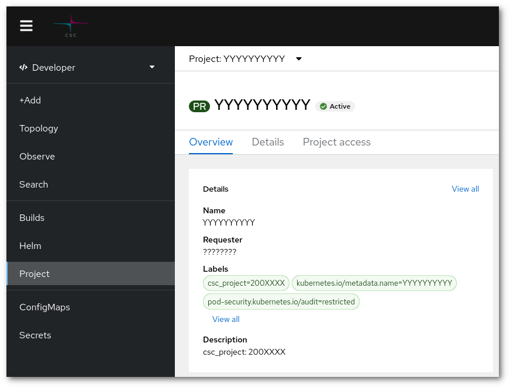
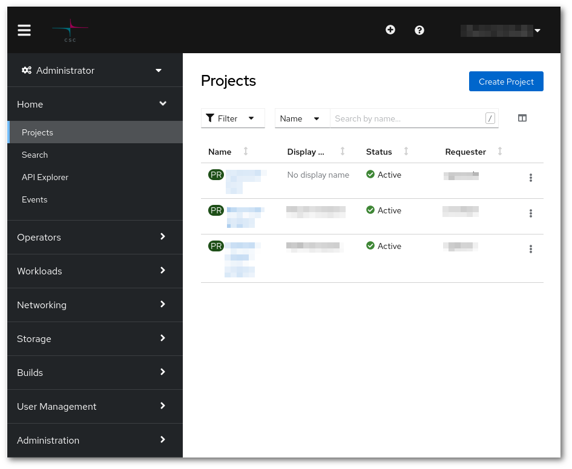

# Projektit ja kiintiöt { #projects-and-quota }

## OpenShift-projektit ja CSC:n laskentaprojektit { #openshift-projects-and-csc-computing-projects }

!!! info
    Rahtin projektit ovat erillään CSC:n laskentaprojekteista. Yhdellä CSC:n
    laskentaprojektilla voi olla pääsy useisiin projekteihin Rahtissa.
    Jokaisella CSC:n laskentaprojektilla, jolla on pääsy Rahtiin, on vastaava *group*
    Rahtissa.

Kaikki Rahtin projektit on liitettävä CSC:n laskentaprojektiin. Tätä liitosta käytetään sen määrittämiseen, mihin CSC:n laskentaprojektiin tietty resurssi kuuluu laskutusta ja muita tarkoituksia varten. Sinun on määritettävä, mitä niistä käyttää. Määrität liitettävän projektin kirjoittamalla _Description_-kenttään `csc_project:` ja sen perään CSC:n laskentaprojektisi nimen tai numeron, kun luot uutta projektia Rahtissa. Voit myös kirjoittaa kuvauskenttään muuta tekstiä, jos haluat projektille ihmisen luettavan kuvauksen.

Esimerkiksi, jos sinulla on Rahti-oikeus projektin *project_1000123* kautta, syöttäisit _Description_-kenttään seuraavan:

```yaml
csc_project: 1000123
```

Voit myös lisätä projektille ihmisen luettavan kuvauksen, jolloin kenttä voisi näyttää tältä:

```yaml
This project is used for hosting the Pied Piper web application.

csc_project: 1000123
```

Tällöin kyseisen Rahti-projektin kaikki käyttö laskutetaan projektin project_1000123 Cloud Billing Unit -kiintiöstä. Huomaa, että projektilla project_1000123 on oltava Rahti-palvelun käyttöoikeus ja sinun on oltava kyseisen laskentaprojektin jäsen, muuten OpenShift-projektin luonti epäonnistuu.

Katso osio [tileistä](../../../accounts/index.md).

Jos haluat tietää, minkä CSC:n laskentaprojektien jäsen olet, näet luettelon MyCSC:n [My Projects -työkalussa](https://my.csc.fi/projects).

Jos haluat tietää, mihin CSC:n laskentaprojektiin jokin Rahti-projekti on liitetty, voit tehdä sen _oc_-komentorivityökalulla. Löydät ohjeet oc:n käyttöönottoon kohdasta [komentorivityökalun käyttöohjeet](cli.md). Jos Rahti-projektisi nimi on esimerkiksi *my-openshift-project*, suorita:

```bash
oc get project my-openshift-project -o yaml
```

Tämän pitäisi tuottaa seuraavanlaista tulostetta:

```yaml
apiVersion: project.openshift.io/v1
kind: Project
metadata:
  annotations:
    ...
  creationTimestamp: 2018-11-22T12:27:05Z
  labels:
    csc_project: "1000123"
  name: my-openshift-project
  resourceVersion: "72557736"
  selfLink: /apis/project.openshift.io/v1/projects/my-openshift-project
  uid: df4970e2-abd7-4417-adbf-531293c68cd6
spec:
  finalizers:
  - openshift.io/origin
  - kubernetes
status:
  phase: Active
```

Yllä olevasta tulosteesta löydät liitetyn CSC:n laskentaprojektin kohdasta `metadata.labels.csc_project`. Tässä tapauksessa projekti on `1000123`.
Tämä tieto on saatavilla myös verkkokäyttöliittymästä.



!!! info

    Tavallisilla käyttäjillä ei ole mahdollista muuttaa *csc_project*-tunnistetta
    sen jälkeen, kun projekti on luotu. Jos haluat muuttaa olemassa olevan projektin tunnistetta, [ota yhteyttä tukeen](../../../support/contact.md). Voit myös luoda kokonaan uuden projektin, jos haluat käyttää toista tunnistetta.

## Projektin luominen { #creating-a-project }

Avaa ensin tämä [linkki](https://rahti.csc.fi/) päästäksesi Rahtin etusivulle ja klikkaa **Login Page** kohdan *OpenShift 4.15* alla.  

Kirjautumisen jälkeen klikkaa sinistä "Create Project" -painiketta luodaksesi projektin; eteesi avautuu seuraava näkymä:



Jos olet "Developer"-näkymässä, klikkaa yläpalkissa "Projects: All projects" ja valitse "Create Project":
  

1. Sinun on valittava järjestelmässä **yksilöllinen nimi**, jota mikään muu projekti ei käytä.
1. Voit myös antaa **ihmisen luettavan näyttönimen**.
1. Sinun on lisäksi annettava **CSC:n laskentaprojekti** _Description_-kenttään. Sen on oltava tällä hetkellä voimassa oleva CSC-projekti, johon tililläsi on pääsy. Näet, mihin CSC-projekteihin sinulla on pääsy, osoitteessa <https://my.csc.fi>. Jos sinulla ei ole pääsyä yhteenkään CSC-projektiin, et voi luoda Rahti-projektia. Jos sinulla on Rahti-oikeus projektin project_1000123 kautta, kirjoita _Description_-kenttään seuraava:

> csc_project: 1000123


Katso osio [tileistä](../../../accounts/index.md).

Kun olet täyttänyt kentät, klikkaa "Create", jolloin näet sovelluskatalogin, josta voit valita sovelluspohjan tai tuoda oman.

Lisätietoa verkkokäyttöliittymän käytöstä löytyy [OpenShiftin virallisesta dokumentaatiosta](https://docs.okd.io/) (käyttämämme versio on 4.15). Näet, mitä dokumentaatioversiota kannattaa käyttää, klikkaamalla kysymysmerkki-symbolia yläpalkissa ja valitsemalla "About".

## CSC:n laskentaprojektien kiintiöt { #csc-computing-project-quotas }

!!! info

    CSC-projektin kiintiö jaetaan eri Rahti-projektien (ns. nimiavaruuksien) kesken.
    Tämä tarkoittaa, että jos useampi henkilö työskentelee saman CSC-projektin parissa ja luo omia nimiavaruuksiaan, resurssit ovat yhteiset.

Jokaisella CSC:n laskentaprojektilla on oma kiintiönsä. Alkuperäinen kiintiö on seuraava:

| Resurssi                         | Oletus |
|----------------------------------|--------|
| Virtuaaliset ytimet              | 4      |
| RAM                              | 16 GiB |
| Tallennustila                    | 100 GiB|
| Kuvavirtojen (images) lukumäärä  | 20     |
| Kunkin rekisterikuvan koko       | 5 GiB  |

Tämä tarkoittaa, että CSC:n laskentaprojektisi voi käyttää yhteensä enintään 4 ydintä ja 16 GiB muistia. Se voi olla 1 Pod, joka käyttää koko 4 ydintä ja 16 GiB, 8 Podia, joista kukin käyttää puolta ydintä ja 2 GiB, jne.

!!! Warning

    Jos CSC:n laskentaprojektiin pääsee useampi käyttäjä, he voivat luoda uuden Rahti-projektin (katso edellä). Huomaa, että kiintiöt jaetaan eri Rahti-projektien kesken.
    Jos tarvitset muutoksia CSC:n laskentaprojektisi kiintiöihin, ota meihin yhteyttä. Lisätietoja [täällä](projects_and_quota.md#requesting-more-quota)

Löydät projektin resurssien käytön ja kiintiön verkkokäyttöliittymässä projektinäkymästä valikosta **Administration -> ResourceQuota** ja **Administration -> LimitRanges** `Administrator`-valikossa.

Vaihtoehtoisesti voit käyttää oc-komentorivityökalua:

```sh
$ oc describe AppliedClusterResourceQuotas
Name:                      crq-200xxxx
Namespace Selector:        ["test-delete"]
Resource                   Used  Hard
--------                   ----  ----
limits.cpu                 500m  16
limits.ephemeral-storage   0     5Gi
limits.memory              1Gi   40Gi
openshift.io/imagestreams  1     20
persistentvolumeclaims     0     20
pods                       1     100
requests.storage           0     200Gi
```

```sh
$ oc describe limitranges
Name:                  limits
Namespace:             test-delete
Type                   Resource  Min  Max    Default Request  Default Limit  Max Limit/Request Ratio
----                   --------  ---  ---    ---------------  -------------  -----------------------
Container              cpu       50m  4      100m             500m           5
Container              memory    8Mi  16Gi   500Mi            1Gi            -
openshift.io/Image     storage   -    5Gi    -                -              -
PersistentVolumeClaim  storage   -    100Gi  -                -              -
```

### Podien oletusresurssirajat { #default-pod-resource-limits }

Jokaisella Podilla on oltava ala- ja ylärajat resursseille, erityisesti CPU:lle ja muistille. Alarajoja kutsutaan `requests`-arvoiksi ja ylärajoja `limits`-arvoiksi. `requests` määrittää vähimmäisresurssit, joita Podin ajaminen edellyttää, eikä Pod saa käyttää enemmän resursseja kuin mitä `limits` määrittelee.

Käyttäjä voi asettaa rajat itse käytettävissä olevan kiintiön puitteissa. Jos käyttäjä ei aseta rajoja, käytetään oletusarvoja:

|Tyyppi|CPU|Muisti|
|:-:|:-:|:-:|
|limits|500m|1Gi|
|requests|100m|500Mi|

Huom: `m` tarkoittaa millicore-yksikköä. `500m` vastaa 0,5 ydintä, eli toisin sanoen puolta yhden CPU-ytimen ajasta.

Rahti pakottaa enimmäissuhteen limits/requests = 5. Tämä tarkoittaa, että CPU:n tai muistin `limits` ei voi olla yli 5 kertaa suurempi kuin `request`. Jos siis CPU:n request on 50m, CPU:n limit ei voi olla yli 250m. Ja jos haluat nostaa CPU-limitin arvoon 1, sinun on nostettava myös request vähintään arvoon 200m.

## Lisäkiintiön pyytäminen { #requesting-more-quota }

Jos tarvitset oletuksia enemmän resursseja, voit hakea lisäkiintiötä ottamalla yhteyttä Service Deskiin. Ohjeet löytyvät [yhteydenottosivulta](../../../support/contact.md). Kiintiöpyynnöt käsitellään tapauskohtaisesti riippuen Rahtin kulloinkin käytettävissä olevista resursseista ja käyttötapauksesta.

## Projektien jakaminen muiden käyttäjien kanssa { #sharing-projects-with-other-users }

!!! info

    Kun luot Rahti-projektin, joka on liitetty tiettyyn CSC:n laskentaprojektiin, oletuksena kaikki tämän CSC:n laskentaprojektin jäsenet saavat admin-oikeudet Rahti-projektiin.
    Voit myös lisätä yksittäisen käyttäjän tiettyyn Rahti-projektiin. Käyttäjällä on oltava CSC- tai HAKA-tunnus.

OpenShiftissa on joustava roolipohjainen käyttöoikeusjärjestelmä, jonka avulla voit antaa luomiisi projekteihin käyttöoikeuksia muille käyttäjille ja ryhmille järjestelmässä. Voit antaa esimerkiksi täydet admin-oikeudet, peruskäyttöoikeudet, muokkausoikeudet tai vain lukuoikeudet yhteistyötä varten.

Voit muokata projektin jäsenyyksiä verkkokäyttöliittymässä kohdassa **User Management ->
RoleBindings**, `Administrator`-valikossa. Voit antaa käyttöoikeuksia yksittäisille käyttäjille, ryhmille tai Service Accounteille valitsemalla joko _Users_, _Groups_ tai ServiceAccount.


Huomaa, että on tärkeää käyttää oikeita käyttäjätunnuksia, kun jaat projekteja muille. Rahti sallii minkä tahansa käyttäjätunnuksen syöttämisen eikä ilmoita, jos syötät olemattoman tunnuksen. Käyttäjätunnukset ovat myös kirjainkoolle herkkiä. Näet oman käyttäjätunnuksesi Rahtissa komentoriviltä komennolla `oc whoami`.

## Projektin poistaminen { #deleting-a-project }

Poistaaksesi projektin siirry etusivulle ja klikkaa kolmea pystysuoraa pistettä projektin nimen vieressä. Pudotusvalikossa näkyy vaihtoehto "Delete Project".


Tämän jälkeen sinua pyydetään syöttämään projektin nimi vahinkopoistojen estämiseksi.

!!! warning

    Kun projektin poisto on vahvistettu, kaikki resurssit poistetaan, eikä niitä voi palauttaa. Tämä koskee myös pysyviin levyihin tallennettuja tietoja.


Tämän jälkeen Rahti alkaa poistaa projektin kaikki resurssit. Tämä voi kestää vain muutamia sekunteja tai jopa minuutin riippuen projektin resurssien määrästä. Tämän jälkeen Rahti vapauttaa projektin nimen, ja saman nimisen tyhjän projektin voi luoda uudelleen.