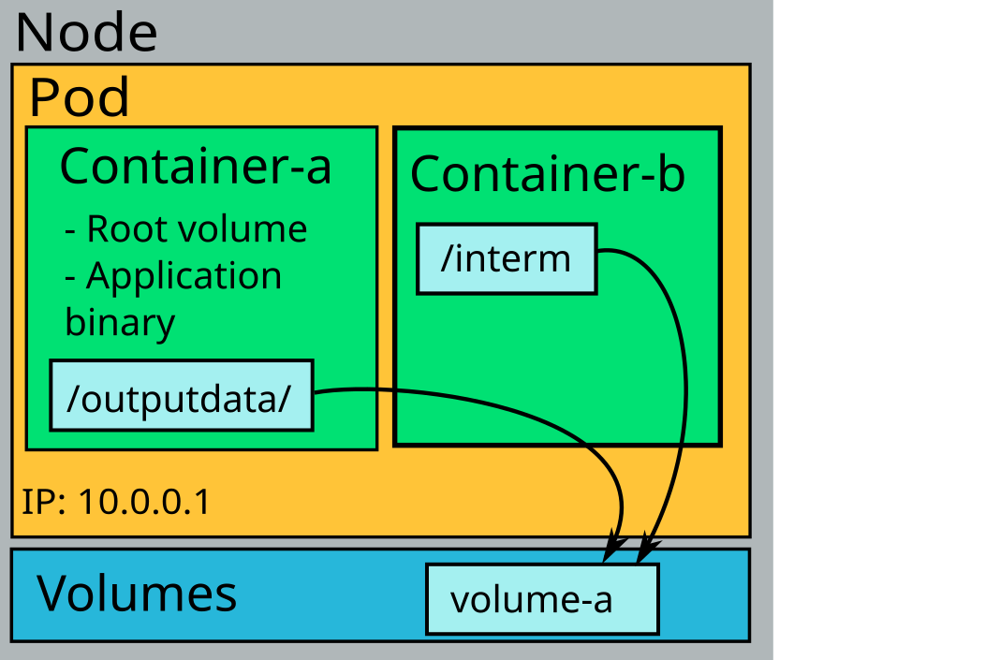

# Ephemeral storage

When local ephemeral (temporary) storage is needed, an `emptyDir` volume should be created. The volume is local to the node on which the Pod is running; in Rahti this is a local SSD disk. The volume can be shared across several containers in the same Pod, and it is the *fastest* filesystem storage available in Rahti. However, an `emptyDir` volume is deleted when the Pod is deleted or migrated to another node. It is declared directly in the Pod definition, as in the following example:

```yaml
apiVersion: v1
kind: Pod
metadata:
  name: my-app
  labels:
    app: my-application
spec:
  volumes:
  - name: volume-a
    emptyDir:
      sizeLimit: 2Gi
  containers:
  - name: container-a
    image: almalinux:10
    command: ['sh', '-c', 'while true; do sleep 50; done']
    volumeMounts:
    - mountPath: /outputdata
      name: volume-a
  - name: container-b
    image: almalinux:10
    command: ['sh', '-c', 'while true; do sleep 50; done']
    volumeMounts:
    - mountPath: /interim
      name: volume-a
```

Here both containers mount the same volume, so `container-a` sees the shared data under `/outputdata` and `container-b` sees it under `/interim`.



## Using memory as the storage medium

An `emptyDir` volume can be made even faster by using memory (`tmpfs`) as the storage medium instead of the local disks. The size of the data stored in a memory-backed `emptyDir` is counted towards the Pod's memory usage, which means the maximum size of the data that can be stored is equal to the Pod memory limit (i.e. the sum of the memory limits of the containers inside the Pod). If the Pod exceeds its memory limit, Kubernetes may terminate one or more containers with an OutOfMemory (`OOMKilled`) status. This can happen even if the application itself is not using too much memory, because the contents of the `tmpfs` volume contribute to the limit. You can create a memory-backed `emptyDir` by adding the `medium: Memory` field under `emptyDir`. It is recommended to configure `sizeLimit` to a value lower than the Pod memory limit.

```yaml
apiVersion: v1
kind: Pod
metadata:
  name: test-pod
spec:
  containers:
  - image: busybox:stable
    name: test-container
    command: ['sh', '-c', 'while true; do sleep 50; done']
    volumeMounts:
    - mountPath: /cache
      name: mem-cache-volume
    resources:
      limits:
        memory: 2Gi
  volumes:
  - name: mem-cache-volume
    emptyDir:
      sizeLimit: 500Mi
      medium: Memory
```
