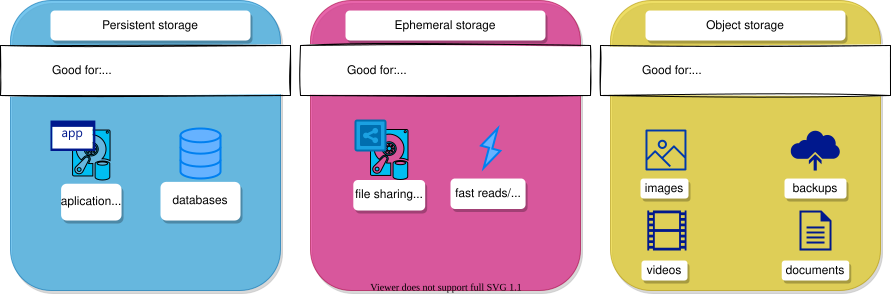

# Storage in Rahti

While containers are designed to be ephemeral, many workloads need persistent storage that survives restarts, rescheduling, or updates. Kubernetes solves this by introducing abstractions that allow storage to be requested, attached, and managed independently of Pods. Rahti supports different types of storage depending on how long data needs to live and how it should be accessed. The storage options available in Rahti are ephemeral storage, persistent storage, and object storage. Each serves a different purpose and is suitable for different workloads.

## Ephemeral storage

Ephemeral storage exists only for the lifetime of a Pod. When the Pod stops, restarts, or is rescheduled to another node, the data is lost. Rahti provides ephemeral storage via `emptyDir` volumes. An `emptyDir` volume gives the applications running inside the containers fast read and write access to data that can be recreated or does not need to survive, for example:

* Caches.
* Temporary files or scratch space.
* Working directories for short tasks or jobs.
* Intermediate data during processing.

Do **not** use ephemeral storage for user data, databases, or anything that must persist.

You can find additional information on the [Ephemeral storage](./ephemeral.md) page.

## Persistent storage

Persistent storage survives Pod restarts, failures, and rescheduling. Kubernetes provides PersistentVolumes (PVs) and PersistentVolumeClaims (PVCs) to manage persistent data independently of Pods, so applications can reliably store and retrieve data even when Pods move between nodes. This makes persistent storage essential for stateful applications. Use persistent storage when your application must retain data even when Pods are recreated or deleted:

* Databases (PostgreSQL, MySQL, MongoDB).
* Message queues (Kafka, RabbitMQ).
* Applications that manage user-generated content.
* State that must survive updates, restarts, or node failures.

You can find additional information on the [Persistent volume](./persistent.md) page. If a volume later runs out of space, see [Expand a volume](./persistent.md#expanding-volume).

## Object storage

Object storage is an external service accessed via an API (typically HTTP/S3). It stores data as objects rather than files and is optimized for durability and scalability. Objects are not mounted as a filesystem: applications must download them for read access and upload them back to persist changes. Object storage is suitable when data is large and unstructured, or needs to be published over the internet, and does not need to be accessed as a local filesystem:

* Backups and archives.
* Large binary files (images, video, datasets).
* Machine learning training data.
* Scientific or research data.
* Application assets served externally.
* Logs or analytical outputs stored outside the cluster.

CSC provides the object storage service [Allas](../../../../data/Allas/index.md), which can also be used from Rahti. See the [Object storage](./object-storage.md) page for instructions.

## Volume snapshots

A snapshot represents the state of a storage volume within the cluster at a specific point in time. Volume snapshots can be used to provision a new volume and help protect against data loss. Rahti supports Container Storage Interface (CSI) volume snapshots by default, and the default volume snapshot class name is `standard-csi`.

With CSI volume snapshots, you can:

* Use volume snapshots as building blocks for developing application-level or cluster-level storage backup solutions.
* Roll back rapidly to a previous version during development.
* Use storage more efficiently by avoiding the need to create a full copy each time.

You can find additional information on the [Volume snapshot](./volume-snapshot.md) page.
