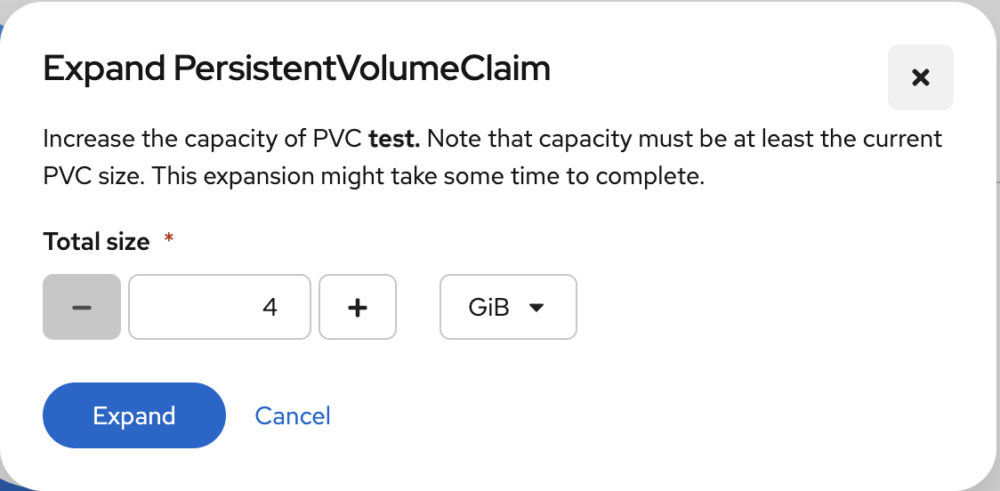

# Persistent storage

Many applications running in Kubernetes require data that must survive Pod restarts, rescheduling, failures, or upgrades. Kubernetes provides persistent storage to ensure that data is stored independently of the Pod lifecycle. This is essential for databases, message queues, and stateful applications.

Persistent storage in Kubernetes is built around three key concepts: **StorageClasses**, **PersistentVolumes (PVs)**, and **PersistentVolumeClaims (PVCs)**.


## StorageClasses (SCs)

A StorageClass defines a type of storage available in the cluster. It mainly describes the provisioner responsible for the creation of PVs and the parameters of that provisioner. StorageClasses are created and managed by cluster administrators, but normal users can use them to request a specific type of storage without knowing the low-level details of the storage system. Rahti provides `standard-csi` as its default StorageClass with `ReadWriteOnce` access mode.

## PersistentVolumes (PVs)

A PersistentVolume (PV) represents a piece of storage provisioned at the cluster level (i.e. PVs are not bound to a specific namespace, also known as a Rahti project). In Rahti, users do not create PVs directly. Instead, PVs are typically created automatically by a **StorageClass** provisioner that users designate in their **PersistentVolumeClaims**. A PersistentVolume contains information such as storage capacity and access modes (e.g. `ReadWriteOnce` or `ReadWriteMany`).

## PersistentVolumeClaims (PVCs)

A PersistentVolumeClaim (PVC) is the object that users create to request storage. A PVC specifies the desired storage capacity, the access mode, and the StorageClass used to create the corresponding PV.

Example PVC:

```yaml
apiVersion: v1
kind: PersistentVolumeClaim
metadata:
  name: my-data
spec:
  accessModes:
    - ReadWriteOnce
  resources:
    requests:
      storage: 1Gi
  storageClassName: standard-csi
```

The example above requests 1 GiB of persistent storage that can be mounted in read-write mode by a single Pod.

Persistent volumes can also be requested via the web console.

!!! warning

    When a volume contains a large number of files (>15 000), the time it takes to mount and become available can be longer than 5 minutes. The more files, the longer it takes to become available.

The persistent volume can be used in a Pod by specifying `spec.volumes` (defines the volumes to attach) and `spec.containers.volumeMounts` (defines where to mount the attached volumes in the container's filesystem):

```yaml
apiVersion: v1
kind: Pod
metadata:
  name: my-pod
spec:
  containers:
    - name: app
      image: nginx:latest
      volumeMounts:
        - name: data-volume
          mountPath: /data
  volumes:
    - name: data-volume
      persistentVolumeClaim:
        claimName: my-data  # Refers to your PersistentVolumeClaim
```

!!! warning

    When a PersistentVolume is deleted, the corresponding data is deleted **permanently**. It is highly recommended to make regular and versioned copies of the data to an independent storage system like [Allas](../../../../data/Allas/using_allas/a_backup.md).

## Expanding volume

Rahti supports dynamic volume expansion, this means that you can increase the size of your PVCs (and implicitly their bound PVs) when you need more storage. This can be done by simply increasing the `.resources.requests.storage` attribute in the YAML defention of your PVC or by using the web user interface at Storage -> PersistentVolumeClaims -> `<volume-name>` -> Actions -> Expand PVC:




!!! warning
    When increasing the size of a PersistentVolumeClaim (PVC), it's recommended to use sizes that are multiples of **8 GiB** (e.g., 16 GiB, 32 GiB, 64 GiB, 128 GiB, etc.). Other values may not work and the size increase may silently fail.
