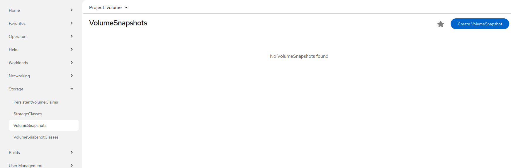
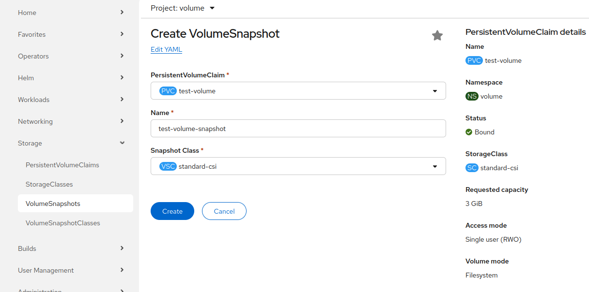

# Volume snapshot

## Volume snapshot provisioning

Rahti offers two methods for provisioning snapshots: through the web interface and by using the CLI.

### Prerequisites

* An active project in Rahti.
* No Pods are using the PersistentVolumeClaim (PVC) that you want to take a snapshot of.

### Procedure

1. Create a PVC.
2. Create a deployment.
3. Mount the PVC to the deployment (in Rahti, the underlying volume is provisioned only after the PVC has been mounted to a deployment).
4. Unmount the PVC from the deployment (Scale the deployment to 0 replica).
5. Create a volume snapshot that uses the PVC as its source.

### Using the web interface

After making sure that the PVC is not attached to any Pod, navigate to the `VolumeSnapshots` section in the `Storage` dropdown list of the left-hand menu and click `Create VolumeSnapshot` to create a snapshot of your PVC.



Fill in the required details: in `PersistentVolumeClaim`, select the PVC you want to take a snapshot of, provide a `Name` for the volume snapshot, select the default snapshot class `standard-csi`, and click `Create`.



### Using the CLI

Create a `snapshot.yaml` file that references the PVC as the source of the volume snapshot:

```yaml
apiVersion: snapshot.storage.k8s.io/v1
kind: VolumeSnapshot
metadata:
  name: <name_of_volumesnapshot>
spec:
  source:
    persistentVolumeClaimName: <name_of_PVC>
  volumeSnapshotClassName: standard-csi
```

Run the following command to create the volume snapshot:

```bash
oc apply -f snapshot.yaml
```

To list all the volume snapshots, use the command:

```bash
oc get volumesnapshot
```

To get the details of the volume snapshot that was created, enter the following command:

```bash
oc describe volumesnapshot <your-volume-snapshot>
```

Delete the volume snapshot by entering the following command:

```bash
oc delete volumesnapshot <volumesnapshot_name>
```

## Restore a volume snapshot

The CSI Snapshot Controller Operator provides the snapshot custom resource definitions (CRDs) in the `snapshot.storage.k8s.io/v1` API group. The content of a `VolumeSnapshot` can be used to restore an existing volume to a previous state. To do so, create a `pvc-restore.yaml` file:

```yaml
apiVersion: v1
kind: PersistentVolumeClaim
metadata:
  name: myclaim-restore
spec:
  storageClassName: standard-csi
  dataSource:
    name: <name-of-snapshot>
    kind: VolumeSnapshot
    apiGroup: snapshot.storage.k8s.io
  accessModes:
    - ReadWriteOnce
  resources:
    requests:
      storage: 1Gi
```

Run the following command to create the restored PVC:

```bash
oc apply -f pvc-restore.yaml
```

In `spec.dataSource.name`, give the name of the snapshot to use as the source. The requested storage must be at least as large as the volume the snapshot was taken from.

## Use case

In this example, we take a snapshot of the content of an `nginx` deployment and restore that content into a new deployment. Follow these steps:

1. Create an `nginx` deployment in a file named `nginx-deployment.yaml`.
2. Create a PVC in a file named `nginx-pvc.yaml`.
3. Attach this PVC to the `nginx` deployment.
4. Open a shell in the Pod created for this deployment, create a file named `test.txt`, and add some static content to it. This content is stored on the PVC created earlier.
5. Save the snapshot definition in a file named `nginx-snapshot.yaml`. This file should reference the PVC used by `nginx` (as specified in `nginx-pvc.yaml`).
6. Delete the PVC.
7. Create a new PVC from the snapshot by saving the new PVC configuration in `nginx-restore-pvc.yaml`. This file should specify that the data source is the snapshot created in the previous step.
8. Deploy a new instance of `nginx` using the restored PVC with a modified deployment configuration saved in `nginx-restored-deployment.yaml`. This new deployment uses the PVC created from the snapshot, which allows it to serve the previously added static content.
9. You can see that the data is restored.
