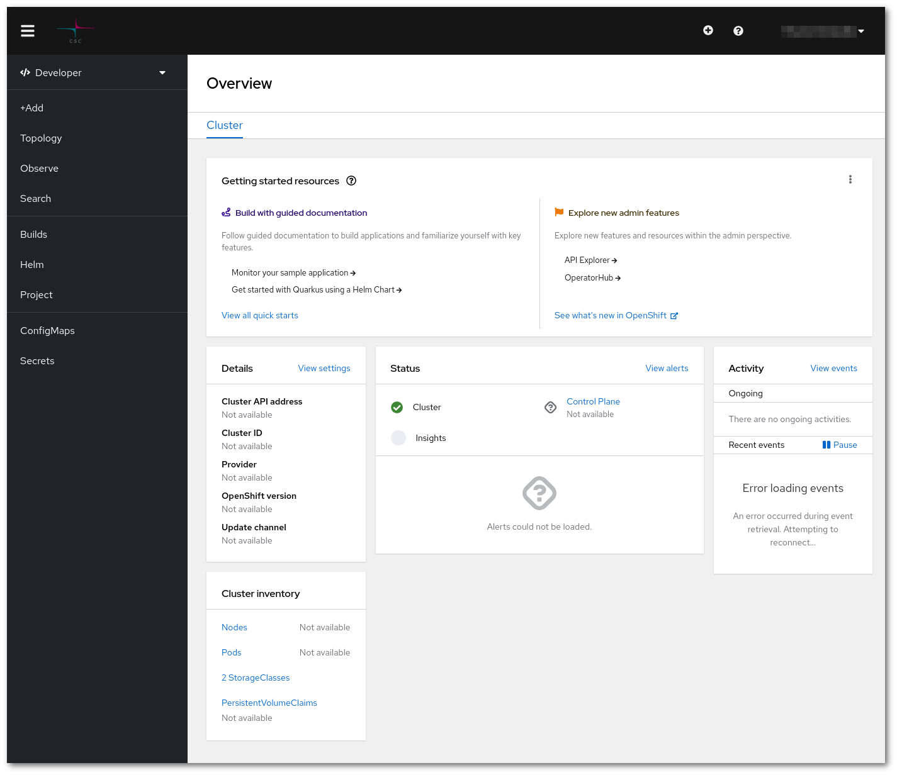

--8<-- "rahti2_announcement.md"
## What is Rahti 2?

Rahti 2 is the container orchestration service at CSC. Rahti 2 runs on [okd](https://www.okd.io/), the community distribution of Kubernetes that powers Red Hat OpenShift. Built around a core of [OCI](https://opencontainers.org/) container packaging and [Kubernetes](https://kubernetes.io/) container cluster management.

With the Rahti 2 service you can easily deploy scalable and fault tolerant applications and make them accessible over the web. Rahti 2 provides features like load balancing, high availability and rolling updates for your application. It also provides a set of ready-made templates that allow you to set up applications like a database or a web server with just a few clicks. Under the hood, Rahti 2 is built on open source and based on a distribution of Kubernetes called OKD.

Like cPouta, Rahti 2 is a generic platform that can run many different kinds of applications from web servers and databases to complex scientific software stacks and data analysis pipelines. However, the approach Rahti 2 takes and the way you use it is quite different from cPouta. In contrast to cPouta where you manage infrastructure like virtual machines and networks, in Rahti 2 you manage applications directly. You can think of it as a big computer where you launch applications whereas cPouta is like a data center where you add your own computers. As you will be sharing this big computer with other users, extra security limitations are in place, the most important being that the applications will be run using a non privileged user.

## When should I choose Rahti 2?

Here are some example use cases that Rahti 2 is good for:

* Host an interactive web application or just a regular web site.
* Pre-package a complex application like Apache Spark and make it easy for others to run their own instance of that application.
* Deploy a web application written in common languages like Python, Javascript or Java to the web with just one command.
* If you want to run a web application or host a web site, Rahti 2 will likely be the platform for you. It comes with a lot of the most common features needed for web based applications.

## OpenShift OKD v Kubernetes

OpenShift [OKD](https://www.okd.io/) is optimized for multi-tenant deployment. This means that different tenants will be sharing the same hardware. For this reason, **privileged mode** is not allowed, and containers **cannot be run as root**.

OpenShift provides these extra services over a standard Kubernetes offering:

* Web UI: <https://rahti.csc.fi/>

* HTTP(s) load balancer (HAProxy). Using [Routes](networking.md#routes) instead of **Ingresses**, and only supporting HTTP (80) and HTTPS (443).

* Central file [storage volumes](storage/index.md)
