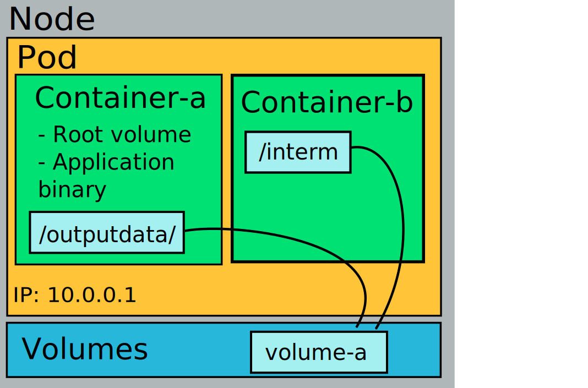

When local ephemeral (temporal) storage is needed, an `emptyDir` should be issued. It is local to the node, on Rahti 2 this is RAID-1 SSD storage. It can be shared across several containers in the same Pod, and it the *fastest* filesystem available in Rahti 2 but it will be **lost when the Pod is killed or restarted**. It is declared directly in the Pod definition:

*`podWithEmptydDir.yaml`*:

```yaml
apiVersion: v1
kind: Pod
metadata:
  name: my-app
  labels:
    app: my-application
spec:
  volumes:
  - name: volume-a
    emptyDir: {}
  containers:
  - name: container-a
    image: centos:7
    volumeMounts:
    - mountPath: /outputdata
      name: volume-a
  - name: container-b
    image: centos:7
    volumeMounts:
    - mountPath: /interm
      name: volume-a
```



## Using memory as medium

It is possible to make an `emptyDir` even faster by using memory as storage medium, i.e.: use `tmpfs`. The two drawbacks of this approach compared with a standard `emptyDir` is (1) the memory is shared with all the processes of the Pod, so its maximum size will be the same as the memory limit of the `Pod`, and (2) if the `emptyDir` (together with the processes of the Pod) uses all the available memory, the Pod will be killed. You can create one by adding `medium: Memory` under `emptyDir`. It is recommended to configure the `sizeLimit` to something lower than the Pod memory limit.

* `podWithEmptyDirMemory.yaml`

```yaml
apiVersion: v1
kind: Pod
metadata:
  name: test-pd
spec:
  containers:
  - image: busybox:stable
    name: test-container
    command: ['sh', '-c', 'while true; do sleep 50; done']
    volumeMounts:
    - mountPath: /cache
      name: cache-volume
    resources:
      limits:
        memory: 2Gi
  volumes:
  - name: cache-volume
    emptyDir:
      sizeLimit: 500Mi
      medium: Memory
```
