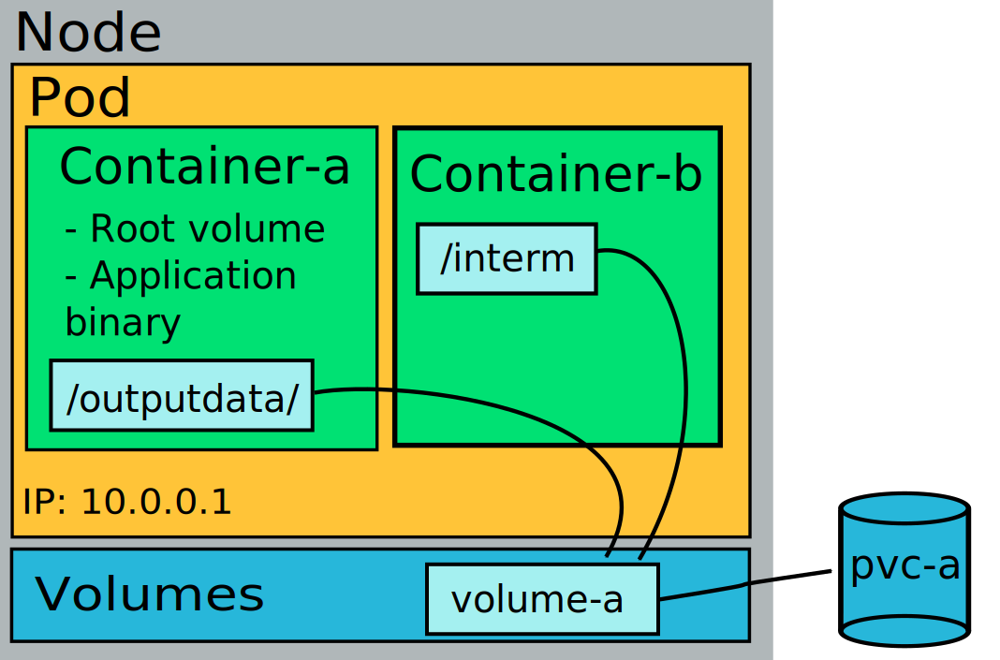

--8<-- "rahti2_rwx_storage.md"

**Persistent volumes** are storage which persist during & after pod's lifetime.

Persistent volumes in Rahti 2 are stored in a resilient storage such as CEPH. They are created by using a **PersistentVolumeClaim**. When a
new claim is made, and **a Pod mounts it**, a new volume space will be created.

!!! info "A change from Rahti 1 version"

    In production Rahti 2 a new persistent volume will remain in **"⏳ Pending"** until any Pod mounts it. This is a change from Rahti 1 where the volume was created right away.

There is one storage class available in Rahti 2:

 * *standard-csi*. This is a "Read Write Once" (RWO) storage class, meaning that only one pod can mount the volume (in read-write mode).

More storage classes are on the work.



Persistent storage is requested in the cluster using `PersistentVolumeClaim` objects:

*`pvc.yaml`*

```yaml
apiVersion: v1
kind: PersistentVolumeClaim
metadata:
  name: testing-pvc
spec:
  accessModes:
  - ReadWriteOnce
  resources:
    requests:
      storage: 1Gi
```

The example above will request a 1 GiB persistent storage that can be mounted in read-write
mode by a single pod.

Persistent storage can be requested also via the web console.

!!! warning

    When a volume contains a high amount of files (>15 000), the time it takes to mount and be available can be higher than 5 minutes. The more files, the more time it takes to be available.

The persistent volume can be used in a pod by specifying `spec.volumes`
(defines the volumes to attach) and `spec.containers.volumeMounts` (defines where
to mount the attached volumes in the container's filesystem):

*`pvc-pod.yaml`*:

```yaml
apiVersion: v1
kind: Pod
metadata:
  name: mypod-vol
  labels:
    app: serveapp-vol
    pool: servepod-vol
spec:
  containers:
  - name: serve-cont
    image: "image-registry.openshift-image-registry.svc:5000/openshift/httpd"
    volumeMounts:
    - mountPath: /mountdata
      name: smalldisk-vol # Refers to your volume below
  volumes:
  - name: smalldisk-vol
    persistentVolumeClaim:
      claimName: testing-pvc # Refers to your PersistentVolumeClaim (pvc.yaml)
```

!!! warning

    When a Persistent Volume is deleted, the corresponding data is deleted **permanently**. It is highly recommended to make regular and versioned copies of the data to an external storage system like [Allas](../../../data/Allas/using_allas/a_backup.md).
