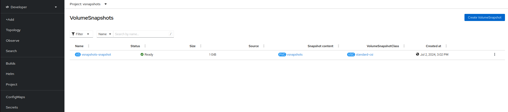

## Volume snapshot provisioning

Rahti2 offers two methods for provisioning snapshots: through web interface and by using the CLI.

### Prerequisites

- An active project in Rahti2
- Ensure no pods are using persistent volume claim (PVC) that you want to take a snapshot of.

### Procedure

1. Create a deployment
2. Create a PVC
3. Mount the PVC to deployment (in Rahti2 PVC is only created after that is mount to a deployment)
4. Unmount the PVC from deployment
5. Create a volume snapshot
6. Attach the PVC to volume snapshot

### Through web interface

After making sure that PVC is not attached to any pod, Navigate to the 'VolumeSnapshot' section and click on 'Create VolumeSnapshot' to create a snapshot of your PVC. 



To find volume snapshot, select 'Developer' view, click 'Project' in left hand side menu, in 'Invertory' section of 'Overview' tab last option is VolumeSnapshot. 


Fill the required details. In PersistentVolumeClaim, select the PVC you want to attach, provide a name to volume snapshot, select the default snapshot class 'standard-csi' and click on 'create'.


### Using CLI

Create `snapshot.yaml` file to attach PVC to volume snapshot

```
apiVersion: snapshot.storage.k8s.io/v1
kind: VolumeSnapshot
metadata:
  name: <name_of_volumesnapshot>
spec:
  source:
    persistentVolumeClaimName: <name_of_PVC>
  volumeSnapshotClassName: standard-csi
```
Run `oc apply -f  snapshot.yaml` to deploy the `snapshot.yaml`.

To list all the volume snapshots, use the command:

`oc get volumesnapshot`

To get the details of the volume snapshot that was created, enter the following command:

`oc describe volumesnapshot <your-volume-snapshot>`

Delete the volume snapshot by entering the following command:

`oc delete volumesnapshot <volumesnapshot_name>`

## Restore a volume snapshot

CSI Snapshot Controller Operator creates the following snapshot custom resource definitions (CRDs) in the snapshot.storage.k8s.io/v1 API group. The VolumeSnapshot CRD content can be used to restore the existing volume to a previous state. Create a `pvc-restore.yaml` file.

``` 
apiVersion: v1
kind: PersistentVolumeClaim
metadata:
  name: myclaim-restore
spec:
  storageClassName: csi-hostpath-sc
  dataSource:
    name: <name-of-snapshot> 
    kind: VolumeSnapshot 
    apiGroup: snapshot.storage.k8s.io 
  accessModes:
    - ReadWriteOnce
  resources:
    requests:
      storage: 1Gi
```
Run `oc apply -f pvc-restore.yaml` to deploy the `pvc-restore.yaml`.

Here, in `spec.dataSource.name`, the name of the snapshot to use as source is provided.

## Use Case

Here, we are taking snapshot of the content for nginx deployment and bucking up the data by the restore script. Follow the steps:

1. Create an nginx deployment `nginx-deployment.yaml`.
2. Create a PVC name `nginx-pvc.yaml`.
3. Attach this PVC to the ngninx deployment.
4. Go to the pod created for this deployment and create a file name test.txt and add static content to the it. This content will be stored on the PVC created earlier.
5. Save the snapshot definition in a file named `nginx-snapshot.yaml`. This file should reference the PVC used by Nginx (as specified in `nginx-pvc.yaml`).
6. Delete the PVC.
7. Create a new PVC from the snapshot by saving the new PVC configuration in `nginx-restore-pvc.yaml`. This file should specify that the data source is the snapshot created in the previous step.
8. Deploy a new instance of Nginx using the restored PVC with a modified deployment configuration saved in `nginx-restored-deployment.yaml`. This new deployment will use the PVC created from the snapshot, allowing it to serve the previously added static content.
9. You can see that the data is restored. 