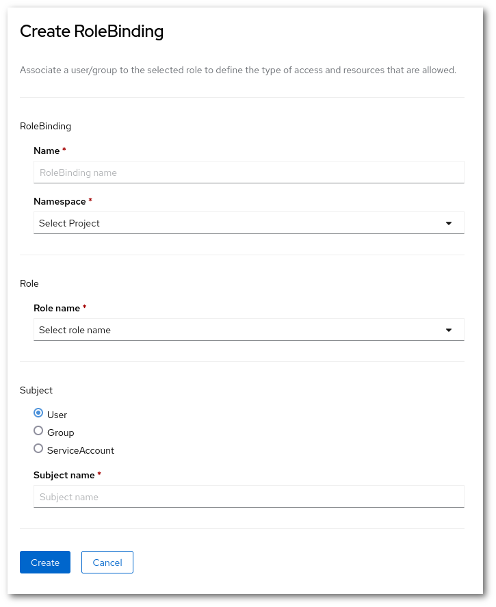
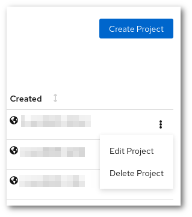

# Projects and quota

## OpenShift projects and CSC computing projects

!!! info

    Projects in Rahti 2 are separate from CSC computing projects. A single CSC
    computing project can have access to multiple projects in Rahti 2.
    Each CSC computing project with access to Rahti will have a corresponding *group* in
    Rahti 2.

All projects in Rahti 2 must be mapped to a CSC computing project. This
mapping is used to determine which CSC computing project a given resource
belongs to for billing and other purposes. You need to
specify which of them to use. You have to specify which project to map by entering `csc_project:` followed
by the name or number of your CSC computing project in the _Description_ field
when creating a new project in Rahti 2. You can also enter other text in the
description field if you want to have a human-readable description for
the project you are creating.

For example, if you have Rahti 2 access via *project_1000123*, you would
enter the following in the _Description_ field:

```yaml
csc_project: 1000123
```

You can also enter a human-readable description for the project, in which case
the field could look like this:

```yaml
This project is used for hosting the Pied Piper web application.

csc_project: 1000123
```

This would make it so that any usage within that Rahti 2 project is billed
to the billing unit quota of project_1000123. Note that project_1000123 must
have Rahti service access and you must be a member of that computing project,
or the OpenShift project creation will fail.

If you would like to know which CSC computing projects you are a member of, you
can view a list in the [My Projects
tool](https://my.csc.fi/projects) of MyCSC. 

If you would like to know which CSC computing project a Rahti 2 project is
associated with, you can do so using the _oc_ command line tool. You can find
instructions for setting up oc in the [command line tool usage
instructions ](cli.md). For example, if your Rahti 2 project is called
*my-openshift-project*, you would run:

```bash
oc get project my-openshift-project -o yaml
```

This should produce the following output:

```yaml
apiVersion: project.openshift.io/v1
kind: Project
metadata:
  annotations:
    ...
  creationTimestamp: 2018-11-22T12:27:05Z
  labels:
    csc_project: "1000123"
  name: my-openshift-project
  resourceVersion: "72557736"
  selfLink: /apis/project.openshift.io/v1/projects/my-openshift-project
  uid: df4970e2-abd7-4417-adbf-531293c68cd6
spec:
  finalizers:
  - openshift.io/origin
  - kubernetes
status:
  phase: Active
```

In the output above, you can find the associated CSC computing project under
`metadata.labels.csc_project`. In this case, the project is `1000123`.
This information is also available via a web interface.


!!! info

    It is not possible for normal users to change the *csc_project* label
    after a project has been created. If you would like to change the label for
    an existing project, please [contact the support](../../../support/contact.md). You can also create
    a completely new project if you want to use a different label.

## Creating a project

First, click this [link](https://rahti.csc.fi/) to access the homepage of Rahti 2 and click **Login Page** under *OpenShift 4.15*.  

After being logged in, click the blue "Create Project" button to create a project, and you will be presented with the following view:


If you are in "Developer" view, click on "Projects: All projects" located in the topbar and "Create Project":
  

1. You *need* to pick a **unique name** that is not in use by any other project
in the system.
1. You *can* also enter a **human-readable display name** and.
1. You *have to* also enter a **CSC computing project** in the _Description_ field. It must be a currently valid CSC project, that your account has access to. In order to view to which CSC projects you have access to, please check <https://my.csc.fi>. If you have access to no CSC project, you will not be able to create any Rahti 2 project. If you have Rahti 2 access via project_1000123, you would enter the following in the Description field:

> csc_project: 1000123


See the section about [accounts](../../../accounts/index.md).

Once you have filled in the fields, click "Create", and you will see the application
catalog where you can pick an application template or import your
own one.

For more information about using the web interface, refer to the
[official OpenShift documentation](https://docs.okd.io/) (our current version is 4.15). You can find out which version of the documentation to look at in the web interface by
clicking the question mark symbol in the top bar and selecting "About".

## CSC computing project quotas

!!! warning  
    
    Starting June 5th, 2024 a new quota system will be applied. Namespaces/Rahti projects quota will be removed to only have CSC projects quota.  

Each CSC computing project has its own quota. Initial quota is the following:

| Resource                         | Default |
|----------------------------------|---------|
| Virtual cores                    | 4       |
| RAM                              | 16 GiB  |
| Storage                          | 100 GiB |
| Number of image streams (images) | 20      |
| Size of each registry images     | 5 GiB   |

This means that your CSC computing project can use up to 4 cores and 16GiB in total, it can be 1 Pod using the whole 4 cores and 16 GiB, 8 pods each using half a core and 2 GiB, etc...

!!! Warning

    If you have several users that can access the CSC computing project, they can create a new Rahti project (see above). Keep in mind that the quotas will be shared across the different Rahti projects.  
    If you need to adjust your CSC computing project quotas, please contact us. More information [here](projects_and_quota.md#requesting-more-quota)

You can find the resource usage and quota of a project in the project view in
the web interface under **Administration -> ResourceQuota** and **Administration -> LimitRanges** in the `Administrator` menu.

Alternatively, you can use the oc command line tool:

```sh
$ oc describe AppliedClusterResourceQuotas
Name:                      crq-200xxxx
Namespace Selector:        ["test-delete"]
Resource                   Used  Hard
--------                   ----  ----
limits.cpu                 500m  16
limits.ephemeral-storage   0     5Gi
limits.memory              1Gi   40Gi
openshift.io/imagestreams  1     20
persistentvolumeclaims     0     20
pods                       1     100
requests.storage           0     200Gi
```

```sh
$ oc describe limitranges
Name:                  limits
Namespace:             test-delete
Type                   Resource  Min  Max    Default Request  Default Limit  Max Limit/Request Ratio
----                   --------  ---  ---    ---------------  -------------  -----------------------
Container              cpu       50m  4      100m             500m           5
Container              memory    8Mi  16Gi   500Mi            1Gi            -
openshift.io/Image     storage   -    5Gi    -                -              -
PersistentVolumeClaim  storage   -    100Gi  -                -              -
```

### Default Pod resource limits

Every Pod needs to have lower and upper limits regarding resources, specifically for CPU and memory. The lower are called `requests`, and the upper are called `limits`. The `requests` sets the minimum resources needed for a  Pod to run, and a Pod is not allowed to use more resources than the specified in `limits`.

The user can set the limits explicitly within the available quota, but if no limit is set by the user, the defaults are used:

|Type|CPU|Memory|
|:-:|:-:|:-:|
|limits|250m|2500Mi|
|requests|50m|500Mi|

Note: `m` stands for milicores. `500m` will be the equivalent of 0.5 cores, or in other words half of the time of a CPU core.

Rahti 2 enforces a maximum limit/request ratio of 5. This means that the CPU or memory `limits` cannot be more than 5 times the `request`. So if the CPU request is 50m, the CPU limit cannot be higher than 250m. And if you want to increase the CPU limit to 1, you will have to increase as well the request to at least 200m.

## Requesting more quota

If you need more resources than the defaults, you can apply for more quota by contacting the Service Desk. See the [Contact page](../../../support/contact.md) for instructions. Quota requests are handled on a case-by-case basis depending on the currently available resources in Rahti 2 and the use case.

## Sharing projects with other users

!!! info

    When creating a Rahti 2 project which is associated with certain CSC computing project, by default all members the of 
    CSC computing project will have admin access to the Rahti 2 project.  
    You can also add individually an user to a specific Rahti 2 project. The user must have a CSC or HAKA login.

OpenShift has a flexible role-based access control system that allows you to
give access to projects you have created to other users and groups in the system.
You can give e.g. full admin, basic user, edit or read only access to other
users and groups in the system for collaboration.

You can edit project memberships in the web interface via **User Management ->
RoleBindings**, in the `Administrator` menu. You can either give access rights to individual users, groups or Service Accounts by selecting either the _Users_,  _Groups_ or ServiceAccount.



Note that it is important to use correct usernames when sharing projects
with others. Rahti 2 allows you to freely enter any username and will not notify
you for having entered a non-existent username. Usernames are also case-sensitive.
You can find out your username in Rahti 2 via the command line, by using the command `oc whoami`.

## Deleting a project

In order to delete a project, you need to go to the main landing page and click in the 3 vertical dots next to the name of the project. In the drop down menu, you will see the option "Delete Project"



Then you will be asked to input the name of the project to prevent accidental deletions.

!!! warning

    After the project has been confirmed for deletion, all resources will be deleted and there will be no way to restore them, including the data stored in the persistent volumes.


After that, Rahti 2 will start to delete all the resources of the project. It could take only few seconds or up to a minute, it depends on the amount of resources the project had. After that, Rahti 2 will liberate the project name, and it will be possible to create an empty project with the same name.
