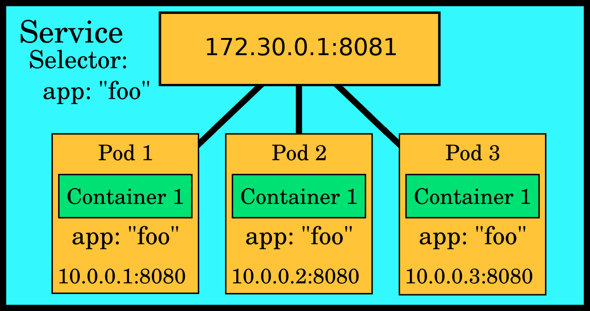
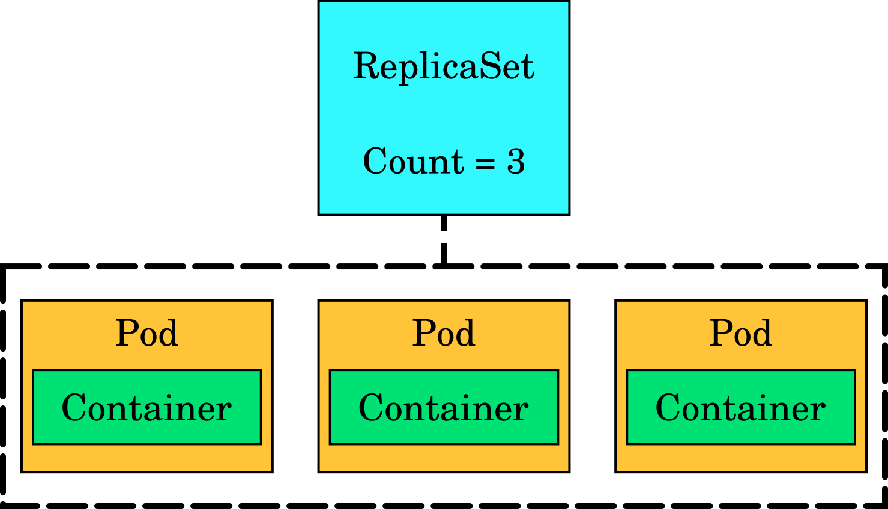
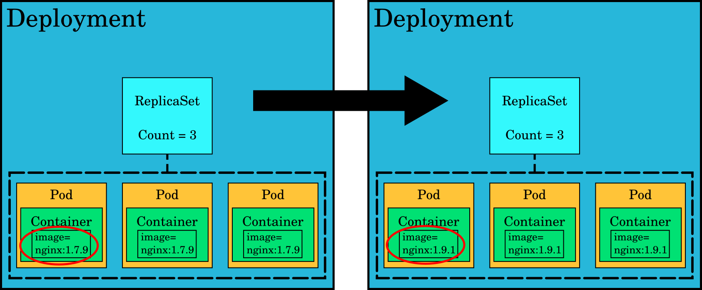

--8<-- "rahtibeta_announcement.md"
# Kubernetes and OpenShift concepts

The power of Kubernetes (and OpenShift) is in the relatively simple abstractions that they provide for complex tasks such as load balancing, software updates for a distributed system, or autoscaling. Here we give a very brief overview of some of the most important abstractions, but we highly recommend that you read the concept documentation for Kubernetes and OpenShift as well:

* [Kubernetes concepts](https://kubernetes.io/docs/concepts/)
* [OpenShift concepts](https://docs.okd.io/3.11/architecture/core_concepts/index.html)

These abstractions are objects, persistent entities in the Kubernetes system. These entities are used to represent the desired state of the project (also called namespace in Kubernetes). Most of the objects are common to both plain Kubernetes and OpenShift, but OpenShift also introduces some of its own extra objects.


## Kubernetes concepts

### Namespace

Every Kubernetes object is created inside a **Namespace**. It is just a sandbox where all the other objects are contained and separated from objects belonging to other namespaces. In Openshift they are referred as **Projects**. The two names (project and namespace) are very common words in computing so referring to them can sometimes be confusing. In order to create a project, please go to the [Creating a project](usage/projects_and_quota.md#creating-a-project) documentation.

### Pod

**Pods** contain one or more containers that run applications. It is the basic
unit in Kubernetes: when you run a workload in Kubernetes, it always runs in a
pod. Kubernetes handles scheduling these pods on multiple servers. Pods can
contain volumes of different types for accessing data. Each pod has its own IP
address shared by all containers in the pod, this IP address may change if the Pod gets killed and recreated. In the most typical
case, a pod contains one container and perhaps one or a few different volumes.

Pods are intended to be _expendable_, i.e. they may be killed at any time and a "cloud native" application must be able to continue working and show no sign of interruption to the user. It must recover automatically. Any data that needs to persist after a pod is killed should be stored on a volume attached to the pod.


The abstractions in Kubernetes/OpenShift are described using YAML or JSON. YAML
and JSON are so-called data serialization languages that provide a way to
describe key value pairs and data structures such as lists in a way that is easy to
read for both humans and computers. An example of what the
representation of a pod looks like in YAML:

```yaml
---
apiVersion: v1
kind: Pod
spec:
  containers:
  - name: webserver
    image: registry.access.redhat.com/rhscl/nginx-112-rhel7
    ports:
    - containerPort: 8080
      protocol: TCP
    volumeMounts:
    - name: website-content-volume
      mountPath: /usr/share/nginx/html
    volumes:
    - name: website-content-volume
      persistentVolumeClaim:
        claimName: web-content-pvc
```

The above YAML representation describes a web server pod that has one container
and one volume and exposes the port 8080. You could put this snippet of text
in a file and create a pod that runs NGINX by feeding that file to the Kubernetes API.

### Service

Pod IP addresses are not predictable. If a pod is replaced as part of normal
operations such as an update, the IP address of the new pod can be different. It is
also typical to have multiple pods serving the same content, in which case there
are several of these unpredictable IP addresses to point to. Thus, pods alone
are not enough to provide a predictable way to access an application.

A **service** provides a stable virtual IP, a port and a DNS name for one or
more pods. They act as load balancers, directing traffic to a group of pods
that all serve the same application.



*`service.yaml`*:

```yaml
apiVersion: v1
kind: Service
metadata:
  labels:
    app: app
  name: service-name
spec:
  ports:
  - name: 8080-tcp
    port: 8080
    protocol: TCP
    targetPort: 8080
  selector:
    app: app
  sessionAffinity: None
  type: ClusterIP
status:
  loadBalancer: {}
```

### ReplicaSet

A **ReplicaSet** ensures that _n_ copies of a pod are running. If one of the
pods dies, the ReplicaSet ensures that a new one is created in its place. They
are typically not used on their own but rather as part of a **Deployment**
(explained next).



### Deployment

**Deployments** manage rolling updates for an application. They typically
contain a ReplicaSet and several pods. If you make a change that requires an
update such as switching to a newer image for pod containers, the deployment
ensures the change is made in a way that there are no service interruptions. It
will perform a rolling update to kill all pods one by one and replace them with
newer ones while making sure that end user traffic is directed towards working
pods at all times.



*`deployment.yaml`*:
```yaml
apiVersion: extensions/v1beta1
kind: Deployment
metadata:
  name: deployment-name
spec:
  selector:
    matchLabels:
      app: deployment-name
  template:
    metadata:
      labels:
        app: deployment-labels
    spec:
      containers:
      - name: pod
        image: <your_image>
      volumeMounts:
      - mountPath: /path/to/folder/
        name: pvc
      ports:
      - containerPort: xx
        protocol: TCP
      volumes:
      - name: vol
        persistentVolumeClaim:
          claimName: pvc
```

### InitContainer

_InitContainer_ is a container in a pod that is intended run to completion before
the main containers are started. Data from the init containers can be
transferred to the main container using e.g. empty volume mounts.

*`pod-init.yaml`*:

```yaml
apiVersion: v1
kind: Pod
metadata:
  name: mypod
  labels:
    app: serveapp
    pool: servepod
spec:
  volumes:
  - name: sharevol
    emptyDir: {}
  initContainers:
  - name: perlhelper
    image: perl
    command:
    - sh
    - -c
    - >
      echo Hello from perl helper > /datavol/index.html
    volumeMounts:
    - mountPath: /datavol
      name: sharevol
  containers:
  - name: serve-cont
    image: docker-registry.default.svc:5000/openshift/httpd
    volumeMounts:
    - mountPath: /var/www/html
      name: sharevol
```

Here we run an init container that uses the `perl` image and writes text
in the `index.html` file on the shared volume.

The shared volume is defined in `spec.volumes` and "mounted" in
`spec.initContainers.volumeMounts` and `spec.containers.volumeMounts`.

### StatefulSet

Most Kubernetes objects are stateless. This means that they may be deleted and recreated, and the application should be able to cope with that without any visible effect. For example, a DeploymentConfig defines a Pod with 5 replicas and a Rolling release strategy. When a new image is deployed, Kubernetes will kill one by one all Pods, recreating them with different names and possibly in different nodes, always keeping at least 5 replicas active. For some application this is not acceptable, for this use case, Stateful sets have been created.

Like a DeploymentConfig, a StatefulSet defines Pods based on container specification. But unlike a Deployment, a StatefulSet gives an expected and stable identity, with a persistent identifier that it is maintained across any event (upgrades, re-deployments, ...). A stateful set provides:

* Stable, unique network identifiers.
* Stable, persistent storage.
* Ordered, graceful deployment and scaling.
* Ordered, automated rolling updates.

*`statefulSet.yaml`*:

```yaml
apiVersion: apps/v1
kind: StatefulSet
metadata:
  name: web
spec:
  selector:
    matchLabels:
      app: nginx # has to match .spec.template.metadata.labels
  serviceName: "nginx"
  replicas: 3 # If omitted, by default is 1
  template:
    metadata:
      labels:
        app: nginx # has to match .spec.selector.matchLabels
    spec:
      terminationGracePeriodSeconds: 10
      containers:
      - name: nginx
        image: openshift/hello-openshift
        ports:
        - containerPort: 8888
          name: web
        volumeMounts:
        - name: www
          mountPath: /usr/share/nginx/html
  volumeClaimTemplates:
  - metadata:
      name: www
    spec:
      accessModes: [ "ReadWriteOnce" ]
      storageClassName: "standard-rwo"
      resources:
        requests:
          storage: 1Gi
```

### Jobs

_Jobs_ are run-to-completion pods, except that they operate on the same level
as ReplicationControllers, in the sense that they too define the template for the pod
to be launched instead of directly describing the pod. The difference is,
however, that *jobs* are not restarted when they finish.

*`job.yaml`*:

```yaml
apiVersion: batch/v1
kind: Job
metadata:
  name: pi
spec:
  template:
    spec:
      volumes:
      - name: smalldisk-vol
        emptyDir: {}
      containers:
      - name: pi
        image: perl
        command:
        - sh
        - -c
        - >
          echo helloing so much here! Lets hello from /mountdata/hello.txt too: &&
          echo hello to share volume too >> /mountdata/hello-main.txt &&
          cat /mountdata/hello.txt
        volumeMounts:
        - mountPath: /mountdata
          name: smalldisk-vol
      restartPolicy: Never
      initContainers:
      - name: init-pi
        image: perl
        command:
        - sh
        - -c
        - >
          echo this hello is from the initcontainer >> /mountdata/hello.txt
        volumeMounts:
        - mountPath: /mountdata
          name: smalldisk-vol
  backoffLimit: 4
```

This job names the pod automatically, and the pod can be queried with
a job-name label:

```bash
$ oc get pods --selector job-name=pi
NAME       READY     STATUS      RESTARTS   AGE
pi-gj7xg   0/1       Completed   0          3m
```

The standard output of the job:

```bash
$ oc logs pi-gj7xg
helloing so much here! Lets hello from /mountdata/hello.txt too:
this hello is from the initcontainer
```

There may only be one object with a given name in the project namespace, thus the
job cannot be run twice unless its first instance is removed. The pod,
however, needs not be cleaned.

## OpenShift extensions

OpenShift includes all Kubernetes objects, plus some extensions:

* **BuildConfig** objects build container images
  based on the source files.
* **ImageStream** objects abstract images and
  enrich them to streams that emit signals when they see that a new image is
  uploaded into them by e.g. BuildConfig.
* **DeploymentConfig** objects create new [**ReplicationControllers**](../tutorials/elemental_tutorial.md#replicationcontroller) based on the new images.
* **Route** objects connects a **Service** with the internet using _HTTP_.

### DeploymentConfig

DeploymentConfigs are objects that create
[ReplicationControllers](../tutorials/elemental_tutorial.md#replicationcontroller) according to
`spec.template`. They differ from ReplicationControllers in the sense that 
DeploymentConfig objects may start new ReplicationControllers based on the state of
`spec.triggers`. In the example below, the DeploymentConfig performs
an automatic rolling update when it gets triggered by an ImageStream named
`serveimagestream:latest`. For other update strategies, see "[Deployment
Strategies](https://docs.okd.io/3.11/dev_guide/deployments/deployment_strategies.html)"
in the OpenShift documentation.

DeploymentConfig objects function similarly to deployments described in the
chapter [concepts](concepts.md) except that deployments
trigger updates only when `spec.template` is changed. Furthermore, deployment
is a pure Kubernetes concept, and DeploymentConfig is an OpenShift extension.

Recall that [ReplicationControllers](../tutorials/elemental_tutorial.md#replicationcontroller)
are objects that make sure that a requested number of replicas of the pod defined in the
`spec.template` is running.

*`deploymentconfig.yaml`*:

```yaml
apiVersion: v1
kind: DeploymentConfig
metadata:
  labels:
    app: serveapp
  name: blogdeployment
spec:
  replicas: 1
  selector:
    app: serveapp
    deploymentconfig: blogdeployment
  strategy:
    activeDeadlineSeconds: 21600
    type: Rolling
  template:
    metadata:
      labels:
        app: serveapp
        deploymentconfig: blogdeployment
    spec:
      containers:
      - name: serve-cont
        image: "serveimagestream:latest"
  triggers:
  - type: ConfigChange
  - imageChangeParams:
      automatic: true
      containerNames:
      - serve-cont
      from:
        name: serveimagestream:latest
    type: ImageChange
```

In this case, the DeploymentConfig object listens to the *ImageStream* object
`serveimagestream:latest`.

### ImageStream

ImageStreams simplify image names and get triggered by a BuildConfig if new
images are uploaded to the registry. When a new image is
uploaded, it can trigger its listeners to act. In the case of our
DeploymentConfig, the action triggered would be to do an update for the pods
that it is meant to deploy.

A simple ImageStream object:

*`imagestream.yaml`*:

```yaml
apiVersion: image.openshift.io/v1
kind: ImageStream
metadata:
  labels:
    app: serveapp
  name: serveimagestream
spec:
  lookupPolicy:
    local: false
```

### BuildConfig

BuildConfig objects create container images according to specific rules. In
the following example, the _Docker_ strategy is used to build a trivial extension
of the `httpd` image shipped with OpenShift.

*`buildconfig.yaml`*:

```yaml
kind: "BuildConfig"
apiVersion: "v1"
metadata:
  name: "serveimg-generate"
  labels:
    app: "serveapp"
spec:
  runPolicy: "Serial"
  output:
    to:
      kind: ImageStreamTag
      name: serveimagestream:latest
  source:
    dockerfile: |
      FROM docker-registry.default.svc:5000/openshift/httpd
  strategy:
    type: Docker
```

After creating the build object (here named `serveimg-generate`), we can
request the OpenShift cluster to build the image:

```bash
 oc start-build serveimg-generate
```

Other source strategies include `custom`, `jenkins` and `source`.

### Route

Route objects are the OpenShift equivalent of _Ingress_ in vanilla Kubernetes, they expose a Service object to the internet via HTTP/HTTPS. A typical Route definition would be:

```yaml
apiVersion: route.openshift.io/v1
kind: Route
metadata:
  name: <name-of-the-route>
spec:
  host: <host.name.dom>
  to:
    kind: Service
    weight: 100
    name: <name-of-service>
  tls:
    insecureEdgeTerminationPolicy: Redirect
    termination: edge
status:
  ingress: []
```

This will redirect any traffics coming to `<host.name.dom>` to the service `name-of-service`.

* `insecureEdgeTerminationPolicy` is set to `Redirect`. This means that any traffic coming to port 80 (HTTP) will be redirected to port 443 (HTTPS).
* `termination` is set to `edge`, This means that the route will manage the TLS certificate and decrypt the traffic sending it to the service in clear text. Other options for `termination` include `passthrough` or `reencrypt`.

Every host with the pattern `*.rahtiapp.fi` will automatically have a **DNS record** and a valid **TLS certificate**. It is possible to configure a Route with any given hostname, but a `CNAME` pointing to `rahtiapp.fi` must be configured, and a **TLS certificate** must be provided. See the [Custom domain names and secure transport](../tutorials/custom-domain.md) article for more information.

#### Annotations

* It is possible to use annotations to enable **IP whitelisting**, where only a few IP ranges are allowed to get through the **route** and the rest of the internet is blocked. Security-wise, it is highly encouraged to utilize IP whitelisting for services that are not meant to be visible to the entire internet. In order to add it to a route do:

    ```sh
    oc annotate route <route_name> haproxy.router.openshift.io/ip_whitelist='192.168.1.0/24 10.0.0.1'
    ```

!!! Caution
    If the whitelist entry is malformed, OpenShift will discard the whitelist and allow all traffic.

* It is also possible to use annotations to [configure Route Timeouts](https://docs.openshift.com/container-platform/3.11/install_config/configuring_routing.html), as described in the upstream documentation.

    A timeout from the LoadBalancer looks like:

    ```html
    <html><body><h1>504 Gateway Time-out</h1>
    The server didn't respond in time.
    </body></html>
    ```

    Any other kind of Timeout error, will more likely be not related to the LoadBalancers.

    For example, to increase the timeout of route `myroute` to 60s give:

    ```sh
    oc annotate route myroute --overwrite haproxy.router.openshift.io/timeout=60s
    ```
