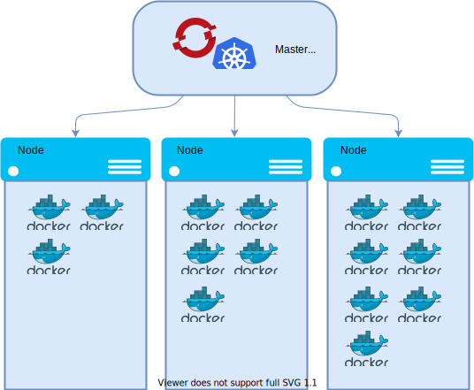

# Containers & Container Orchestration

## Containers

Containers are a technology based on operating system kernel features
that allow the creation of isolated environments sharing a kernel.
For example, container features make it possible to have several isolated root
filesystems, network stacks and process trees that all use the same kernel.
These isolated environments are similar in functionality to lightweight virtual
machines, but there are some key differences between virtual machines and
containers. The biggest one is that virtual machines always have their own
kernels, while containers share the host system's kernel.


*The difference between virtual machines and containers.*

While many operating systems have the container functionality, what we look at more
specifically in this documentation is containers in the Linux operating system.
Linux is the most popular operating system for running containers, and it is
also the operating system used in the Rahti container cloud.

In order to use the container functionality, a _runtime_ is needed. Currently, the most popular runtime in Linux is _Docker_, but [podman](https://podman.io/), [cri-o](https://cri-o.io/), and many others are getting more relevance. All of these runtime follows the guidelines of the [Open Container Initiative](https://opencontainers.org/) (OCI). A runtime provides
a set of tools that makes it easier to use containers compared to using the
kernel functionality directly. Mainly the command line interface and backend libraries for running, building and managing containers and images

Docker has popularized containers by making them easier to use. Instead of
looking at kernel documentation and figuring out how to use the different
interfaces of the kernel's container features and then having to figure out
which features you want to use and how, Docker provides a simpler way to start
containers with a single command line command. The specific kernel features and
how to use them are isolated to the user by Docker.

As an example of how Docker is used, this is how you could start a container on
your computer after installing Docker:

```bash
docker run -it ubuntu
```

This will download the _ubuntu_ image if it is not already present on the
computer, start a container based on that image, and give the user a command line
interface within the container. From the user's point of view, the experience is
similar to starting a virtual machine: regardless of the operating system
distribution on your computer, interacting with the container seems like you
are interacting with a Ubuntu installation.

After running the command, you should be able to see the Ubuntu Docker image
that has been downloaded by listing the images:

```bash
docker images
```

You can also do many other things, such as launch containers in the background,
attach to a running container to interact with it, or build your own Docker
images from a Dockerfile. The examples given here are intended to give a general
idea of what using containers is like from the user's perspective. For more
complete documentation about Docker, see the
[official Docker documentation](https://docs.docker.com/).

## Container orchestration

To understand why container orchestration platforms are important, let us
describe how a typical web-based application that end users access via a web
browser is built.



The application comprises a frontend that is the part of the application
visible to users and a backend that handles various tasks in the background such as
storing user data in a database. The application runs a server process that
clients access to interact with the application. It also accesses a database
such as PostgeSQL or MongoDB in the background to store user data.

The architects of this application must design it to keep the application
running reliably, quickly and safely:

  * Server hardware can fail, so the application must be replicated on multiple
    physical servers so that the failure of an individual server will not render the
    entire application inaccessible.
  * A large number of users causes load on the application. It must be
    possible to scale up the application by adding more application processes to
    prepare for increased user load.
  * The connection to the application must be secure so that the users can safely
    enter their data in the application without fearing eavesdroppers.
  * User data must be stored reliably on a fault-tolerant storage system.

You could create Linux virtual machines, install Docker on them, and run the
application directly using those, but there is a lot of additional work to meet
all of the above requirements. You would have to figure
out how to manage multiple instances of the application running on several
servers, how to direct incoming traffic evenly to all the application instances,
how to store user data, and how to quickly add more capacity when needed.

Luckily, most applications have similar requirements, so the steps for creating
good applications are often quite similar. This is where container orchestration
systems come in. They handle many of the common tasks required for running
robust web applications such as distributing application instances over multiple
servers, directing traffic to the application instances, and providing persistent
storage for databases.

Currently, the most popular software for container orchestration is _Kubernetes_.
It is based on earlier systems developed at Google over a decade. The Rahti
system is based on a distribution of Kubernetes called _OpenShift_ made by
Red Hat.
