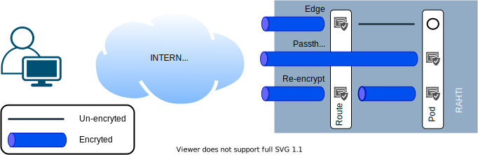

# Networking

## Ipv4

All networking in Rahti uses [IPv4](https://en.wikipedia.org/wiki/IPv4). All IPs in this document and Rahti's system itself are ipv4 only, no ipv6 IP is used.

## Namespaces

Rahti is divided in **Namespaces**. Depending on the context, namespaces can be referred as **Projects**. Every object in Rahti must belong to and run inside a namespace. From a networking point of view, namespaces provide an isolated **VLAN** to everything that runs inside it, notably to [Pods](../concepts/#pod), [Services](../concepts/#service) and [Routes](../concepts/#route).


## Pods

**Pods** are the basic unit in Kubernetes. They accommodate one or more containers that contain the software and the environment needed to run an application. Each Pod has a [**private** IP](https://en.wikipedia.org/wiki/Private_network), which is only reachable from inside the namespace/VLAN. It is not advisable to use these Pod IPs directly in applications, they are meant to be used by **Services**. This is because not only other Pods in other namespaces may share this private IP, but more importantly, when a Pod is recreated it will get a new IP.

For example, if we deploy the `nginx` image in a Pod. This Pod will get a random private IP like `10.1.1.200`. Any unprivileged port (`>=1024`) that the image exports, like for example `8081`, will be reachable in that IP. A Pod will fail to start if it tries to export a privileged port (`[0-1023]`). If the Pod is killed, normally due to a change in its configuration, but also possibly due to unexpected reasons like hardware failure, a new Pod with a different IP will be created, like for example `10.1.1.140`. These IPs will respond to traffic from within the namespace only. If we set up a Pod that will query the first IP (`10.1.1.200`), it will obviously stop working at the moment of the recreation of the Pod associated with it. This is why we use **services**.

## Services

**Services** (also abbreviated `svc`) provide a _stable_ [private IP](https://en.wikipedia.org/wiki/Private_network) to one or more Pods. This IP will act as a load balancer, distributing the traffic load between the Pods behind it. For this, the service will make sure to keep an updated list of IPs so requests are only sent to valid ones.

Services are built to export one or more ports, and they also provide an internal DNS name. Any of these names are valid and will resolve to the same service IP:

* `<service_name>`, e.g., nginx.
* `<service_name>.<namespace>`, e.g., ngin.fenic
* and `<service_name>.<namespace>.svc.cluster.local`, e.g., nginx.fenic.svc.cluster.local.

In the same manner than Pods, Rahti Services can only be reached from inside the namespace they run, any request from another namespace will be able to resolve the DNS into an IP, but it will never connect. Another feature of services is that they can forward requests from one port to another target port (ex: 80 to 8080). This is useful in Rahti as Pods cannot listen on privileged ports (`<1024`).

Services can be used for internal connections. For example, if we have one or more MongoDB database replicas running in the `fenic` namespace, each in a different pod, and they export port `27017`. We can create a service called `mongo` associated with the pods under the same name. Then we can launch `nginx` Pods that run a Python application which will use the URL `<mongo:27017` to connect to the database. When connections to the service are attempted, one of the mongo pods will be selected to serve the data request.


## Routes

**Routes** are the OpenShift equivalent of _Ingress_ in vanilla Kubernetes, they expose a single port of a single Service object to traffic from outside the namespace and the Internet, via HTTP/HTTPS only. If the route is configured to provide no encrypted HTTP traffic, the pods associated should talk in HTTP non encrypted traffic. If the route is configured to provide TLS/HTTPS secure traffic, several options are available regarding the Route encryption:

* **Edge**, this is the default and the simplest to configure. The Route provides the certificate, which is stored in the Route object itself. The traffic is decrypted and the Pod is contacted using plain text un-encrypted HTTPD traffic.
* **Passthrough** is when the encryption is delegated to the pod, which must listen for TLS/HTTPS traffic and provide the certificate the client will receive.
* **Re-encrypt**, this is a mixture of two previous options, the Route will provide a certificate, but it will connect to the Pod using TLS/HTTPS and expect a valid certificate for the domain name of the service. The client will still get the certificate stored by the Route. This is for example used when the internal network between nodes in the cluster is not considered secure enough and we still want the Route to control the certificates that the client will get. Also in some rare applications is not possible to disable TLS in the Pods.



A Route can also be configured to (1) provide a HTTP/302 redirection from port `80` to `443`. It is also possible to (2) serve the same content in both ports, or to (3) not serve anything at all in the un secure `80` port.

An important limitation for Rahti is that **only the HTTP/80 and HTTPS/443 ports are exposed for incoming traffic**, and they only can serve **HTTPD protocol requests**. Internally to a namespace, any port and protocol is supported, this means we can connect an application to a database with no issues, but we will never be able to expose that database to outside traffic. This is due to the fact that the same incoming virtual IP is shared with all the incoming traffic in Rahti's HAProxy load balancers. [Name-based virtual hosts](https://en.wikipedia.org/wiki/Virtual_hosting#Name-based) are used to redirect the traffic to the correct Route. Other protocols that are not HTTPD, do not have this feature and will need a dedicated IP/port pair to work.

Rahti provides a range of pre-created domain names, `XXXX.2.rahtiapp.fi` where `XXXX` can be any combination of letters, numbers and dashes. These pre-created domain names also come with a valid TLS certificate.

Every single pre-created domain name is configured to point to the HAProxy load balancers.

Any other domain name is possible, but the DNS and the certificates must be managed by the customer:

* For the DNS, a `CNAME` pointing to `2.rahtiapp.fi` or in cases that this is not possible, directly the `A` record containing the IP of `apps.2.rahti.csc.fi` has to be configured. The way this needs to be configured depends on the register of the DNS record.

* Any certificate provider can be used, like for example use the free certificates provided by the [Let's Encrypt controller](../tutorials/custom-domain/#lets-encrypt).

Another aspect of routes is the IP white listing feature, ie: only allowing a range of IPs to access the route. This is controlled by creating an annotation in the Route object with the key `haproxy.router.openshift.io/ip_whitelist`, and by setting the value to a space separated list of IPs and or IP ranges.

* This first example will white list a range of IPs (`193.166.[0-255].[1-254]`):

```bash
oc annotate route <route_name> haproxy.router.openshift.io/ip_whitelist='193.166.0.0/16'
```

* This other example will white list only a specific IP:

```bash
oc annotate route <route_name> haproxy.router.openshift.io/ip_whitelist='188.184.9.236'
```

* And this example will combine both:

```bash
oc annotate route <route_name> haproxy.router.openshift.io/ip_whitelist='193.166.0.0/15 193.167.189.25'
```

## Egress IPs

The IP for all outgoing customer traffic is `128.214.255.177`. Any pod that runs in Rahti will use by default this IP to reach anything located outside Rahti or a Route. It is possible, for selected namespaces that need it, to configure a dedicated IP. Each request is reviewed individually due to the fact that there is a limited pool of virtual IPs available.
