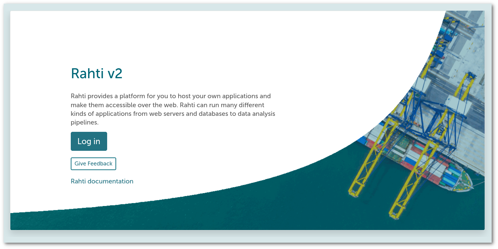
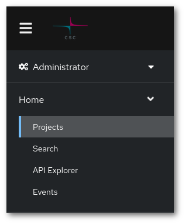
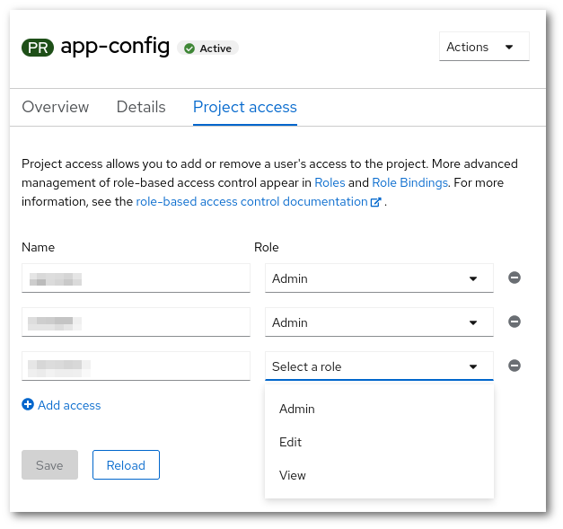
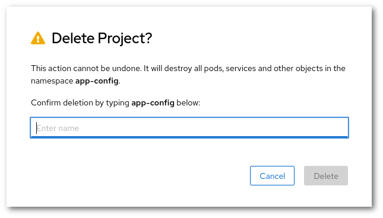

# Rahti4 migration guide

This guide is dedicated to answer te most frequent questions and provide procedures for the Rahti3 to Rahti4 migration.

Rahti3 is the current deployed and used version of OpenShift OKD running in CSC. The exact version is `v3.11`, it is the last released version in the `3.XX` series. The underlining Kubernetes version is v1.11. Rahti3 is in open beta, and will never react production status.

Rahti4 is the next version of OpenShift OKD running in CSC. The underlining version of Kubernetes is v1.22. This version uses [cri-o](https://cri-o.io/) as the container runtime. `CRI-o` it is a lightweight alternative to using Docker as the runtime for kubernetes, both are fully compatible with each other and follow the `OCI` standard. Due to the fact that OpenShift OKD v4 is a re-implementation, there is no upgrade path provided by the manufacturer for Rahti3 to become Rahti4. So in other words, this means that every single application running in Rahti3 needs to be migrated to Rahti4 manually. The two versions will run in parallel for a while, till all applications running in v1 are migrated to v2.

## How to log in Rahti4?

Go to [Rahti4](https://landing.2.rahti.csc.fi/), click in `Login` and then choose the `oidcidp` option, it stands for OpenID Connect identity provider:

{: style="width:400px"}

You will be then served with a page with all the authentication options that Rahti accepts. Choose the one that is more convenient for you, all your identities should be linked to the same Rahti account.

### Command line login

In order to get the "login command", once you have logged in the web interface, click on your name and then in "Copy Login Command". For security reasons, you will be required to login again, after that you will be served the page the login command you can copy to the clipboard and paste it in any terminal running on your system.

## How to create a project?

There are few places in th web interface where a project can be created. One of the paths to create a project is to go to `Administrator` > `Home` > `Projects`

Then click in "Create Project".

The fields are the same as with Rahti3:

1. You need to pick a unique name that is not in use by any other project in the system.
    
1. You can also enter a human-readable display name and.
    
1. You have to also enter a CSC computing project in the Description field. It must be a currently valid CSC project, that your account has access to. In order to view to which CSC projects you have access to, please check https://my.csc.fi. If you have access to no CSC project, you will not be able to create any Rahti project. If you have Rahti access via project_1000123, you would enter the following in the Description field:

> csc_project: XXXXXXX

## How to see quota/limits?

The quota and limits of a given project can be found in the bottom of the project details page 

If you click in "quota"

## How to create routes?

!!! info "Default URLs sufix have changed"

    In Rahti3 default URLs were `<whatever>.rahtiapp.fi` meanwhile in Rahti4 it will be `<whatever>.2.rahtiapp.fi`

A Route can be created by going to the project details page, and click in Routes.

And then click in "Create Route"

A Route has two compulsory parameters:

* a `name`, which must be unique within the project.
* a `service`/`port`, which is where the traffic will be routed to.  

Other optional parameters are:

* a `hostname`, which must be unique within Rahti. If none is provided, the hostname will be autogenerated by using the route `name` and the `project name`.
* `Secure Route` can be activated to activate TLS encryption (Only TLS v1.3 and v1.2 are supported in Rahti4, Rahti3 only support TLS v1.2). The options are similar than in [Rahti3 Routes](/cloud/rahti/networking/#routes)

## What changes must be made in firewalls?

The egress IP used in Rahti4 is different that for Rahti3. This means that if you have a firewall rule opening for traffic coming from Rahti, the IP has to be updated. The Rahti3 IP is `193.167.189.25` and the new one for Rahti4 is `128.214.255.177`.

Some project with dedicated egress IPs will have to request a new dedicated IP in Rahti4 and update their firewalls accordingly.

## How to manage users in project?

In the project details page select "Project access".

You just need to write the user's username, and a role level: `admin`, `Edit` or `View`. To save the changes, just click in `Save`. The different access that each role level has can be checked out in the linked documentation in the page itself.

## How to delete project?

A project can be deleted from the Project details page (`Developer` > `Project`), by selecting `Actions` > `Delete project`. A dialog to confirm the deletion will appear:

The name of the project (`app-config` in this example) has to be inputted before the project is deleted. This is just to avoid accidental deletion.

## How to use storage?

In the Project details page (`Developer` > `Project`), click `PersistentVolumeClaims` and then click in `Create PersistentVolumeClaim`.

* For the moment only a single type of `StorageClass` can be used. It corresponds to `Cinder` volumes, which can only be read or write by a single Pod.

* A unique name within the project must be provided.

* A size within the quota limits has to be inputted.

* The Volume mode should be `Filesystem`.

Once the volume is created, it can be mounted in a Pod as in `Rahti3` or any other Kubernetes installation.

