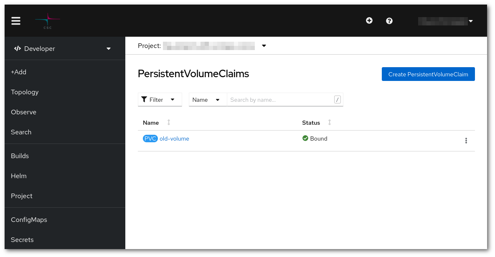
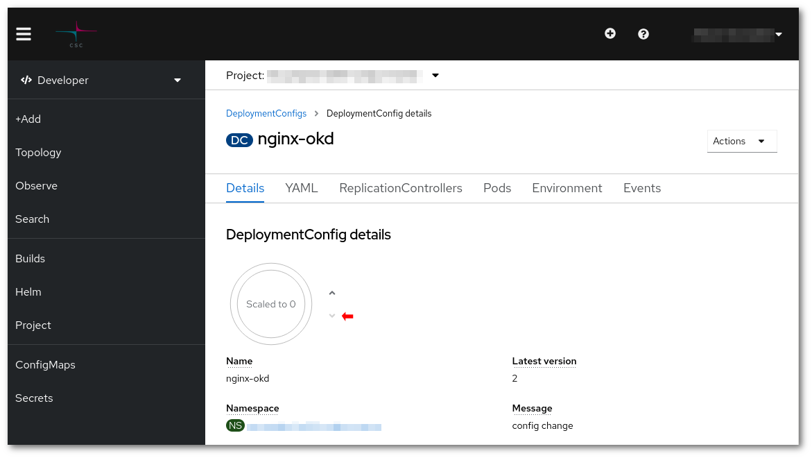

# Expand a volume

## Non dynamically

When dynamic volume expansion is not activated, the command line will give an error like:

```sh
error: persistentvolumeclaims "postgresql" could not be patched: persistentvolumeclaims "postgresql" is forbidden: only dynamically provisioned pvc can be resized and the storageclass that provisions the pvc must support resize
```

Then a more artisanal procedure must be followed:

* Create a new volume with the desired size



* Scale down the deployment that mounts the volume that is being resized.



* Mount the old and new volume in another Pod. The best option is to create a new deployment, create a file called `two-volumes.yaml` and replace the names of both volumes:

```yaml
apiVersion: apps.openshift.io/v1
kind: DeploymentConfig
metadata:
  name: two-volumes
spec:
  replicas: 1
  selector:
    app: two-volumes
  template:
    metadata:
      labels:
        app: two-volumes
    spec:
      containers:
      - image: lvarin/nginx-okd:plus
        name: two-volumes
        ports:
        - containerPort: 8081
          protocol: TCP
        volumeMounts:
        - mountPath: /new
          name: new-volume
        - mountPath: /old
          name: old-volume
      volumes:
      - name: new-volume
        persistentVolumeClaim:
          claimName: new-volume
      - name: old-volume
        persistentVolumeClaim:
          claimName: old-volume
```

```sh
oc create -f two-volumes.yaml
```

* Sync the data

```sh
oc rsh dc/two-volumes rsync -vrlpD /old/ /new/
```

* Delete that new Pod

```sh
oc delete dc/two-volumes
```

* Exchange volumes in the deployment that was mounting the volume, it is at **template > spec > volumes** under `claimName`.

```sh
oc edit deploy/<name of deployment>
```

* Finally scale up the deployment.

In order to check the procedure worked, you may enter in a `Pod` that is mounting the volume and check the new size.
