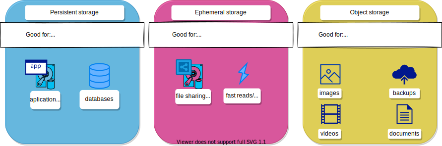

# Rahti storage

This article introduces the storage options available in CSC's Rahti environment. Using the storage requires an account, a CSC project, a Rahti Namespace, and at least a Pod.

One of the pillars of Docker is the immutability of images, once they are built, docker images never change. The issue for most of the applications is that it is necessary to store, update and later retrieve application data. In docker, this is solved by the concept of volumes, an external filesystem (to docker) that is mounted in the internal filesystem of a container. In Kubernetes, and by extension OpenShift, this problem can be solved in several ways.

## Persistent storage

The solution more similar to Docker volumes is a [Persistent volume](persistent/). This is a volume located in an external storage, that is mounted directly into the filesystem of the container like an additional hard disk would. This is the best solution for a seamless storage solution. You can also unmount it from the Pods it is attached to and attach it to another set of Pods. Moreover, persistent volumes represent a reliable storage option as the data in them is replicated.

You can find additional information on the [Persistent volume](persistent/) page.

## Ephemeral storage

Other solution is to use ephemeral storage, called in Kubernetes an _Empty dir_. This is only meant for storing intermediate or temporal data, that needs fast read write access by the applications running inside the containers. The same _Empty dir_ can be mounted in every container inside a Pod. The data in the ephemeral storage is lost when the Pod is deleted. Given that the data in the ephemeral you should not store any persistent data there, and the ephemeral storage should not be considered reliable.

You can find additional information on the [Ephemeral storage](ephemeral/) page.

## Object storage

In case you need to store large volumes of data, or you need that your data can be easily accessed over the Internet, e.g., using URLs, object storage is the storage solution you are looking for. By using object storage, you are free to create and delete your Pods as the object storage is not tied to any Pod. Moreover, your data is replicated, thus object storage represents a reliable long-term storage option.

At CSC, we offer Allas as our object storage solution. You can find additional information on the [Allas page](../../../data/Allas/index.md).
