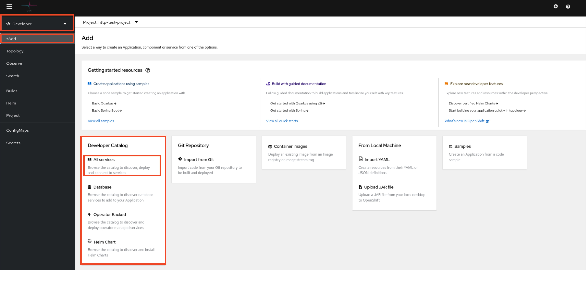
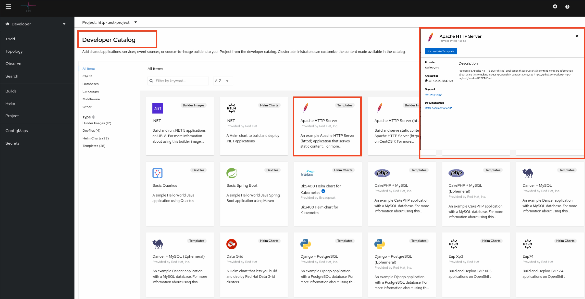
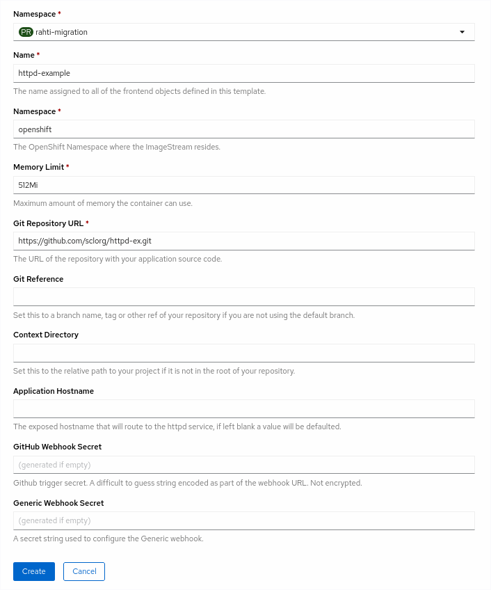
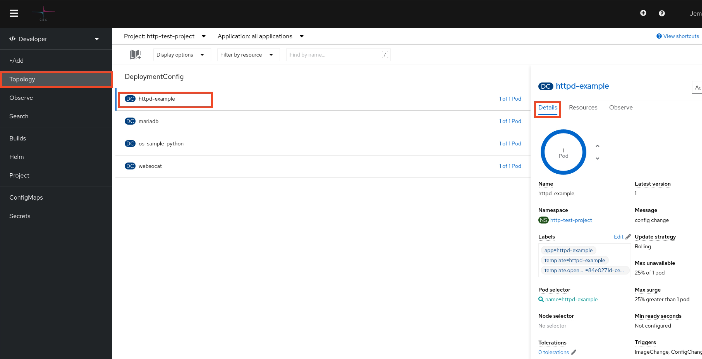
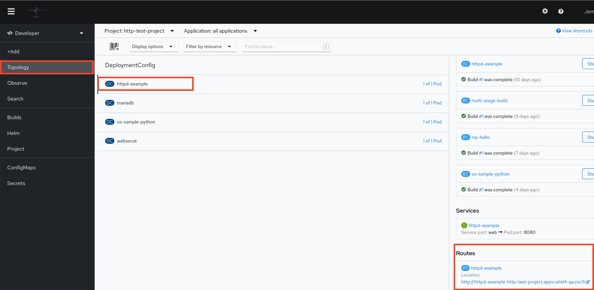

# Static web server

How to set up a static web server in Rahti4.

1. Create a project. [Instructions](../../usage/projects_and_quota/)

2. In the Openshift Rahti4 web console, switch to the Developer perspective. Select _Add_ from the navigation panel. To create an application, under Developer Catalog list Select _All services_ and then search for _Apache HTTP Server_, Click the _Apache HTTP Server_, and Select _Instantiate Template_ on the pop-up window on the right.
    
    

3. Type in the source Git repository containing the content to be
    served. Click _Create_ . Here, the sample content is used, and the application is created in the project _http-test-project_.
    

4. Select _Topology_ from the navigation panel to Navigate to the newly created project and Click name of the project from the _DeploymentConfigs_ list. Select _Details_ on the pop-up window on the right. Now, the OpenShift dashboard should display information about the application.
    

 This application is available at Select _Resources_ on the pop-up window on the right under the _Routes_ list.
 [httpd-example-http-test-project.apps.rahti4-qa.csc.fi](http://httpd-example-http-test-project.apps.rahtiapp.fi)
 

OpenShift processed a template that provisioned
various objects, such as _Pods_, _Services_, _Routes_, _DeploymentConfigs_, and
_Builds_ into the container cloud, and as a result, a web server emerged.

For deeper insight in to the created objects, please see:

* [Core objects](elemental_tutorial.md) for introduction to the fundamental objects on
  which OpenShift/Kubernetes applications are built upon.
* Kubernetes and OpenShift [Concepts](../concepts.md) for how managing applications in
  OpenShift/Kubernetes is further streamlined using higher abstraction level objects.
