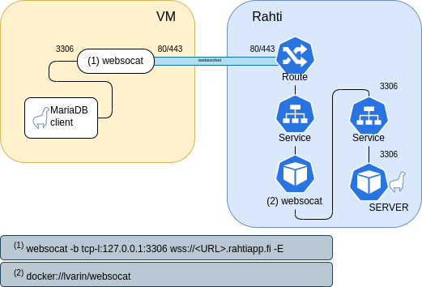

# Accessing databases on Rahti from CSC supercomputers

Many HPC workflows require a database. Running these on the login node poses several issues and running on Pouta brings administration overhead. Rahti is a good candidate, but one obstacle is that Rahti does not support non-HTTP traffic from external sources.

A workaround for this problem is to establish a TCP tunnel over an HTTP-compatible WebSocket connection. This can be achieved using a command-line client for connecting to and serving WebSockets called [WebSocat](https://github.com/vi/websocat). Here, a WebSocat instance running on Puhti/Mahti translates a database request coming from a workflow to an HTTP-compatible WebSocket protocol. Once the traffic enters Rahti we use another WebSocat instance running inside Rahti to translate back the WebSocket connection to a TCP connection over the original port the database is configured to receive traffic. A drawing of the process is shown below.



This tutorial outlines the steps to achieve this using MariaDB as an example database.

!!! Note
    The OpenShift template used below to configure WebSocat on Rahti is an unsupported beta version!

!!! Note
    This solution is suitable for computationally light use cases. Reasonable scaling can be expected for up to ~100 processes simultaneously accessing a database on Rahti. Exceeding this limit is not advised and may result in performance degradation.

## Step 1: Setting up MariaDB and WebSocat on Rahti

Configuring MariaDB and WebSocat on Rahti can be done either through the web interface or using the `oc` command line tool. Notice that your CSC project must have access to the Rahti service. See here [how to add service access for a project](../../../accounts/how-to-add-service-access-for-project.md).

!!! Note
    Mind the difference between [persistent](../storage/index.md#persistent-storage) and [ephemeral storage](../storage/index.md#ephemeral-storage) when creating a new database in Rahti. Ephemeral databases are meant for temporary storage and should not be considered reliable. If the [Pod](../networking.md#pods) in which your database is running is deleted or restarted you will lose all your data! To avoid this, create a database with a persistent volume and make sure to also perform regular backups to for example [Allas](../../../data/Allas/index.md).

### Option 1: Using the Rahti web interface

- Log in to the [Rahti web interface](https://rahti.csc.fi:8443). See [Getting access](../../access/) for instructions.
- Deploy MariaDB from the "Developer Catalog". You will find the developer catalog in the **+Add** section of the `Developer` menu.
- Configure the database. You need to at least select or create a Rahti project to which you want to add the database. If creating a new project, make sure to include your CSC project number in the project description in the form `csc_project: 2001234`
- Create the database and remember the
    - Connection Username
    - Connection Password
    - Root Password
    - Database name (`sampledb` by default)
    - Database service name (`mariadb` by default)
- After creation, double check the network parameters and remember them:
    - Target port (3306 by default)
    - Hostname address (of the form `<service name>.<project name>.svc`)
- An [OpenShift template](https://github.com/CSCfi/websocat-template/blob/main/websocat-template.yaml) is needed to configure WebSocat on Rahti. Download or copy this YAML file to your clipboard. **Note:** that this is an _unsupported_ beta template
- Click in the `+` sign in the upper right corner of the webinterface, and paste the template. Click create.
- Come back to the "Developer Catalog" and deploy the Websocat template. You need to provide the "Database service name" (`mariadb` by default) and the "Database port" (`3306` by default).
- In the `Developer` menu, go to **Project -> Route** and copy the Location URL. You will use this URL to connect from outside Rahti.

### Option 2: Using the `oc` command line tool

- See [Command line tool usage](../usage/cli.md) for basic instructions
- Login using your CSC username and password

```bash
oc login https://rahti2.csc.fi:8443 -u <username> -p <password>
```

- Create a new project (namespace) or switch to existing one. If creating a new project, make sure to include your CSC project number in the project description in the form `csc_project: 2001234`

```bash
oc new-project <project name> --display-name='My new project'\
   --description='csc_project: <project number>'
```

or

```bash
oc project <project name>
```

- Add MariaDB by launching the `mariadb-persistent` template. Remember the username, password, database name and the database service name. Use the `-p` flag to modify default parameters

```bash
oc new-app --template=mariadb-persistent
```

- Add WebSocat by launching the [OpenShift template](https://github.com/CSCfi/websocat-template/blob/main/websocat-template.yaml). You can check the target port with `oc describe services <service name>`. The default parameters for the service name and target port are `mariadb` and 3306, respectively

```bash
oc new-app --file=/path/to/websocat-template.yaml\
  --param=DATABASE_SERVICE=<service name>.<project name>.svc\
  --param=DATABASE_PORT=<port>
```

- Remember the route hostname of the form `websocat-<project name>.rahtiapp.fi`. You can check this later with `oc get route websocat`

## Step 2: Running WebSocat on CSC supercomputers

MariaDB and WebSocat have now been set up on Rahti and you should have the following details: MariaDB username, password, database name and the WebSocat route hostname. These are needed when connecting to the database. However, first we need to run the `websocat` binary on Puhti/Mahti to open the required TCP tunnel.

- [Download `websocat` from GitHub](https://github.com/vi/websocat/releases) and add it to your `PATH`. For example:

```bash
wget https://github.com/vi/websocat/releases/download/v1.8.0/websocat_amd64-linux-static \
  -O websocat
export PATH=$PATH:$PWD
```

- We do not want to run WebSocat on the login node, so open an interactive session with `sinteractive -i` and launch `websocat`. By passing 0 as the target port, WebSocat gets handed an available port which we can extract using `lsof` (the below commands are conveniently put into a script). Recall that the `<project name>` placeholder in the route hostname provided to `websocat` refers to the name of your Rahti project

```bash
websocat -b tcp-l:127.0.0.1:0 wss://websocat-<project name>.rahtiapp.fi -E &
ws_pid=$!  # $! contains the process ID of the most recently executed background command
mkdir -p /tmp/$USER
lsof -i -p $ws_pid 2>/dev/null | grep TCP | grep -oE "localhost:[0-9]*" | \
  cut -d ":" -f2 > /tmp/$USER/${SLURM_JOB_ID}_rahtidb_port
echo "Got target port $(cat /tmp/$USER/${SLURM_JOB_ID}_rahtidb_port)"
```

!!! Note
    If you want to access your database within a batch job, run `websocat` within your batch script. You can utilize the same obtained target port if you're submitting your job from an interactive session in which `websocat` is already running, `websocat -b tcp-l:127.0.0.1:<port> wss://websocat-<project name>.rahtiapp.fi -E &`. Otherwise, pass 0 as the target port and check which one it gets handed using `lsof`.

- Now `websocat` is running in the interactive session/batch job and you may connect to your MariaDB database on Rahti using the obtained target port. You can verify the connection with e.g. Python. Note that the username and password below refer to the created database service, not your CSC credentials

```python
# Module Imports
import mariadb
import sys

# Connect to MariaDB Platform
try:
    conn = mariadb.connect(
        user="<username>",
        password="<password>",
        host="localhost",
        port=<port>,
        database="<database name>"

    )
except mariadb.Error as e:
    print(f"Error connecting to MariaDB Platform: {e}")
    sys.exit(1)

# Get Cursor
cur = conn.cursor()
```

