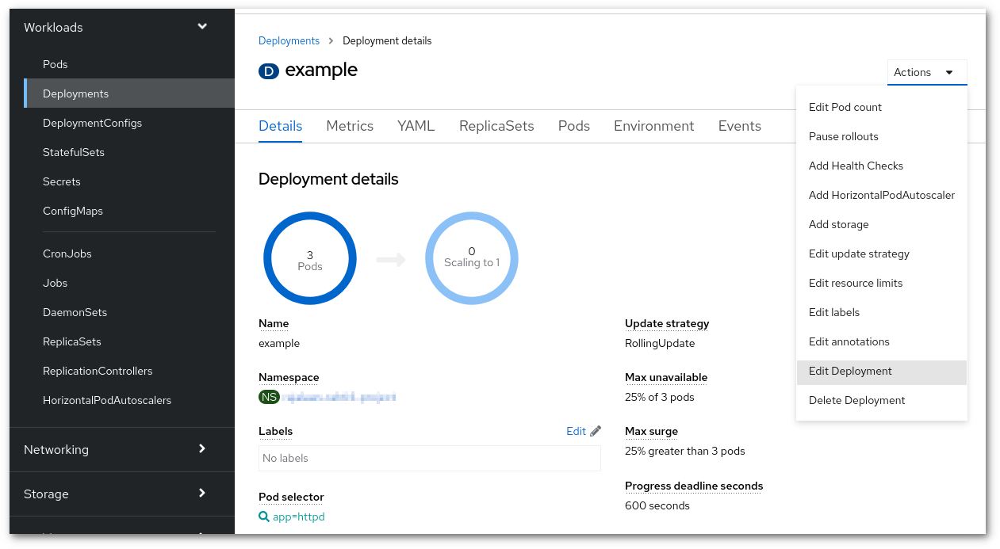

# How to manually cache images in Rahti's registry

It is possible to manually cache images in Rahti's internal registry. This could be useful to remove
an external dependency or improve performance.

The process is simple, go to <https://registry-console.rahti.csc.fi/registry>, there you must do two
things:

1. Create an image in the project's space.

    

    

1. Find the login command and use it to login in the terminal.

    

## Update the image

* Pull the image from docker hub in your laptop, tag it with the name you just created, and push it
to Rahti's registry. For example to cache `centos:7`:

```
docker pull centos:7
docker tag centos:7 docker-registry.rahti.csc.fi/$PROJECT/centos:7
docker push docker-registry.rahti.csc.fi/$PROJECT/centos:7
```

This has to be repeated for every time the upstream changes.

## Use the image

Go to your project's deployment, and edit it.



Go to the Images section, make sure the option "Deploy images from an image stream tag" is clicked.
Finally select the new image.


