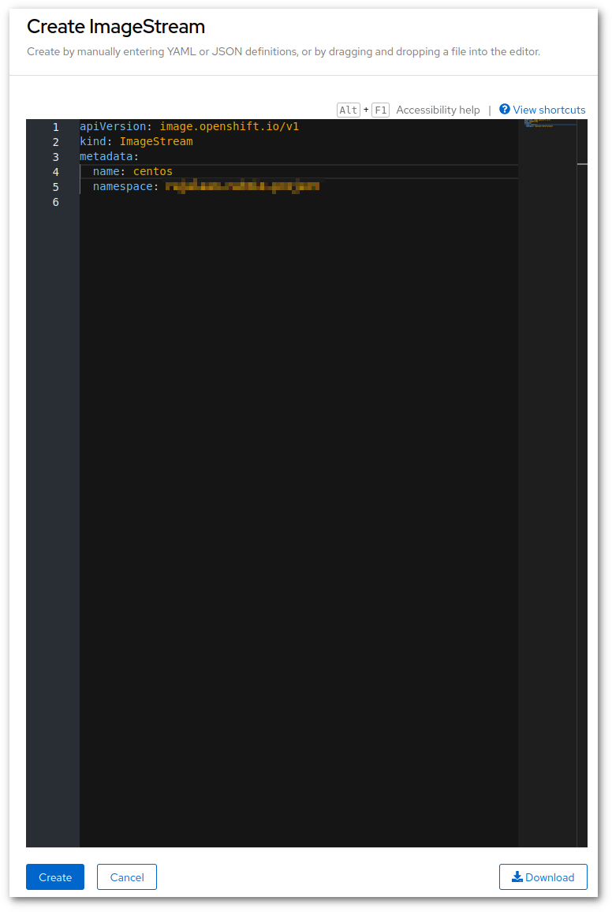
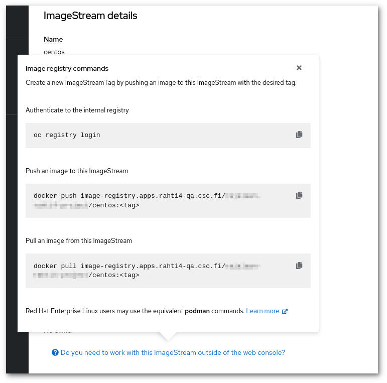

# How to manually cache images in Rahti

It is possible to manually cache images in Rahti. This could be useful to remove
an external dependency or improve performance.

The process is simple, go to RAHTI_URL, there you must take the follwowing
actions:

1. In administrator role, open ImageStreams page under Builds. Click "Create ImageStream" button on
top right of the page.

    

1. Create an image stream in the project's space.

    


1. After creating an image stream "ImageStream details"" page will open. Click the "Do you need to work with this ImageStream outside of the web console?" text to find appropriate commands to work with the image stream.

    

## Update the image

* Pull the image from docker hub in your laptop, tag it with the name you just created, and push it
to Rahti's registry. For example to cache `centos:7`:

```
docker pull centos:7
docker tag centos:7 image-registry.apps.rahti4-qa.csc.fi/$PROJECT/centos:7
```

Befor pushing the image to Rahti's internal registry, you need to give it a tag. This can be done with `oc tag` command. Remember to authenticate to the internal registry before pushing the image to an image stream.

```
oc tag centos centos:7
docker login -p $(oc whoami -t ) -u unused image-registry.apps.rahti4-qa.csc.fi
docker push image-registry.apps.rahti4-qa.csc.fi/$PROJECT/centos:7
```

This has to be repeated for every time the upstream changes.

## Use the image

Go to your project's deployment or DeploymentConfig, and edit it.


Go to the Images section, make sure the option "Deploy images from an image stream tag" is clicked.
Finally select the new image.


