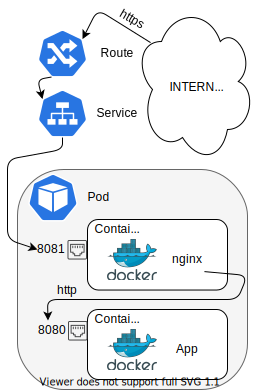

# Reverse proxy authentication using a sidecar container

A container is called a sidecar when: it is located in the same Pod than other "main" container, and it provides a functionality to that other container. When containers are in the same `Pod`, they share the same network, always reside in the same node, and are created and destroyed at the same time.

One of the uses for this design pattern is to have a reverse proxy that will handle authentication. The idea is that we will have a Flask application running in a container in a Pod. In the same Pod, we will create a nginx container. This nginx server will connect to the Flask application using the internal Pod network and will implement authentication. In this case it will be a default username and password.



## Deployment

First create the project:

```bash
oc new-project <OPEN_SHIFT_PROJECT_NAME> --description="csc_project: <CSC_PROJECT_NUMBER>" \
    --display-name="Sidecar test tutorial"
```

Then clone the repository for this tutorial:

```bash
git clone https://github.com/CSCfi/nginx-sidecar.git
```

Inside the repository, there is a folder called `templates`, we will create the objects one by one:

* First the [DeploymentConfig](https://github.com/CSCfi/nginx-sidecar/blob/master/templates/DeploymentConfig.yaml) that creates the `Pod`:

```bash
oc create -f templates/DeploymentConfig.yaml
```

* Then the [Service](https://github.com/CSCfi/nginx-sidecar/blob/master/templates/Service.yaml) that will connect to the port 8081 of nginx:

```bash
oc create -f templates/Service.yaml
```

* Finally create the route:

```bash
oc create route edge sidecar --service=python-and-sidecar --insecure-policy='Redirect'
oc get route sidecar
```

The first command will create the route, and the second will give you the DNS name chosen by OpenShift for it.

## Test

If all went as expected, if you enter the DNS name from the previous step, the browser will ask for a username and password (`admin`/`admin1041`), and then the message "Hello World" will be shown.

## Conclusion

This is just a simple example of the design pattern. Two or more containers working together in the same local network, normally being one of the containers the "main" one that other provide extra functionality. This concept can be extended by using other authentication methods can be used, like LDAP or OpenID. Also this pattern is useful for file serving, where files are hosted in a "slow but safe" filesystem, and a sidecar container pull these files to an emptyDir, which is a temporal fast filesystem Rahti provides.
