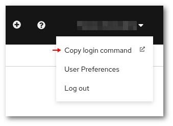

# Command line tool usage

Rahti can be used via the command line either with OpenShift's _oc_ tool
or with the _kubectl_ tool from Kubernetes. Certain features specific to OpenShift
are only available when using the oc tool.

## How to install the `oc` tool

The oc tool is a single binary that only needs to be included in your _path_. You may download it from the [Getting started with the OpenShift CLI](https://docs.openshift.com/container-platform/4.10/cli_reference/openshift_cli/getting-started-cli.html) page in OpenShift's documentation. Follow the detailed instructions in the link.

In order to test that it was properly installed, open a new terminal, go to any folder, and run:

```
$ oc --help
```

It should show the list of all available commands.

## The "Command Line Tools" page in the OpenShift web UI

Instructions for downloading the oc tool and logging in via the command line
can be found in the "Command Line Tools" page in the web interface:


## How to login with `oc`?

The oc login command to login can be found in one of the fields on the page. There is a
button next to it for copying the command to the clipboard:


Copy the command and paste it in a terminal to start using OpenShift via the
command line.

!!! note
    If you open multiple terminals, the login session for oc will be active in
    all of them.

## How to login in the registry?

In order to use Rahti internal container registry, it is necessary to login separately. Once you login, it is possible to use the client docker to `pull` and `push` from Rahti's registry.

### Using personal account

After login with `oc`, it is possible to use the command to generate a token (`oc whoami -t`):

`docker login -p $(oc whoami -t ) -u unused image-registry.apps.rahti4-qa.csc.fi`

### Using a service account token

Rahti also offers the opportunity of using an internal service account to interact with the registry. This is recommended for automated procedures like a CI pipeline. Even though by default 3 internal service accounts are created in every Rahti namespace: builder, default and deployer, it is recommended to create a dedicated internal service account and assign to it the `system:image-pusher` role.

```sh
oc create serviceaccount pusher
oc policy add-role-to-user system:image-pusher pusher
docker login -p $(oc sa get-token pusher) -u unused image-registry.apps.rahti4-qa.csc.fi
```

This service account token, the one you get with `oc sa get-token pusher` does not expire.

## CLI cheat sheet

**Basic usage:**

```bash
oc <command> <--flags>
oc help <command>
```

**Examples:**

Authorize the CLI tool to the cluster:

```bash
oc login RAHTI4_URL --token=<secret access token>
```

This command can be obtained by clicking your usename and "Copy Login Command"
in the web console:



Show projects:

```bash
oc projects
```

Switch to project `my-project`:

```bash
oc project my-project
```

Show all pods in the current namespace:

```bash
oc get pods
```

Show all pods in the namespace `<my-other-name-space>`:

```bash
oc get pods -n <my-other-namespace>
```

Show all pods that have the key-value pair `app: myapp` in `metadata.labels`:

```bash
oc get pods --selector app=myapp
```

Print the specifications of the pod `mypod`

```bash
oc get pod mypod -o yaml
```

### Other useful commands

* `oc create` creates an object. Example: `oc create -f file.yaml`
* `oc replace` replaces an object. Example: `oc replace -f file.yaml`
* `oc delete` deletes an object in OpenShift. Example: `oc delete rc
  myreplicationcontroller`
* `oc apply` modifies an object according to the input. Example `oc apply -f
  file.yaml`
* `oc explain` prints out the API documentation. Example: `oc explain dc.spec`
* `oc edit` loads an object from the API to the local editor chosen by the `$EDITOR`
  environment variable. Example: `oc edit DeploymentConfig mydc`

## Abbreviations

Object types have abbreviations that are recognized in the CLI:

|Abbreviation |Meaning|
|-----:|:-------|
|`is`|`ImageStream`|
|`dc`|`DeploymentConfig`|
|`svc`|`Service`|
|`bc`|`BuildConfig`|
|`rc`|`ReplicationController`|
|`pvc`|`PersistentVolumeClaim`|

## Further documentation

See the official documentation for more information about using the command line
interface:

* [OpenShift documentation: CLI reference](https://access.redhat.com/documentation/en-us/openshift_container_platform/4.10/html-single/cli_tools/index)
