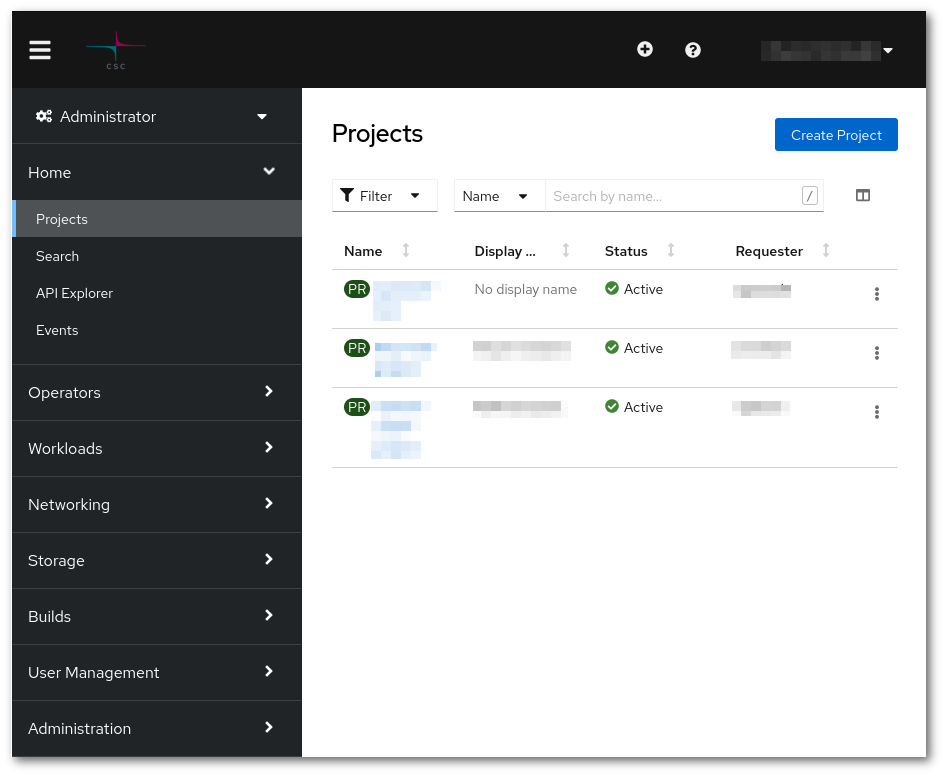
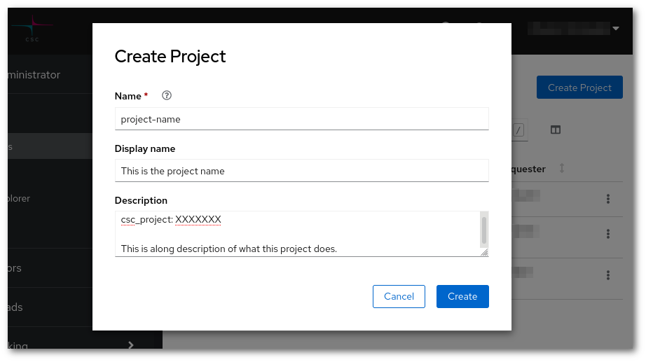
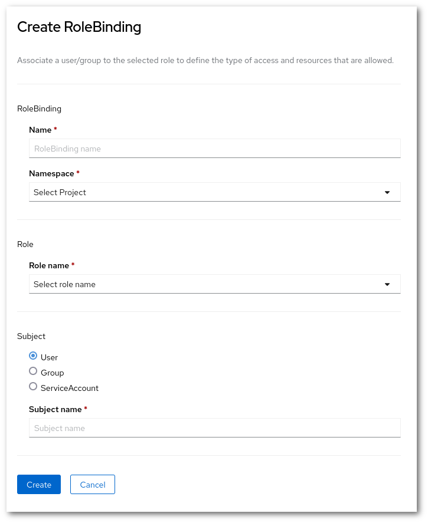
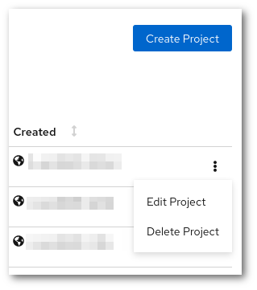
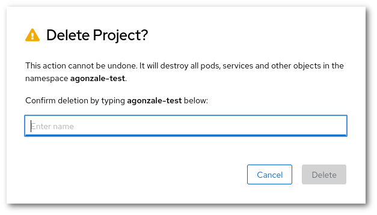

# Projects and quota

## OpenShift projects and CSC computing projects

!!! note
    Projects in OpenShift are separate from CSC computing projects. A single CSC
    computing project can have access to multiple projects in OpenShift.
    Each CSC computing project with access to Rahti receives a *group* in
    OpenShift.

!!! note
    Rahti can be used free of charge for open research and
    education in Finnish universities and polytechnics.

All projects in OpenShift must be mapped to a CSC computing project. This
mapping is used to determine which CSC computing project a given resource
belongs to for billing and other purposes. You need to
specify which of them to use. You have to specify which project to map by entering `csc_project:` followed
by the name or number of your CSC computing project in the _Description_ field
when creating a new project in OpenShift. You can also enter other text in the
description field if you want to have a human-readable description for
the project you are creating.

For example, if you have Rahti access via *project_1000123*, you would
enter the following in the _Description_ field:

```yaml
csc_project: 1000123
```

You can also enter a human-readable description for the project, in which case
the field could look like this:

```yaml
This project is used for hosting the Pied Piper web application.

csc_project: 1000123
```

This would make it so that any usage within that OpenShift project is billed
to the billing unit quota of project_1000123. Note that project_1000123 must
have Rahti access and you must be a member of that computing project,
or the OpenShift project creation will fail.

If you would like to know which CSC computing projects you are a member of, you
can view a list in the [My Projects
tool](https://my.csc.fi/myProjects) of MyCSC. You can also set a default 
billing project by going to [Your Profile page](https://my.csc.fi/myProfile). 

If you would like to know which CSC computing project an OpenShift project is
associated with, you can do so using the _oc_ command line tool. You can find
instructions for setting up oc in the [command line tool usage
instructions ](../cli/). For example, if your OpenShift project is called
*my-openshift-project*, you would run:

```bash
oc get project my-openshift-project -o yaml
```

This should produce the following output:

```yaml
apiVersion: project.openshift.io/v1
kind: Project
metadata:
  annotations:
    ...
  creationTimestamp: 2018-11-22T12:27:05Z
  labels:
    csc_project: "1000123"
  name: my-openshift-project
  resourceVersion: "72557736"
  selfLink: /apis/project.openshift.io/v1/projects/my-openshift-project
  uid: df4970e2-abd7-4417-adbf-531293c68cd6
spec:
  finalizers:
  - openshift.io/origin
  - kubernetes
status:
  phase: Active
```

In the output above, you can find the associated CSC computing project under
`metadata.labels.csc_project`. In this case, the project is `1000123`.
Unfortunately, this information is not available via a web interface yet.

!!! note
    It is not possible for normal users to change the *csc_project* label
    after a project has been created. If you would like to change the label for
    an existing project, please [contact the support](/support/contact/). You can also create
    a completely new project if you want to use a different label.

## Creating a project

Click the blue "Create Project" button to create a project, and you will be
presented with the following view:



1. You *need* to pick a **unique name** that is not in use by any other project
in the system.
1. You *can* also enter a **human-readable display name** and.
1. You *have to* also enter a **CSC computing project** in the _Description_ field. It must be a currently valid CSC project, that your account has access to. In order to view to which CSC projects you have access to, please check <https://my.csc.fi>. If you have access to no CSC project, you will not be able to create any Rahti project. If you have Rahti access via project_1000123, you would enter the following in the Description field:

> csc_project: XXXXXXX



See the section about [accounts](/accounts/).

Once you have filled in the fields, click "Create", and you will see the application
catalog where you can pick an application template or import your
own one.

For more information about using the web interface, refer to the
[official OpenShift documentation](https://docs.okd.io/). You can find
out which version of the documentation to look at in the web interface by
clicking the question mark symbol in the top bar and selecting "About".

## Project quotas

Two kinds of quota are applied in OpenShift:

* Total number of projects per user
* Resources created inside a project

By default, users can create **up to five projects**. Each of them has its
own quota for the following resources:

| Resource                         | Default |
|----------------------------------|---------|
| Pods                             | ??      |
| Virtual cores per pod            | 4       |
| Virtual cores per container      | 4       |
| RAM per pod                      | 16 GiB  |
| RAM per container                | 16 GiB  |
| Storage                          | 100 GiB |
| Number of image streams          | 20      |
| Size of each registry images     | 5 GiB   |

You can find the resource usage and quota of a project in the project view in
the web interface under **Administration -> ResourceQuota** and **Administration -> LimitRanges** in the `Administrator` menu.

Alternatively, you can use the oc command line tool:

```bash
oc describe quota
oc describe limitranges
```

If you need to create more projects or you need more resources in a project for
your application, you can apply for more quota by contacting the Rahti
support. See the [Contact page](/support/contact/) for instructions. Quota requests are
handled on a case-by-case basis depending on the currently available resources
in Rahti and the use case.

## Sharing projects with other users

OpenShift has a flexible role-based access control system that allows you to
give access to projects you have created to other users and groups in the system.
You can give e.g. full admin, basic user, edit or read only access to other
users and groups in the system for collaboration.

You can edit project memberships in the web interface via **User Management ->
RoleBindings**, in the `Administrator` menu. You can either give access rights to individual users, groups or Service Accounts by selecting either the _Users_,  _Groups_ or ServiceAccount.



Note that it is important to use correct usernames when sharing projects
with others. OpenShift allows you to freely enter any username and will not notify
you for having entered a non-existent username. Usernames are also case-sensitive.
You can find out your username in OpenShift via the command line, by using the command `oc whoami`.

## Deleting a project

In order to delete a project, you need to go to the main landing page and click in the 3 vertical dots next to the name of the project. In the drop down menu, you will see the option "Delete Project"



Then you will be asked to input the name of the project to prevent accidental deletions.

!!! note
    After the project has been confirmed for deletion, all resources will be deleted and there will be no way to restore them, including the data stored in the persistent volumes.



After that, Rahti will start to delete all the resources of the project. It could take only few seconds or up to a minute, it depends of amount of resources the project had. After that Rahti will liberate the project name, and it will be possible to create an empty project with the same name.
