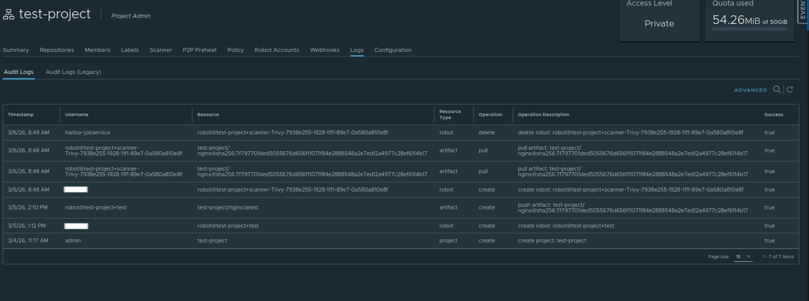

## Audit Logs

Audit logs provide a record of all important activities performed in Satama. These logs help administrators track user actions and investigate security incidents.

Audit logs typically record actions such as:
* User login attempts
* Image push or pull operations
* Project creation or deletion
* Permission changes
* Configuration updates

### Viewing Audit Logs

* Log in to Satama Web UI.
* Click on **Logs**

You can also check project wise logs by:

* Click on your project.
* Open **Log** tab.

Here, you can see all logs. Admin can review these logs to monitor system usage and detect suspicious activity.

Audit logs are important for:

* Security monitoring
* Compliance requirements
* Troubleshooting issues
* User activity tracking