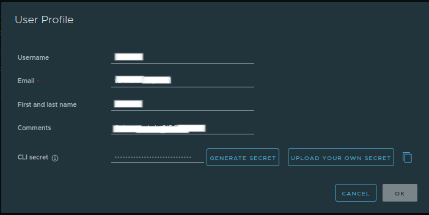
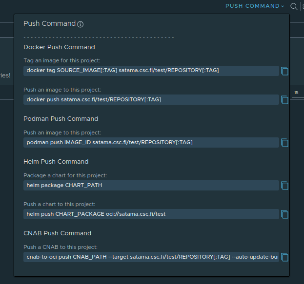

# Command Line Tool

Most day-to-day operations, such as pushing or pulling images, require you to authenticate with Satama using OCI compatible tools like, Docker and Podman. It's a good idea to use CLI secret instead of a password for security reasons. The CLI secret functions as a token that grants permission to interact with the registry via command line tools. 

## Logging in to Satama Using Personal CLI Secret

To generate your CLI secret, log in to the Satama web interface, click on your username in the upper right corner, and select **User Profile**. A pop-up window will be displayed.



 Within this page, you will see a section labeled **CLI Secret**. If you have not generated one before, click **Generate New Secret**, and Satama will display a unique string of characters. This secret should be copied and stored securely. It acts like a personal API key and can be revoked or regenerated at any time.

You can log in from the terminal using this secret by running the following command:

To log in using Docker:
```
docker login satama.csc.fi -u <your-username>
```
You will be prompted to enter your password. Add this CLI secret there. 
```
Password:
```
If the authentication is successful, the terminal will display:
```
Login Succeeded
```

The same process can be performed using Podman:
```
podman login satama.csc.fi -u <your-username>
```

Once you’ve logged in successfully, Docker/Podman will save your credentials locally, allowing you to perform push and pull operations without re-authenticating until your session expires or you log out manually.


## Logging in to Satama Using Robot Account  

It is recommended to use robot accounts instead of personal credentials to login specially when it is used in automated workflow. Robot accounts provide secure token-based authentication and can be limited to specific projects.

To know more about robot account, read [robot account](project-configuration.md/#robot-account) .

Log in using robot account:
```
docker login satama.csc.fi -u <your-robot account> 
```
For example,
```
docker login satama.csc.fi -u robot@test-project+test
```
You will be prompted to enter your password. Add this CLI secret of the robot account. If you don't have credentials, please ask your project admin.

## Pulling an Image

To use an existing container image stored in Satama, you can pull it using the CLI. Pulling an image downloads its layers and metadata to your local machine so that you can run containers from it. The basic syntax is:
```
docker pull satama.csc.fi/<project>/<repository>:<tag>
```
This command downloads the specified image and stores it locally so it can be executed or used as a base image for other builds.


## Tagging an Image

If you have built a new image locally and want to store it in Satama, you need to tag it correctly before pushing. Tagging an image tells Docker where to send it within the registry. Suppose you want to push a ubuntu:24.04 image. To push it to your project, you would tag it like this:
```
docker tag ubuntu:24.04 satama.csc.fi/<project>/ubuntu:24.04
```
This prepares the image to be uploaded to the project repository.

You can also check available images on your system using:
```
docker images
```

## Pushing an Image

Once an image is tagged correctly, it can be pushed to the registry, using:
```
docker push satama.csc.fi/<project>/ubuntu:24.04
```
You can check push command for your project on web UI by selecting your project and in right-hand side, clicking on **PUSH COMMAND**



Docker will upload all the image layers to Satama. If it’s the first time pushing this image, all layers will be uploaded. Subsequent pushes of similar images will be faster since Docker reuses existing layers. When the push completes, you can verify that the image appears in the Satama web interface under the appropriate repository and tag. 

Please note that if you encounter a “permission denied” error, it usually indicates that you don’t have push access to that project, and you should contact your project administrator.

