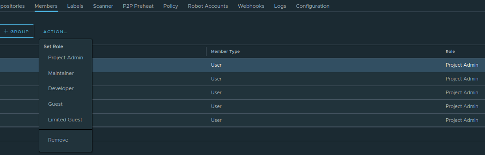

# Getting Access to Satama

## Login Using a CSC Account

In order to use the Satama container registry with a CSC account, you need:

1. A CSC user account. You can check which is your "CSC username" in [MyCSC profile page](https://my.csc.fi/profile). You can also change the password from there. If you don't have a CSC account already, you can create one by following [Create a new CSC user account](../../accounts/how-to-create-new-user-account.md)

2. Multi Factor Authentication (MFA) is required when login. For more information, visit the [Multi-Factor Authentication (MFA) Guide](../../accounts/mfa.md)

3. A CSC project with Satama service enabled. To create a new CSC project, follow [Create a new CSC project](../../accounts/how-to-create-new-project.md) or ask to be added to an existing project. The project should have Satama service enabled to access. Follow [Apply for Satama access](../../accounts/how-to-add-service-access-for-project.md) to enable Satama in your CSC project.

Please contact [servicedesk@csc.fi](mailto:servicedesk@csc.fi) in case you need assistance.

## Change Role of Individual Members

The user must be added to MyCSC project and should login to Satama platform once. This will automatically create a username at Satama. When user login first time, only **library** project will be visible and in 15 min, other CSC projects which have satama enabled, will appear. 

By default, everyone having access to project have **Project admin** role. Members with project admin role, can remove members and change the role of other members in the project. Satama enforces role-based access control to ensure that only authorized users can perform specific actions.

1. Click on your project 
2. Click on **Members** tab
3. Select the member from the list
4. Click on **Action..**
5. A list will appear
6. Remove/change role of that member.

The primary roles are Limited Guest, Guest, Developer, Maintainer, and Project Admin.

* **Limited Guest** can pull images but cannot push, and they cannot see logs or the other members of a project.
* **Guest** has read-only permission, they can only retag and pull images.
* **Developer** can both push and pull images.
* **Maintainer** have extended rights, such as the ability to scan images, view replications jobs, and delete images and helm charts.
* **Project Admin** can manage project members, assign roles, configure project settings and starting a vulnerability scan.

If you find that you cannot perform certain actions, such as pushing an image or initiating a scan, it’s likely due to insufficient permissions. In such cases, you should contact your project administrator to adjust your role or confirm your access level. You can check detail permission of the role [here](https://goharbor.io/docs/2.14.0/administration/managing-users/user-permissions-by-role/). 

It is also possible to have read-only access to public projects when user is not logged in. That type of user is known as **Anonymous user**. 