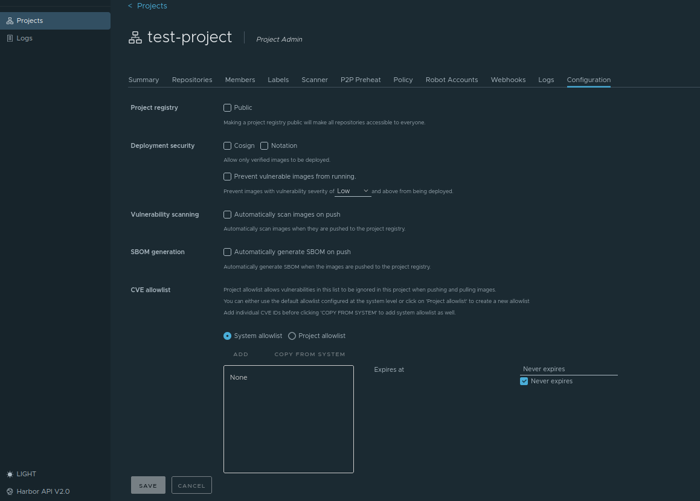

# Project Configuration

After the initial creation of a project, users with project admin privileges can configure or reconfigure its properties. Project configuration in Satama allows administrators and developers to control how container images are stored, secured, scanned, and maintained within a project. These settings help enforce security policies, manage image lifecycle, and automate repository maintenance.

Login to Satama, in the landing page click on your project and you can see few tabs there. All your project related settings can be done there.  

These configurations help ensure that container images are secure, properly maintained, and accessible only to authorized users.
