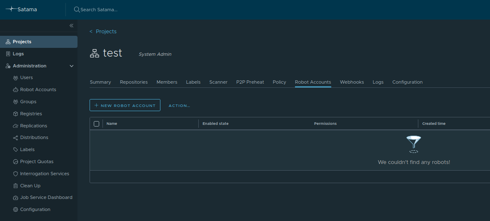
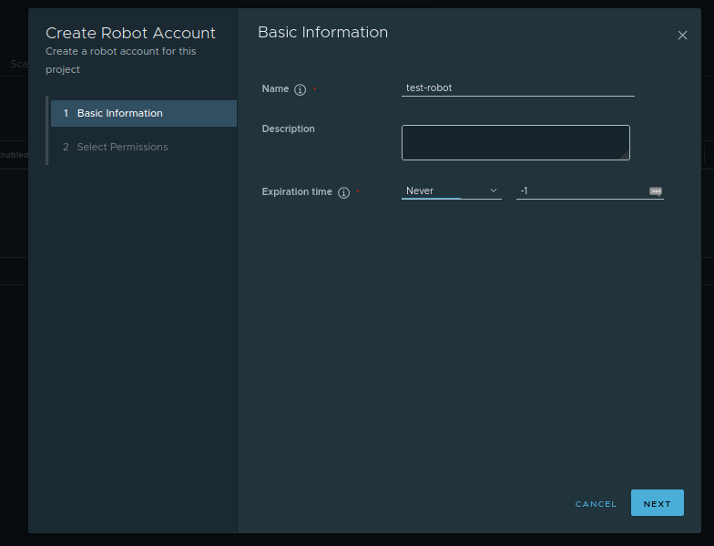
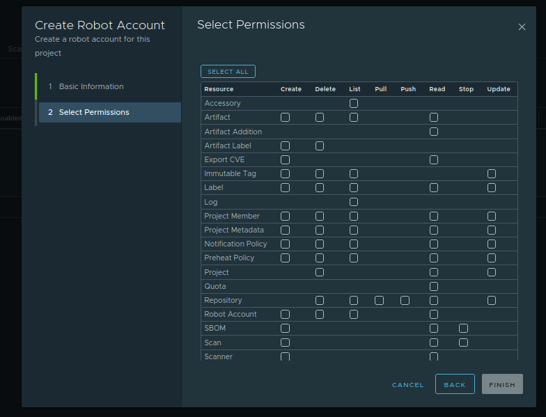

# Robot Account

Robot accounts in Satama are special service accounts designed for automated processes, such as CI/CD pipelines, deployment systems, or build servers, that need to interact with the registry without using a personal user account. Unlike regular user accounts, which are tied to individual identities and may expire or change, robot accounts provide stable credentials that can be used by systems to perform operations like pushing and pulling images programmatically. 

Each robot account is scoped to a specific project and inherits only the permissions granted within that project’s configuration. This ensures that automation tools have the minimum necessary privileges and cannot access unrelated repositories. 

### Create a Robot Account

To create a robot account, a project administrator can navigate to the desired project in the Satama web interface, open the **Robot Accounts** tab



Click on **New Robot Account**. A pop-up window will open.



Enter the details about robot account. Provide a name, add the description about robot account like, purpose of the account and selects an expiration date. You can also select **never** expire. 

After adding all details, click on **Next** button.



Here, you can add permissions you want to give to this robot account. Here, you can specify which actions the robot account can perform, such as pushing, pulling, or deleting images. You can also give full permissions by selecting all. Now, click on **Finish** Button.

## Save the Credentials
Once created, Satama generates a robot username and a secret key that must be copied immediately, as it cannot be retrieved later. The credentials can be used in Docker/Podman CLI or CI tools by logging in with a command like

## Authenticate Using the Robot Account
Log in using robot account:
```
docker login satama.csc.fi -u <your-robot account> 
```
For example,
```
docker login satama.csc.fi -u robot@test-project+test
```

## Use the Robot Account in Automation
Robot accounts are especially useful for continuous integration pipelines that automatically build and publish container images, since they enable secure, auditable, and controlled access without requiring a human user. By using robot accounts, consistent automation workflows can be maintained while keeping individual user credentials private and ensuring compliance with least-privilege principles.