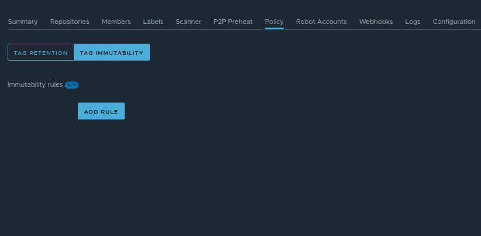
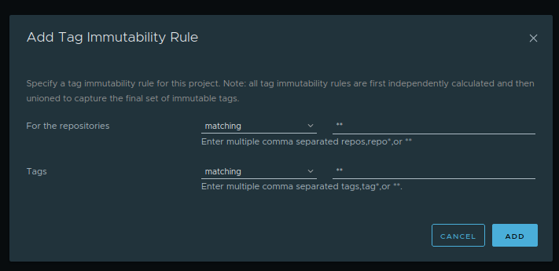

## Tag Immutability

Tag immutability prevents container image tags from being overwritten or modified after they are pushed.

Normally, users can push a new image with the same tag (for example latest). This can cause issues because deployments may use different image versions without noticing.

Tag immutability ensures that once a tag is created, it cannot be changed.

### Benefits

* Prevents accidental image overwrites
* Improves deployment consistency
* Strengthens supply chain security
* Ensures traceability of image versions

### How to Configure Tag Immutability

To configure tag immutability, open the Project in Satama and go to **Policy** tab.

Click on **Tag Immutability** section. Click on **Add rule**. A pop-up window will open

Create a rule specifying which tags should be immutable.

