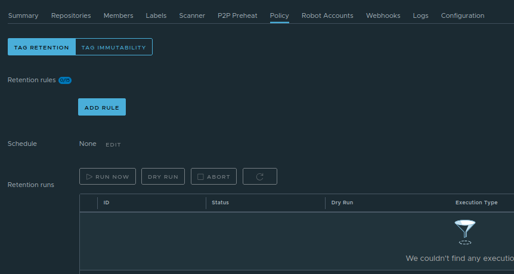
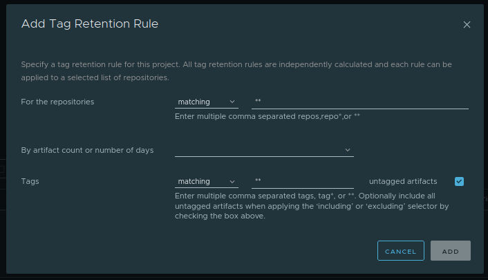

## Tag Retention Policy

Container registries can accumulate many image versions over time. Tag retention policies help automatically remove unused or old image tags to save storage space.

Instead of manually deleting images, administrators can define rules that determine which tags should be kept and which should be removed.

### How to Configure Tag Retention

To configure tag retention, open the Project in Satama and go to **Policy** tab.

Click on **Tag Retention** section. Click on **Add rule**. A pop-up window will open

Create a rule specifying which images should be retained and which should be deleted.

For example, 
* Keep the latest 10 tags
* Delete tags older than 30 days
* Keep tags matching release- pattern*

Once configured, Satama will automatically apply the policy according to the defined schedule.