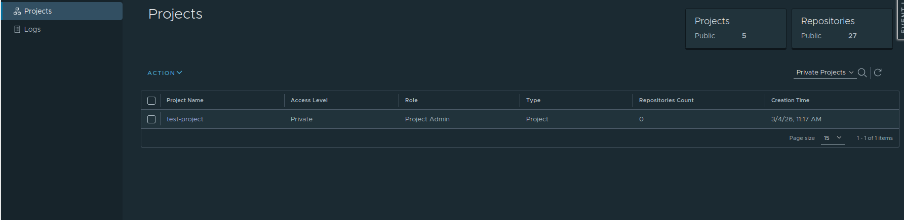
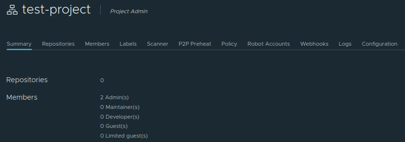

# Using the Web Interface

Web UI is the graphical interface that allows users to manage container images, projects, security settings, and automation features without using the command line.

To access Satama web interface, open your browser and navigate to [https://satama.csc.fi/](https://satama.csc.fi/). You will be presented with a login page. 

Use HAKA/MyCSC/Virtu login page and enter your credentials. Once logged in, you will be taken to your personal dashboard. This page shows a summary of all projects you have access to. 

The interface is organized into two main levels:

1. System-Level Navigation (left sidebar)
2. Project-Level Navigation (top tabs inside a project)

## System-Level Navigation (left sidebar)

The left panel provides access to high-level sections, projects and logs. 

By clicking on **Projects**, you can check your existing projects and details about these projects.

By clicking on **Logs**, you can check all the activities happened in your projects, such as image push/pull.

## Project-Level Navigation (top tabs inside a project)

When you open your project at Satama web interface, a horizontal menu appears at the top of the page. Each tab in this menu provides access to a different part of the project and allows users to manage container images, permissions, security settings, and automation features. 

Each tab in this menu provides access to a different part of the project and allows users to manage container images, permissions, security settings, and automation features:

* **Summary** tab provides an overview of number of repositories and members of the project.

* **Repositories** tab is where users manage container images. It lists all repositories that belong to the project. Inside each repository, users can see available image tags, check image digests, view vulnerability reports, and obtain the commands needed to pull images to their systems. Most daily interactions with container images happen in this section.

    * Project admin can add information to describe the repository. Adding a description to a repository helps users and teams understand the purpose, contents, and usage of the images stored within it.

    * Go into the repository and select the Info tab, and click the Edit button. Enter a description—for example, its base image, its intended use, or any relevant deployment notes and click Save to save the description.

* **Members** tab is used to manage access to the project. Project administrators can add users and assign them roles such as Guest, Developer, Maintainer, or Project Admin. These roles determine what actions users are allowed to perform within the project, such as pulling images, pushing new images, or managing project settings.

* **Labels** Labels can be used to categorize and organize repositories and images. it can help in quickly understand the purpose or ownership. You can also filter images by labels. Satama has two types of labels:

    * Global Level Labels: System administrators can create, update and delete the global level labels. These can be used by any image under any project. 
    * Project Level Labels: Project administrators and system administrators can list, create, update and delete the project level labels. These are mainly managed by project administrators only because of the scope of these labels. 

* **Scanner** tab shows information about the vulnerability scanning service used by the project. Here, we have **Trivy** as the scanner.

* **P2P Preheat** tab is used to improve image distribution performance. 

* **Policy** tab is used to define rules related to image tags, such as tag immutability. Tag immutability prevents certain tags from being overwritten, which helps ensure that important versions of images remain unchanged.

* **Robot Accounts** tab allows users to create service accounts for automation. These accounts are commonly used to push or pull images without using personal user credentials.

* **Webhooks** tab allows the project to send notifications to external systems when certain events occur. 

* **Logs** tab displays activity logs related to the project. These logs record actions such as image pushes, pulls, deletions, and configuration changes. They help users track activity and troubleshoot issues. 

* **Configuration** tab contains project-level settings that control security and behavior of the project. Here, users can configure project visibility (public or private), enable automatic vulnerability scanning, enable SBOM generation, configure deployment security rules, and manage the CVE allowlist.

To know more about project configuration, please read [Project configuration](project_configuration.md).